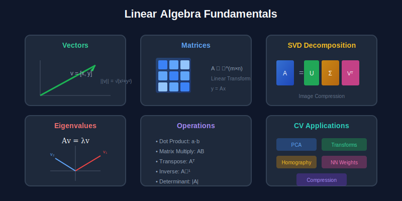
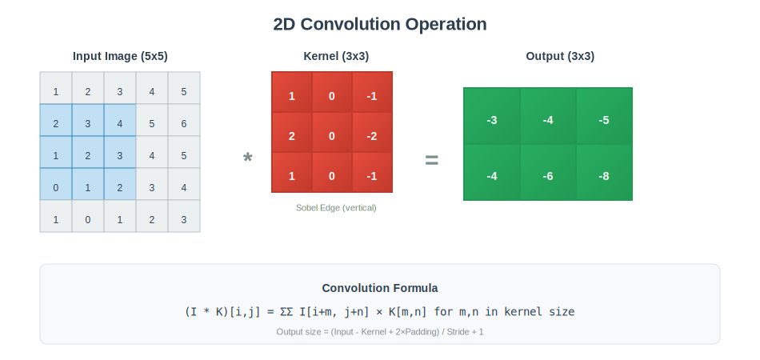

<div align="center">

# 📐 Mathematical Foundations

### *The Language of Computer Vision*

<br/>

<p>


</p>

**📓 [Download Notebook](./colab_tutorial.ipynb) → Upload to Colab → Run!**

</div>

---

[🏠 Home](../README.md) · [Transform Methods →](../02_Transform_Methods/)

---

<br/>

## 📖 Overview

> **Mathematics is the foundation of everything in computer vision.** This module covers the essential math you need—linear algebra, probability, optimization, and convolution—explained visually with runnable code.

<br/>

---

## 🎯 What You'll Learn

<table>
<tr>
<td width="50%">

### 📊 **Linear Algebra**
- Vectors & Matrices
- Matrix Operations
- Eigenvalues & SVD
- Applications in CV

</td>
<td width="50%">

### 📈 **Probability**
- Distributions
- Bayes' Theorem
- Maximum Likelihood
- Softmax & Cross-Entropy

</td>
</tr>
<tr>
<td width="50%">

### ⚡ **Optimization**
- Gradient Descent
- SGD & Adam
- Loss Landscapes
- Convergence

</td>
<td width="50%">

### 🔄 **Convolution**
- 1D & 2D Convolution
- Kernels & Filters
- CNN Foundation
- Fourier Connection

</td>
</tr>
</table>

<br/>

---

## 📊 Key Concepts

| Concept | Formula | Use in CV |
|:--------|:--------|:----------|
| **Matrix Multiply** | `Y = WX` | Neural network layers |
| **SVD** | `A = UΣVᵀ` | Image compression, PCA |
| **Gradient** | `∇f = [∂f/∂x₁, ...]` | Backpropagation |
| **Softmax** | `σ(z)ᵢ = eᶻⁱ/Σeᶻʲ` | Classification output |
| **Convolution** | `(f*g)[n] = Σf[k]g[n-k]` | Filtering, CNNs |

<br/>

---

## 🔢 Essential Formulas

<table>
<tr>
<td>

### Matrix Operations

**Eigendecomposition:**
```
A = VΛV⁻¹
Av = λv
```

**SVD:**
```
A = UΣVᵀ
```

</td>
<td>

### Probability

**Bayes' Theorem:**
```
P(A|B) = P(B|A)·P(A) / P(B)
```

**Gaussian:**
```
N(x|μ,σ²) = exp(-(x-μ)²/2σ²) / √(2πσ²)
```

</td>
</tr>
<tr>
<td>

### Optimization

**Gradient Descent:**
```
θₜ₊₁ = θₜ - η·∇L(θₜ)
```

</td>
<td>

### Cross-Entropy Loss

```
L = -Σ yᵢ·log(ŷᵢ)
```

</td>
</tr>
</table>

<br/>

---

## ⚙️ Algorithms

### Algorithm 1: Gradient Descent

```
┌─────────────────────────────────────────────────────┐
│  INPUT: Loss function L(θ), learning rate η        │
│  OUTPUT: Optimal parameters θ*                     │
│                                                     │
│  1. Initialize θ randomly                          │
│  2. REPEAT until convergence:                      │
│     a. Compute gradient: g = ∇L(θ)                │
│     b. Update: θ = θ - η·g                        │
│                                                     │
│  Variants:                                          │
│  - Momentum: v = βv + g; θ = θ - η·v              │
│  - Adam: Uses adaptive learning rates              │
└─────────────────────────────────────────────────────┘
```

### Algorithm 2: SVD Computation

```
┌─────────────────────────────────────────────────────┐
│  INPUT: Matrix A (m×n)                             │
│  OUTPUT: U, Σ, V such that A = UΣVᵀ               │
│                                                     │
│  1. Compute AᵀA (n×n symmetric)                   │
│  2. Find eigenvalues λᵢ and eigenvectors vᵢ       │
│  3. σᵢ = √λᵢ (singular values)                    │
│  4. V = [v₁, v₂, ..., vₙ]                         │
│  5. uᵢ = Avᵢ/σᵢ (left singular vectors)          │
│  6. U = [u₁, u₂, ..., uₘ]                         │
│                                                     │
│  Truncated SVD: Keep top k singular values        │
└─────────────────────────────────────────────────────┘
```

### Algorithm 3: 2D Convolution

```
┌─────────────────────────────────────────────────────┐
│  INPUT: Image I (H×W), Kernel K (kh×kw)           │
│  OUTPUT: Convolved image O                         │
│                                                     │
│  FOR each output position (i, j):                  │
│    sum = 0                                         │
│    FOR m = 0 to kh-1:                             │
│      FOR n = 0 to kw-1:                           │
│        sum += I[i+m, j+n] × K[m, n]               │
│    O[i, j] = sum                                  │
│                                                     │
│  Output size: (H-kh+1) × (W-kw+1)                 │
│  With padding P: (H+2P-kh+1) × (W+2P-kw+1)        │
└─────────────────────────────────────────────────────┘
```

<br/>

---

## 🎨 Visual Diagrams

<div align="center">

</div>

<br/>

<div align="center">

</div>

<br/>

---

## 📓 Practice

See the Colab notebook for hands-on coding: [`colab_tutorial.ipynb`](./colab_tutorial.ipynb)

<br/>

---

## ⚠️ Common Pitfalls

| ❌ Pitfall | ✅ Solution |
|-----------|------------|
| Numerical overflow in softmax | Subtract max: `softmax(z - max(z))` |
| Matrix inverse fails | Use SVD pseudo-inverse instead |
| Vanishing gradients | Proper initialization + batch norm |
| Wrong axis in NumPy | Always use explicit `axis=` parameter |
| Forgetting to normalize | Normalize features before distance metrics |

<br/>

---

## 🛠️ Mini Projects

<details>
<summary><b>Project 1: PCA Image Compression</b></summary>

- Load a grayscale image
- Apply PCA with different numbers of components (10, 50, 100)
- Compare quality vs compression ratio
- Plot reconstruction error vs number of components

</details>

<details>
<summary><b>Project 2: Optimizer Comparison</b></summary>

- Implement GD, SGD, Momentum, and Adam from scratch
- Test on different loss surfaces (bowl, saddle, ravine)
- Visualize convergence paths
- Compare convergence speed

</details>

<details>
<summary><b>Project 3: Convolution from Scratch</b></summary>

- Implement 2D convolution without using libraries
- Apply different kernels (blur, edge detection, sharpen)
- Compare your implementation with OpenCV/NumPy
- Measure performance difference

</details>

<br/>

---

## ❓ Interview Q&A

<details>
<summary><b>Q1: What's the difference between eigenvalues and singular values?</b></summary>

| Eigenvalues | Singular Values |
|-------------|-----------------|
| Square matrices only | Any matrix shape |
| Can be negative/complex | Always ≥ 0 |
| `Av = λv` | `Av = σu` |

For symmetric positive semi-definite matrices, eigenvalues = singular values.
</details>

<details>
<summary><b>Q2: Why is convolution used in CNNs?</b></summary>

1. **Translation equivariance** - If input shifts, output shifts same amount
2. **Parameter sharing** - Same kernel everywhere → fewer parameters
3. **Local connectivity** - Each output depends on local region
4. **Hierarchical** - Stacking builds receptive field
</details>

<details>
<summary><b>Q3: GD vs SGD?</b></summary>

| Full-batch GD | SGD |
|---------------|-----|
| Uses all samples | Uses mini-batch |
| Exact gradient | Noisy estimate |
| Slow updates | Fast updates |
| Can get stuck | Noise helps escape |
</details>

<details>
<summary><b>Q4: What is softmax?</b></summary>

```
softmax(zᵢ) = exp(zᵢ) / Σⱼ exp(zⱼ)
```

- Converts logits → probabilities (sum = 1)
- Used in multi-class classification
- Temperature `T` controls sharpness
</details>

<details>
<summary><b>Q5: How does SVD relate to PCA?</b></summary>

PCA on centered data X:
1. Covariance: `C = XᵀX / (n-1)`
2. Eigendecompose C

OR: SVD on X directly: `X = UΣVᵀ`
- Principal components = columns of V
- Variance = Σ²/(n-1)
</details>

<br/>

---

## 📚 Resources

**Textbooks:**
- *Mathematics for Machine Learning* - Deisenroth (free PDF)
- *Linear Algebra Done Right* - Axler
- *Pattern Recognition and ML* - Bishop (Ch. 1-2)

**Videos:**
- [3Blue1Brown - Linear Algebra](https://www.3blue1brown.com/topics/linear-algebra)
- [StatQuest - Statistics](https://www.youtube.com/c/joshstarmer)

<br/>

---

<div align="center">

### Next Up

# [Transform Methods →](../02_Transform_Methods/)

*Fourier, Wavelets, DCT & JPEG*

<br/>

[🏠 Back to Home](../README.md)

</div>
