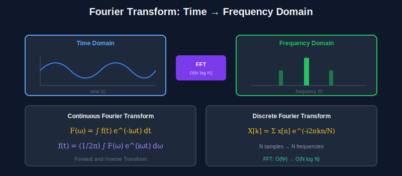
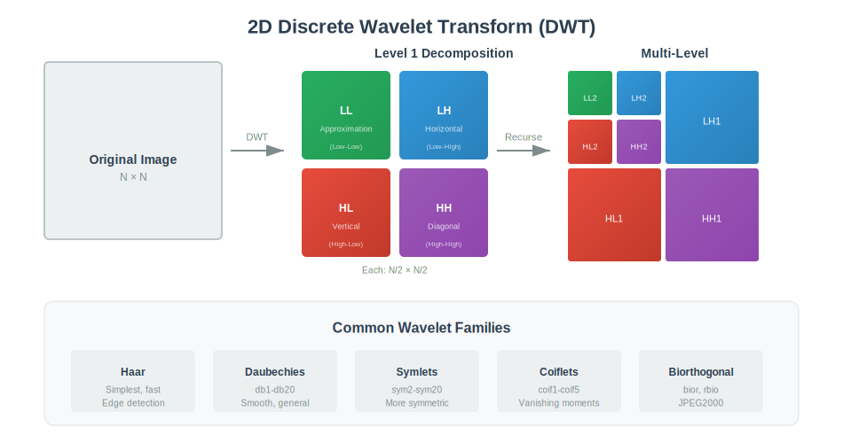

<div align="center">

<br/>

<a href="../01_Mathematical_Foundations/README.md"></a>
&nbsp;&nbsp;&nbsp;&nbsp;&nbsp;
<a href="../README.md"></a>
&nbsp;&nbsp;&nbsp;&nbsp;&nbsp;
<a href="../03_Image_Formation/README.md"></a>

<br/><br/>

---

<br/>

# 🌊 TRANSFORM METHODS

### 🌙 *Frequency Domain Magic*

<br/>


&nbsp;&nbsp;

&nbsp;&nbsp;


<br/><br/>

---

</div>

<br/>

## 🎯 Key Concepts

| Transform | Formula | Use Case |
| :--- | :--- | :--- |
| **DFT** | F(u) = Σ f(x)e^(-j2πux/N) | Frequency analysis |
| **DCT** | C(u) = α(u)Σ f(x)cos[π(2x+1)u/2N] | JPEG compression |
| **Wavelet** | W(a,b) = ∫f(t)ψ*((t-b)/a)dt | Multi-resolution |
| **Gabor** | g(x,y) = exp(-½(x²/σx² + y²/σy²))·exp(j2πfx) | Texture analysis |

---

## 🎨 Visual Overview

<div align="center">

</div>

<div align="center">

</div>

---

## 🔢 Mathematical Foundations

### 1. Fourier Transform

```
┌─────────────────────────────────────────────────────┐
│  CONTINUOUS FOURIER TRANSFORM                       │
│                                                     │
│  F(ω) = ∫_{-∞}^{∞} f(t) e^{-jωt} dt                 │
│                                                     │
│  Inverse: f(t) = (1/2π) ∫ F(ω) e^{jωt} dω           │
│                                                     │
│  2D FOURIER TRANSFORM                               │
│                                                     │
│  F(u,v) = ΣΣ f(x,y) e^{-j2π(ux/M + vy/N)}           │
│                                                     │
│  Properties:                                        │
│  - Linearity: F{af + bg} = aF{f} + bF{g}            │
│  - Convolution: F{f * g} = F{f} · F{g}              │
│  - Shift: F{f(x-a)} = F{f} · e^{-j2πua}             │
└─────────────────────────────────────────────────────┘
```

### 2. Magnitude and Phase

```
┌─────────────────────────────────────────────────────┐
│  COMPLEX REPRESENTATION                             │
│                                                     │
│  F(u,v) = |F(u,v)| e^{jφ(u,v)}                      │
│                                                     │
│  Magnitude: |F(u,v)| = √(Re² + Im²)                 │
│  Phase:     φ(u,v) = arctan(Im/Re)                  │
│                                                     │
│  KEY INSIGHT:                                       │
│  - Magnitude: frequency strength (energy)           │
│  - Phase: frequency location (structure)            │
│  - Phase carries more perceptual information!       │
└─────────────────────────────────────────────────────┘
```

### 3. Discrete Cosine Transform (DCT)

```
┌─────────────────────────────────────────────────────┐
│  DCT-II (JPEG uses this)                            │
│                                                     │
│  C(u) = α(u) Σ_{x=0}^{N-1} f(x) cos[π(2x+1)u/2N]    │
│                                                     │
│  Where α(u) = √(1/N) if u=0, √(2/N) otherwise       │
│                                                     │
│  2D DCT:                                            │
│  C(u,v) = α(u)α(v) ΣΣ f(x,y) cos[...] cos[...]      │
│                                                     │
│  Properties:                                        │
│  - Real-valued (unlike FFT)                         │
│  - Energy compaction (most info in low freq)        │
│  - Basis functions are cosines                      │
└─────────────────────────────────────────────────────┘
```

### 4. Wavelet Transform

```
┌─────────────────────────────────────────────────────┐
│  CONTINUOUS WAVELET TRANSFORM                       │
│                                                     │
│  W(a,b) = (1/√a) ∫ f(t) ψ*((t-b)/a) dt              │
│                                                     │
│  a = scale (dilation)                               │
│  b = translation (position)                         │
│  ψ = mother wavelet                                 │
│                                                     │
│  DISCRETE WAVELET TRANSFORM (DWT)                   │
│                                                     │
│  Uses filter banks:                                 │
│  - Low-pass (approximation): cA = h * f             │
│  - High-pass (detail): cD = g * f                   │
│  - Downsample by 2 after filtering                  │
│                                                     │
│  Multi-level: repeat on approximation               │
└─────────────────────────────────────────────────────┘
```

### 5. Nyquist Sampling Theorem

```
┌─────────────────────────────────────────────────────┐
│  THEOREM                                            │
│                                                     │
│  To perfectly reconstruct signal:                   │
│                                                     │
│  f_s > 2 · f_max  (Nyquist rate)                    │
│                                                     │
│  ALIASING                                           │
│                                                     │
│  If f_s < 2·f_max:                                  │
│  - High frequencies fold into low frequencies       │
│  - Creates artifacts (jaggies, moiré)               │
│                                                     │
│  ANTI-ALIASING                                      │
│  - Low-pass filter before sampling                  │
│  - Remove frequencies > f_s/2                       │
└─────────────────────────────────────────────────────┘
```

---

## ⚙️ Algorithms

### Algorithm 1: 2D FFT

```
┌─────────────────────────────────────────────────────┐
│  INPUT: Image f(x,y) of size M×N                    │
│  OUTPUT: Frequency domain F(u,v)                    │
│                                                     │
│  1. Apply 1D FFT to each row                        │
│  2. Apply 1D FFT to each column of result           │
│  3. Shift zero frequency to center (fftshift)       │
│                                                     │
│  Complexity: O(MN log(MN))                          │
│                                                     │
│  INVERSE:                                           │
│  1. ifftshift to undo centering                     │
│  2. Apply 1D IFFT to each column                    │
│  3. Apply 1D IFFT to each row                       │
└─────────────────────────────────────────────────────┘
```

### Algorithm 2: Frequency Domain Filtering

```
┌─────────────────────────────────────────────────────┐
│  INPUT: Image f, filter H                           │
│  OUTPUT: Filtered image g                           │
│                                                     │
│  1. F = FFT(f)                                      │
│  2. F_shifted = fftshift(F)                         │
│  3. G = F_shifted × H  (element-wise)               │
│  4. G_shifted = ifftshift(G)                        │
│  5. g = real(IFFT(G))                               │
│                                                     │
│  COMMON FILTERS:                                    │
│  Low-pass:  H(u,v) = exp(-(u²+v²)/(2σ²))            │
│  High-pass: H(u,v) = 1 - exp(-(u²+v²)/(2σ²))        │
│  Band-pass: H_low - H_high                          │
└─────────────────────────────────────────────────────┘
```

### Algorithm 3: JPEG Compression (DCT-based)

```
┌─────────────────────────────────────────────────────┐
│  ENCODING:                                          │
│                                                     │
│  1. Convert RGB → YCbCr                             │
│  2. Downsample chroma (4:2:0)                       │
│  3. Split into 8×8 blocks                           │
│  4. FOR each block:                                 │
│     a. Subtract 128 (center around 0)               │
│     b. Apply 2D DCT                                 │
│     c. Quantize: Q_coeff = round(DCT / Q_table)     │
│  5. Zigzag scan (low→high frequency)                │
│  6. Run-length encode zeros                         │
│  7. Huffman encode                                  │
│                                                     │
│  DECODING: Reverse all steps                        │
│  Lossy step: Quantization (information lost)        │
└─────────────────────────────────────────────────────┘
```

### Algorithm 4: DWT Decomposition

```
┌─────────────────────────────────────────────────────┐
│  INPUT: Signal/Image, wavelet type, levels L        │
│  OUTPUT: Approximation + Detail coefficients        │
│                                                     │
│  2D DWT (one level):                                │
│                                                     │
│  1. Apply low-pass h and high-pass g to rows        │
│  2. Downsample by 2                                 │
│  3. Apply h and g to columns of both results        │
│  4. Downsample by 2                                 │
│                                                     │
│  Result: LL (approx), LH, HL, HH (details)          │
│                                                     │
│  Multi-level: Repeat on LL for L levels             │
│                                                     │
│  Common wavelets: Haar, Daubechies, Symlets         │
└─────────────────────────────────────────────────────┘
```

---

## ❓ Interview Questions & Answers

<details>
<summary><b>Q1: Why use Fourier Transform in image processing?</b></summary>

**Answer:**
- **Filtering = multiplication** (faster for large kernels via convolution theorem)
- **Frequency analysis** - understand image content (edges = high freq)
- **Remove periodic noise** (notch filtering)
- **Convolution theorem:** F{f*g} = F{f}·F{g}
- **Compression** - most energy in low frequencies

</details>

<details>
<summary><b>Q2: Fourier vs Wavelet - when to use which?</b></summary>

**Answer:**

| Fourier | Wavelet |
| :--- | :--- |
| Global frequency info | Local time-frequency info |
| Stationary signals | Non-stationary signals |
| Periodic patterns | Transients, edges |
| JPEG compression | JPEG2000 compression |
| Frequency filtering | Multi-resolution analysis |

**Key difference:** Wavelets provide spatial localization

</details>

<details>
<summary><b>Q3: What is the Nyquist theorem?</b></summary>

**Answer:**

**Theorem:** Sampling rate must be > 2× max frequency to avoid aliasing

**Formula:** f_s > 2·f_max

**In images:**
- Pixel spacing determines max resolvable frequency
- Aliasing causes jaggies, moiré patterns
- Solution: Low-pass filter before sampling (anti-aliasing)

</details>

<details>
<summary><b>Q4: How does JPEG compression work?</b></summary>

**Answer:**

1. **Color convert:** RGB → YCbCr
2. **Chroma subsampling:** 4:2:0 (eyes less sensitive to color)
3. **Block DCT:** 8×8 blocks, transform to frequency
4. **Quantization:** Divide by Q-table, round (LOSSY!)
5. **Zigzag scan:** Low to high frequency order
6. **Entropy coding:** RLE + Huffman

**Quality vs Size:** Higher Q values = more quantization = smaller file = lower quality

</details>

<details>
<summary><b>Q5: What is multi-resolution analysis in wavelets?</b></summary>

**Answer:**

**Concept:** Decompose signal into approximation (low-freq) and details (high-freq) at multiple scales

**Process:**
- Level 1: Original → Approx_1 + Detail_1
- Level 2: Approx_1 → Approx_2 + Detail_2
- Continue...

**Each level:** Resolution halves, captures different frequency bands

**Applications:** Denoising, compression, edge detection

</details>

<details>
<summary><b>Q6: What is the difference between DFT and DCT?</b></summary>

**Answer:**

| DFT | DCT |
| :--- | :--- |
| Complex output | Real output |
| Uses complex exponentials | Uses only cosines |
| Assumes periodic signal | Assumes even-symmetric signal |
| No implicit symmetry | Reduces boundary discontinuities |
| Used for analysis | Used for compression (JPEG) |

**Why DCT for compression:** Better energy compaction, no complex numbers

</details>

<details>
<summary><b>Q7: Why does phase carry more structural information?</b></summary>

**Answer:**

**Experiment:** Swap phase between two images
- Keep magnitude of image A, phase of image B
- Result looks like image B!

**Why:** 
- Phase encodes WHERE frequencies occur (edges, features)
- Magnitude encodes HOW MUCH of each frequency
- Our perception relies heavily on structure (phase)

</details>

<details>
<summary><b>Q8: What is a Gabor filter?</b></summary>

**Answer:**

**Definition:** Gaussian envelope × sinusoidal wave

**Formula:** g(x,y) = exp(-½(x²/σx² + y²/σy²)) · exp(j2πf₀x)

**Parameters:**
- σx, σy: Gaussian spread
- f₀: Center frequency
- θ: Orientation

**Use:** Texture analysis (similar to V1 cortex cells)

</details>

---

## 📚 Key Formulas Reference

| Formula | Description |
| :--- | :--- |
| F(u,v) = ΣΣ f(x,y) e^{-j2π(ux/M + vy/N)} | 2D DFT |
| f_s > 2·f_max | Nyquist criterion |
| W(a,b) = ∫f(t)ψ*((t-b)/a)dt | Wavelet transform |
| C(u) = α(u)Σf(x)cos[π(2x+1)u/2N] | DCT-II |
| F{f*g} = F{f}·F{g} | Convolution theorem |


---

<br/>

<div align="center">

## 📓 PRACTICE

### 🚀 *Ready to code? Let's get started!*

<br/>

### 🚀 Open in Google Colab

<br/>

<p align="center">
  <a href="https://colab.research.google.com/github/falkomeAI/Computer-Vision-Tutorial/blob/main/02_Transform_Methods/colab_tutorial.ipynb">
    
  </a>
</p>

<br/>

<p align="center">
  <strong>✨ Click the badge above to open this notebook directly in Google Colab!</strong>
</p>

<br/>


</div>

<br/>


---

<br/>

<div align="center">

| | | |
| :--- |:---:|---:|
| **[◀ Math](../01_Mathematical_Foundations/README.md)** | **[🏠 HOME](../README.md)** | **[Image Formation ▶](../03_Image_Formation/README.md)** |

<br/>

---

🌙 Part of **[Computer Vision Complete](../README.md)**

<p align="center">
  Made with ❤️ by <a href="https://github.com/falkomeAI">falkomeAI</a>
</p>

<p align="center">
  
</p>

<br/>

</div>
