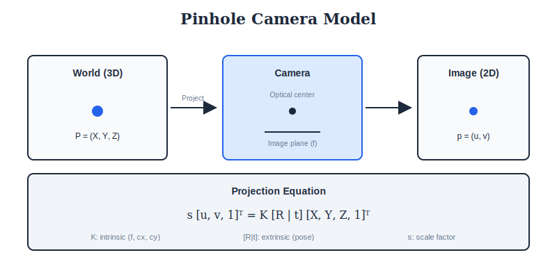

<div align="center">

<br/>

<a href="../02_Transform_Methods/README.md"></a>
&nbsp;&nbsp;&nbsp;&nbsp;
<a href="../README.md"></a>
&nbsp;&nbsp;&nbsp;&nbsp;
<a href="../04_Low_Level_Processing/README.md"></a>

<br/><br/>

---

<br/>

# 📷 IMAGE FORMATION

### 🌙 *How Cameras See*

<br/>


&nbsp;&nbsp;

&nbsp;&nbsp;


<br/><br/>

---

</div>

<br/>

## 📖 Overview

> **Understanding how images are formed is fundamental to computer vision.** This module covers camera models, sensors, optics, color science, and illumination—the physical processes that create the images we process.

<br/>

---

## 🎯 What You'll Learn

<table>
<tr>
<td width="50%">

### 📷 **Camera Models**
- Pinhole projection
- Lens distortion
- Camera calibration
- Intrinsic/extrinsic parameters

</td>
<td width="50%">

### 🔬 **Sensors & Optics**
- CCD vs CMOS
- Bayer pattern & demosaicing
- Thin lens equation
- Depth of field

</td>
</tr>
<tr>
<td width="50%">

### 🎨 **Color Science**
- Color spaces (RGB, HSV, LAB)
- Gamma correction
- Color constancy
- Spectral response

</td>
<td width="50%">

### 💡 **Illumination**
- Lambertian model
- Phong & Blinn-Phong
- BRDF models
- Radiometry basics

</td>
</tr>
</table>

<br/>

---

## 🎯 Key Concepts

| Concept | Formula | Description |
| :--- | :--- | :--- |
| **Pinhole Projection** | `p = K[R\|t]P` | 3D world → 2D image |
| **Intrinsic Matrix** | `K = [f 0 cx; 0 f cy; 0 0 1]` | Camera internal params |
| **Radial Distortion** | `r' = r(1 + k₁r² + k₂r⁴)` | Lens aberration |
| **Thin Lens** | `1/f = 1/do + 1/di` | Focus equation |
| **Sensor Response** | `I = ∫E(λ)S(λ)dλ` | Spectral integration |

---

## 🎨 Visual Overview

<div align="center">

</div>

---

## 🔢 Mathematical Foundations

### Pinhole Camera Geometry

The **pinhole model** projects 3D world points to 2D image:

```
┌─────────────────────────────────────────────────────┐
│  PROJECTION EQUATION                                │
│                                                     │
│  ┌ u ┐   ┌ fx  0  cx ┐ ┌ r11 r12 r13 tx ┐ ┌ X ┐     │
│  │ v │ = │ 0  fy  cy │ │ r21 r22 r23 ty │ │ Y │     │
│  └ 1 ┘   └ 0   0   1 ┘ │ r31 r32 r33 tz │ │ Z │     │
│                        └────────────────┘ └ 1 ┘     │
│           K                   [R|t]         P       │
│      (Intrinsic)           (Extrinsic)    (World)   │
└─────────────────────────────────────────────────────┘
```

**Parameters:**
- `fx, fy`: Focal length in pixels
- `cx, cy`: Principal point (optical center)
- `R`: 3×3 rotation matrix
- `t`: 3×1 translation vector

### Lens Distortion Model

Real lenses introduce distortion:

```
┌─────────────────────────────────────────────────────┐
│  RADIAL DISTORTION                                  │
│                                                     │
│  x_distorted = x(1 + k₁r² + k₂r⁴ + k₃r⁶)            │
│  y_distorted = y(1 + k₁r² + k₂r⁴ + k₃r⁶)            │
│                                                     │
│  where r² = x² + y²                                 │
│                                                     │
│  TANGENTIAL DISTORTION                              │
│                                                     │
│  x_distorted += 2p₁xy + p₂(r² + 2x²)                │
│  y_distorted += p₁(r² + 2y²) + 2p₂xy                │
└─────────────────────────────────────────────────────┘
```

---

## 📷 Pinhole Camera Model

### Algorithm: Camera Calibration

```
┌─────────────────────────────────────────────────────┐
│  ZHANG'S CALIBRATION METHOD                         │
│                                                     │
│  1. Capture N images of checkerboard                │
│  2. Detect corner points in each image              │
│  3. Set up homography equations: H = K[r₁ r₂ t]     │
│  4. Solve for K using constraints:                  │
│     h₁ᵀK⁻ᵀK⁻¹h₂ = 0                                 │
│     h₁ᵀK⁻ᵀK⁻¹h₁ = h₂ᵀK⁻ᵀK⁻¹h₂                       │
│  5. Compute R, t from each H                        │
│  6. Refine with Levenberg-Marquardt                 │
└─────────────────────────────────────────────────────┘
```

### CCD vs CMOS Sensors

| Feature | CCD | CMOS |
| :--- | :--- | :--- |
| **Readout** | Sequential (charge transfer) | Parallel (active pixels) |
| **Noise** | Lower (global shutter) | Higher (rolling shutter) |
| **Power** | Higher | Lower |
| **Speed** | Slower | Faster |
| **Cost** | Higher | Lower |
| **Use** | Scientific, Astronomy | Consumer, Mobile |

---

## 🎨 Color Spaces & Illumination

### Color Space Transformations

| From | To | Use Case |
| :--- | :--- | :--- |
| RGB | HSV | Color-based segmentation |
| RGB | LAB | Perceptually uniform color differences |
| RGB | YCbCr | JPEG compression (separate luminance) |
| RGB | XYZ | Device-independent color matching |

### Illumination Models

| Model | Formula | Properties |
| :--- | :--- | :--- |
| **Lambertian** | `I = kd × (N·L)` | Diffuse, view-independent |
| **Phong** | `I = ka + kd(N·L) + ks(R·V)ⁿ` | Adds specular highlight |
| **Blinn-Phong** | `I = ka + kd(N·L) + ks(N·H)ⁿ` | Faster, uses halfway vector |
| **Cook-Torrance** | Microfacet BRDF | Physically-based |

---

---

## 🎨 Visual Diagrams

<div align="center">

</div>

<br/>

---

## ⚠️ Common Pitfalls

| ❌ Pitfall | ✅ Solution |
| --- | --- |
| Forgetting to undistort images | Always calibrate camera and apply `cv2.undistort()` |
| Confusing intrinsic vs extrinsic | Intrinsic = camera internals, Extrinsic = pose |
| Wrong coordinate system | Remember: OpenCV uses (u,v) with origin at top-left |
| Ignoring gamma correction | Convert to linear space before processing |
| Assuming pinhole model | Real cameras have distortion—calibrate! |

<br/>

---

## 🛠️ Mini Projects

<details>
<summary><b>Project 1: Camera Calibration</b></summary>

- Print a checkerboard pattern
- Capture 10-15 images from different angles
- Use OpenCV's `cv2.calibrateCamera()`
- Compute reprojection error
- Visualize undistorted images

</details>

<details>
<summary><b>Project 2: Color Space Exploration</b></summary>

- Load an image in RGB
- Convert to HSV, LAB, YCbCr
- Segment objects using HSV thresholds
- Compare color distances in RGB vs LAB
- Visualize each channel separately

</details>

<details>
<summary><b>Project 3: Lens Distortion Correction</b></summary>

- Capture images with wide-angle lens
- Detect distortion (barrel/pincushion)
- Apply correction using calibration parameters
- Compare before/after
- Measure improvement using straight lines

</details>

<br/>

---

## ❓ Interview Questions & Answers

<details>
<summary><b>Q1: Explain the pinhole camera model and its parameters.</b></summary>

**Answer:**
The pinhole model projects 3D points to 2D: **p = K[R|t]P**

- **K (Intrinsic Matrix 3×3):**
  - `fx, fy`: Focal length in pixels
  - `cx, cy`: Principal point (optical center)
  - `s`: Skew (usually 0)

- **[R|t] (Extrinsic 3×4):**
  - `R`: Rotation from world to camera (3×3)
  - `t`: Translation from world to camera (3×1)

- **P**: 3D world point (X, Y, Z)
- **p**: 2D image point (u, v)

</details>

<details>
<summary><b>Q2: What is lens distortion and how do you correct it?</b></summary>

**Answer:**
- **Radial distortion**: Barrel (k<0) or pincushion (k>0)
  - `r' = r(1 + k₁r² + k₂r⁴)`
- **Tangential distortion**: From imperfect lens alignment
  - Uses p₁, p₂ coefficients

**Correction:**
1. Calibrate camera to find K, k₁, k₂, p₁, p₂
2. Apply inverse distortion mapping
3. `cv2.undistort(img, K, dist_coeffs)`

</details>

<details>
<summary><b>Q3: CCD vs CMOS - when to use which?</b></summary>

**Answer:**
| Use Case | Sensor | Reason |
| --- | --- | --- |
| Astronomy | CCD | Lower noise, global shutter |
| Smartphone | CMOS | Low power, cheap, fast |
| Industrial | Both | Depends on speed vs accuracy |
| Video | CMOS | High frame rate |

</details>

<details>
<summary><b>Q4: What is the Bayer pattern?</b></summary>

**Answer:**
Color filter array with:
- 50% Green (human eye most sensitive)
- 25% Red
- 25% Blue

**Demosaicing**: Interpolate missing colors at each pixel using neighbors. Algorithms: bilinear, VNG, AHD.

</details>

<details>
<summary><b>Q5: Explain gamma correction.</b></summary>

**Answer:**
- **Problem**: Displays have non-linear response
- **Solution**: Pre-compensate during encoding

```
Encoding:  V_out = V_in^(1/γ)  [γ ≈ 2.2]
Display:   V_display = V_encoded^γ
Result:    Linear response
```

Standard: sRGB uses γ ≈ 2.2

</details>

---

## 📚 Resources

**Textbooks:**
- *Multiple View Geometry* - Hartley & Zisserman (Ch. 6-7)
- *Computer Vision: Algorithms and Applications* - Szeliski (Ch. 2)
- *Digital Image Processing* - Gonzalez & Woods (Ch. 2-3)

**Videos:**
- [Camera Calibration Tutorial](https://docs.opencv.org/master/dc/dbb/tutorial_py_calibration.html)
- [Color Science Explained](https://www.youtube.com/watch?v=as9eNwcrEZo)

<br/>

---

## 📚 Key Formulas Reference

| Formula | Description |
| :--- | :--- |
| `p = K[R\|t]P` | Full projection equation |
| `1/f = 1/do + 1/di` | Thin lens equation |
| `r' = r(1 + k₁r² + k₂r⁴)` | Radial distortion |
| `I = ka + kd(N·L) + ks(R·V)ⁿ` | Phong illumination |
| `E = ∫L(θ,φ)cos(θ)dω` | Irradiance integral |


---

<br/>

<div align="center">

## 📓 PRACTICE

<br/>

### 🚀 Click to Open Directly in Google Colab

<br/>

<a href="https://colab.research.google.com/github/USERNAME/computer_vision_complete/blob/main/03_Image_Formation/colab_tutorial.ipynb">

</a>

<br/><br/>

> ⚠️ **First time?** Push this repo to GitHub, then replace `USERNAME` in the link above with your GitHub username.

<br/>

**Or manually:** [📥 Download](./colab_tutorial.ipynb) → [🌐 Colab](https://colab.research.google.com) → Upload

</div>

<br/>


---

<br/>

<div align="center">

| | | |
|:---|:---:|---:|
| **[◀ Transforms](../02_Transform_Methods/README.md)** | **[🏠 HOME](../README.md)** | **[Processing ▶](../04_Low_Level_Processing/README.md)** |

<br/>

---

🌙 Part of **[Computer Vision Complete](../README.md)** · Made with ❤️

<br/>

</div>
