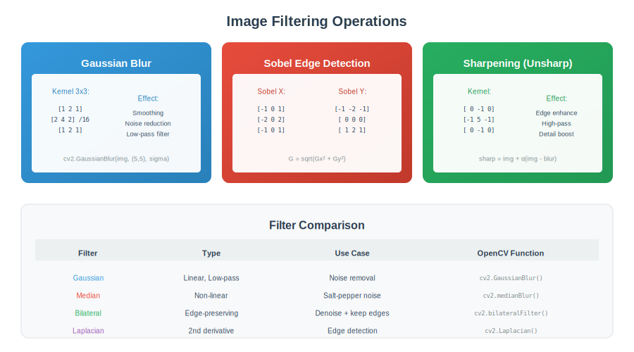

<div align="center">

<br/>

<a href="../03_Image_Formation/README.md"></a>
&nbsp;&nbsp;&nbsp;&nbsp;&nbsp;
<a href="../README.md"></a>
&nbsp;&nbsp;&nbsp;&nbsp;&nbsp;
<a href="../05_Features_Detection/README.md"></a>

<br/><br/>

---

<br/>

# 🎨 LOW-LEVEL PROCESSING

### 🌙 *Pixels & Filters*

<br/>


&nbsp;&nbsp;

&nbsp;&nbsp;


<br/><br/>

---

</div>

<br/>

## 📖 Overview

> 💡 *Get ready to dive deep into the world of computer vision!*

> **Low-level processing forms the foundation of all image analysis.** This module covers filtering, enhancement, noise reduction, edge detection, and morphological operations—the building blocks that prepare images for higher-level tasks.

<br/>

---

## 🎯 What You\'ll Learn

### 🎓 *Master these key concepts:*

<table align="center" width="100%">
<tr>
<td width="50%">

### 🔄 **Filtering**
- Convolution operations
- Gaussian blur
- Bilateral filtering
- Edge-preserving smoothing

</td>
<td width="50%">

### 📊 **Enhancement**
- Histogram equalization
- CLAHE
- Contrast adjustment
- Brightness correction

</td>
</tr>
<tr>
<td width="50%">

### 🔍 **Edge Detection**
- Sobel operators
- Canny edge detector
- Laplacian
- Gradient magnitude

</td>
<td width="50%">

### 🔲 **Morphology**
- Erosion & dilation
- Opening & closing
- Gradient operations
- Structuring elements

</td>
</tr>
</table>

<br/>

---

## 🎯 Key Concepts

| Concept | Description | Use Case |
| :--- | :--- | :--- |
| **Convolution** | Sliding kernel operation | Filtering, blur, edge |
| **Histogram** | Intensity distribution | Contrast, exposure analysis |
| **Noise** | Unwanted signal variations | Denoising required |
| **Edge** | Intensity discontinuity | Object boundaries |
| **Morphology** | Shape-based operations | Binary image processing |

---

## 🎨 Visual Overview

<div align="center">

</div>

---

## 🔢 Mathematical Foundations

### 1. 2D Convolution

```
┌─────────────────────────────────────────────────────┐
│  DISCRETE CONVOLUTION                               │
│                                                     │
│  (f * k)[i,j] = ΣΣ f[i-m, j-n] · k[m,n]             │
│                 m  n                                │
│                                                     │
│  Properties:                                        │
│  - Commutative: f * k = k * f                       │
│  - Associative: (f * k₁) * k₂ = f * (k₁ * k₂)       │
│  - Distributive: f * (k₁ + k₂) = f*k₁ + f*k₂        │
│                                                     │
│  Boundary handling:                                 │
│  - Zero padding, replicate, reflect, wrap           │
└─────────────────────────────────────────────────────┘
```

### 2. Common Kernels

```
┌─────────────────────────────────────────────────────┐
│  BOX BLUR (3×3)         GAUSSIAN (3×3, σ≈0.85)      │
│                                                     │
│  1/9 [1 1 1]            1/16 [1 2 1]                │
│      [1 1 1]                 [2 4 2]                │
│      [1 1 1]                 [1 2 1]                │
│                                                     │
│  SOBEL Gx               SOBEL Gy                    │
│                                                     │
│  [-1 0 1]               [-1 -2 -1]                  │
│  [-2 0 2]               [ 0  0  0]                  │
│  [-1 0 1]               [ 1  2  1]                  │
│                                                     │
│  LAPLACIAN              SHARPEN                     │
│                                                     │
│  [0  1  0]              [ 0 -1  0]                  │
│  [1 -4  1]              [-1  5 -1]                  │
│  [0  1  0]              [ 0 -1  0]                  │
└─────────────────────────────────────────────────────┘
```

### 3. Histogram Operations

```
┌─────────────────────────────────────────────────────┐
│  HISTOGRAM h(r):                                    │
│  h(rₖ) = nₖ  (number of pixels with value rₖ)       │
│                                                     │
│  HISTOGRAM EQUALIZATION                             │
│  s = T(r) = (L-1) · Σⱼ₌₀ʳ p(rⱼ)                     │
│                                                     │
│  where p(r) = h(r) / (M×N)  (normalized histogram)  │
│                                                     │
│  CLAHE (Contrast Limited AHE):                      │
│  1. Divide image into tiles                         │
│  2. Equalize each tile separately                   │
│  3. Clip histogram at limit, redistribute           │
│  4. Bilinear interpolate at tile boundaries         │
└─────────────────────────────────────────────────────┘
```

### 4. Noise Models

```
┌─────────────────────────────────────────────────────┐
│  GAUSSIAN NOISE                                     │
│  p(z) = (1/√2πσ) exp(-(z-μ)²/2σ²)                   │
│                                                     │
│  SALT & PEPPER NOISE                                │
│  p(z) = Pₐ if z=a (pepper), Pᵦ if z=b (salt)        │
│                                                     │
│  POISSON (SHOT) NOISE                               │
│  p(k) = λᵏe⁻λ / k!                                  │
│  Signal-dependent (common in low light)             │
│                                                     │
│  SNR = 10 log₁₀(signal_power / noise_power) dB      │
└─────────────────────────────────────────────────────┘
```

### 5. Edge Detection

```
┌─────────────────────────────────────────────────────┐
│  GRADIENT MAGNITUDE & DIRECTION                     │
│                                                     │
│  G = √(Gx² + Gy²)                                   │
│  θ = atan2(Gy, Gx)                                  │
│                                                     │
│  CANNY EDGE DETECTION:                              │
│  1. Gaussian smoothing                              │
│  2. Compute gradient (Sobel)                        │
│  3. Non-maximum suppression                         │
│  4. Double thresholding + hysteresis                │
│                                                     │
│  LAPLACIAN (2nd derivative):                        │
│  ∇²f = ∂²f/∂x² + ∂²f/∂y²                            │
│  Zero-crossings indicate edges                      │
└─────────────────────────────────────────────────────┘
```

### 6. Morphological Operations

```
┌─────────────────────────────────────────────────────┐
│  DILATION:  (A ⊕ B) = {z | (B̂)ᵤ ∩ A ≠ ∅}           │
│  Expands foreground                                 │
│                                                     │
│  EROSION:   (A ⊖ B) = {z | (B)ᵤ ⊆ A}                │
│  Shrinks foreground                                 │
│                                                     │
│  OPENING:   A ∘ B = (A ⊖ B) ⊕ B                     │
│  Removes small bright regions                       │
│                                                     │
│  CLOSING:   A • B = (A ⊕ B) ⊖ B                     │
│  Fills small dark regions                           │
│                                                     │
│  GRADIENT:  (A ⊕ B) - (A ⊖ B)                       │
│  Edge detection for binary images                   │
└─────────────────────────────────────────────────────┘
```

---

## ⚙️ Algorithms

### Algorithm 1: Gaussian Blur

```
┌─────────────────────────────────────────────────────┐
│  INPUT: Image I, sigma σ                            │
│  OUTPUT: Blurred image                              │
│                                                     │
│  1. Compute kernel size: k = ceil(6σ) | 1           │
│  2. Create 2D Gaussian kernel:                      │
│     G[x,y] = exp(-(x²+y²)/(2σ²)) / (2πσ²)           │
│  3. Normalize kernel: K = G / sum(G)                │
│  4. Convolve: output = I * K                        │
│                                                     │
│  SEPARABLE (faster):                                │
│  1. Create 1D kernel: g[x] = exp(-x²/(2σ²))         │
│  2. Convolve rows: temp = convolve_1d(I, g)         │
│  3. Convolve cols: output = convolve_1d(temp.T, g)  │
└─────────────────────────────────────────────────────┘
```

### Algorithm 2: Bilateral Filter

```
┌─────────────────────────────────────────────────────┐
│  INPUT: Image I, spatial σₛ, range σᵣ               │
│  OUTPUT: Edge-preserving smoothed image             │
│                                                     │
│  FOR each pixel p:                                  │
│    Wₚ = 0                                           │
│    Iₚ' = 0                                          │
│    FOR each neighbor q in window:                   │
│      spatial = exp(-||p-q||² / (2σₛ²))              │
│      range = exp(-(I[p]-I[q])² / (2σᵣ²))            │
│      w = spatial × range                            │
│      Wₚ += w                                        │
│      Iₚ' += w × I[q]                                │
│    output[p] = Iₚ' / Wₚ                             │
│                                                     │
│  Key: Range term preserves edges                    │
└─────────────────────────────────────────────────────┘
```

### Algorithm 3: Canny Edge Detection

```
┌─────────────────────────────────────────────────────┐
│  INPUT: Image I, σ, low_thresh, high_thresh         │
│  OUTPUT: Edge map (binary)                          │
│                                                     │
│  1. SMOOTH: G = GaussianBlur(I, σ)                  │
│                                                     │
│  2. GRADIENT:                                       │
│     Gx = Sobel_x(G)                                 │
│     Gy = Sobel_y(G)                                 │
│     mag = √(Gx² + Gy²)                              │
│     dir = atan2(Gy, Gx)                             │
│                                                     │
│  3. NON-MAX SUPPRESSION:                            │
│     Thin edges by keeping only local maxima         │
│     along gradient direction                        │
│                                                     │
│  4. DOUBLE THRESHOLD:                               │
│     strong = mag > high_thresh                      │
│     weak = low_thresh < mag < high_thresh           │
│                                                     │
│  5. HYSTERESIS:                                     │
│     Keep weak edges connected to strong edges       │
└─────────────────────────────────────────────────────┘
```

---

---

## 🎨 Visual Diagrams

<div align="center">

</div>

<br/>

---

## ⚠️ Common Pitfalls

| ❌ Pitfall | ✅ Solution |
| --- | --- |
| Using wrong kernel size | Gaussian: k = 6σ+1 (odd), Canny: σ=1-2 |
| Forgetting edge handling | Use `cv2.BORDER_REFLECT` or `BORDER_CONSTANT` |
| Over-smoothing edges | Use bilateral filter instead of Gaussian |
| Wrong histogram bins | Use 256 for 8-bit images, 2^bits otherwise |
| Morphology on wrong image type | Convert to binary first for morphology |

<br/>

---

## 🛠️ Mini Projects

<details>
<summary><b>Project 1: Noise Reduction Comparison</b></summary>

- Add Gaussian and salt-and-pepper noise
- Compare: Gaussian blur, median filter, bilateral filter
- Measure PSNR/SSIM for each method
- Visualize results side-by-side
- Analyze which works best for each noise type

</details>

<details>
<summary><b>Project 2: Edge Detection Pipeline</b></summary>

- Implement Sobel, Prewitt, Canny from scratch
- Compare edge maps
- Tune Canny thresholds interactively
- Apply to different image types (natural, medical, etc.)
- Evaluate edge quality metrics

</details>

<details>
<summary><b>Project 3: Histogram Equalization</b></summary>

- Implement global histogram equalization
- Implement CLAHE with different tile sizes
- Compare results on low-contrast images
- Apply to color images (per channel vs HSV)
- Measure contrast improvement

</details>

<br/>

---

## ❓ Interview Questions & Answers

<details>
<summary><b>Q1: What's the difference between correlation and convolution?</b></summary>

**Convolution:** Kernel is flipped (180° rotation)
**Correlation:** Kernel is NOT flipped

For symmetric kernels (Gaussian), they're identical.

**Formula:**
- Convolution: f * k = Σ f[i-m] · k[m]
- Correlation: f ⊗ k = Σ f[i+m] · k[m]

</details>

<details>
<summary><b>Q2: Why is Gaussian blur separable?</b></summary>

**Answer:** 2D Gaussian = product of two 1D Gaussians

G(x,y) = G(x) × G(y)

**Benefit:** O(n²k²) → O(n²k) where k = kernel size

**Example:** 9×9 kernel: 81 ops → 18 ops per pixel

</details>

<details>
<summary><b>Q3: How does histogram equalization work?</b></summary>

**Steps:**
1. Compute histogram h(r)
2. Compute CDF: T(r) = Σ p(rⱼ) for j=0 to r
3. Map: s = (L-1) × T(r)

**Result:** Output has approximately uniform histogram

**Limitation:** Global method, may over-enhance

**Solution:** CLAHE - adaptive, with clip limit

</details>

<details>
<summary><b>Q4: What is bilateral filtering?</b></summary>

**Edge-preserving smoothing** that uses:
- Spatial proximity (like Gaussian)
- Intensity similarity (range filter)

**Formula:** w = exp(-spatial²/2σₛ²) × exp(-intensity_diff²/2σᵣ²)

**Properties:**
- Smooths flat regions
- Preserves edges (large intensity differences get low weight)
- Non-linear, expensive

</details>

<details>
<summary><b>Q5: Explain morphological opening vs closing.</b></summary>

**Opening (erosion then dilation):**
- Removes small bright spots (noise)
- Smooths object boundaries
- Disconnects thin bridges

**Closing (dilation then erosion):**
- Fills small dark holes
- Connects nearby objects
- Smooths inner boundaries

**Property:** Both are idempotent (f∘f = f)

</details>

<details>
<summary><b>Q6: Why does Canny use double thresholding?</b></summary>

**Single threshold problem:**
- Too high: breaks edges
- Too low: keeps noise

**Double threshold solution:**
- Strong edges (> high) definitely kept
- Weak edges (between) kept IF connected to strong
- Below low: definitely noise

**Hysteresis:** Follows weak edges connected to strong

</details>

---

## 📚 Resources

**Textbooks:**
- *Digital Image Processing* - Gonzalez & Woods (Ch. 3-5, 9)
- *Computer Vision: Algorithms and Applications* - Szeliski (Ch. 3)

**Videos:**
- [OpenCV Filtering Tutorial](https://docs.opencv.org/master/d4/d13/tutorial_py_filtering.html)
- [Canny Edge Detection Explained](https://www.youtube.com/watch?v=sRFM5IEqR6w)

<br/>

---

## 📚 Key Formulas Reference

| Formula | Description |
| :--- | :--- |
| (f * k)[i,j] = ΣΣ f[i-m,j-n]·k[m,n] | 2D Convolution |
| G = √(Gx² + Gy²) | Gradient magnitude |
| s = (L-1)·Σp(rⱼ) | Histogram equalization |
| (A ∘ B) = (A ⊖ B) ⊕ B | Morphological opening |
| w = spatial × range | Bilateral filter weight |


---

<br/>

<div align="center">

## 📓 PRACTICE

### 🚀 *Ready to code? Let\'s get started!*

<br/>

### 🚀 Open in Google Colab

<br/>

<p align="center">
  <a href="https://colab.research.google.com/github/falkomeAi/computer_vision_complete/blob/main/04_Low_Level_Processing/colab_tutorial.ipynb">
    
  </a>
</p>

<br/>

<p align="center">
  <strong>✨ Click the badge above to open this notebook directly in Google Colab!</strong>
</p>

<br/>


</div>

<br/>


---

<br/>

<div align="center">

| | | |
| :--- |:---:|---:|
| **[◀ Formation](../03_Image_Formation/README.md)** | **[🏠 HOME](../README.md)** | **[Features ▶](../05_Features_Detection/README.md)** |

<br/>

---

🌙 Part of **[Computer Vision Complete](../README.md)**

<p align="center">
  Made with ❤️ by <a href="https://github.com/falkomeAi">falkomeAi</a>
</p>

<p align="center">
  
</p>

<br/>

</div>
