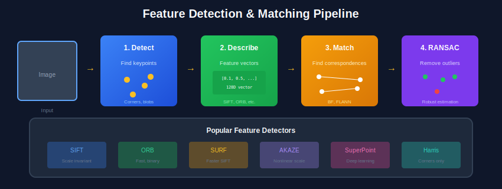
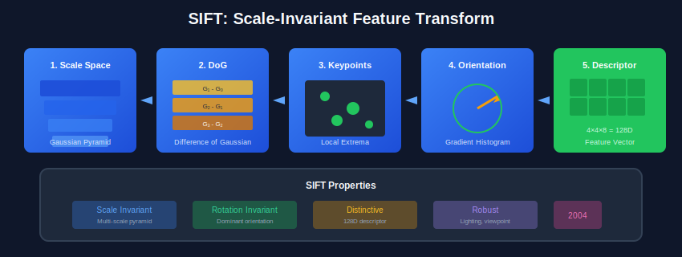

<div align="center">

<br/>

<a href="../04_Low_Level_Processing/README.md"></a>
&nbsp;&nbsp;&nbsp;&nbsp;
<a href="../README.md"></a>
&nbsp;&nbsp;&nbsp;&nbsp;
<a href="../06_Geometry_MultiView/README.md"></a>

<br/><br/>

---

<br/>

# 🎯 FEATURE DETECTION

### 🌙 *Finding What Matters*

<br/>


&nbsp;&nbsp;

&nbsp;&nbsp;


<br/><br/>

---

</div>

<br/>

## 📖 Overview

> **Feature detection and description enable matching and tracking across images.** This module covers corner detection (Harris), scale-invariant features (SIFT), binary descriptors (ORB), and matching algorithms—essential for panorama stitching, 3D reconstruction, and SLAM.

<br/>

---

## 🎯 What You'll Learn

<table>
<tr>
<td width="50%">

### 🔍 **Keypoint Detection**
- Harris corner detection
- FAST keypoints
- Scale-space (SIFT)
- Blob detection (LoG/DoG)

</td>
<td width="50%">

### 📝 **Descriptors**
- SIFT (128-D)
- ORB (256-bit binary)
- BRIEF
- HOG features

</td>
</tr>
<tr>
<td width="50%">

### 🔗 **Matching**
- Ratio test (Lowe)
- Hamming distance
- RANSAC verification
- Homography estimation

</td>
<td width="50%">

### 🎯 **Applications**
- Panorama stitching
- Object tracking
- 3D reconstruction
- Visual SLAM

</td>
</tr>
</table>

<br/>

---

## 🎯 Key Concepts

| Concept | Description | Use Case |
| :--- | :--- | :--- |
| **Corner** | Point with strong gradients in 2 directions | Tracking, matching |
| **Blob** | Region different from surroundings | Object detection |
| **Keypoint** | Interesting point with location, scale, orientation | Feature matching |
| **Descriptor** | Vector describing local patch around keypoint | Matching across images |
| **Feature Matching** | Finding corresponding keypoints between images | Panorama, 3D reconstruction |

---

## 🎨 Visual Overview

<div align="center">

</div>

---

## 🔢 Mathematical Foundations

### 1. Harris Corner Detection

```
┌─────────────────────────────────────────────────────┐
│  STRUCTURE TENSOR (Second Moment Matrix)            │
│                                                     │
│       ┌                    ┐                        │
│  M =  │  Σ Ix²    Σ IxIy  │  weighted by Gaussian   │
│       │  Σ IxIy   Σ Iy²   │                         │
│       └                    ┘                        │
│                                                     │
│  CORNER RESPONSE                                    │
│                                                     │
│  R = det(M) - k·trace(M)²                           │
│  R = λ₁λ₂ - k(λ₁ + λ₂)²                             │
│                                                     │
│  k ≈ 0.04 - 0.06 (empirical)                        │
│                                                     │
│  R > threshold → CORNER                             │
│  R < 0 → EDGE                                       │
│  |R| small → FLAT                                   │
└─────────────────────────────────────────────────────┘
```

### 2. Scale-Space for Blob Detection

```
┌─────────────────────────────────────────────────────┐
│  LAPLACIAN OF GAUSSIAN (LoG)                        │
│                                                     │
│  LoG(x,y,σ) = ∂²G/∂x² + ∂²G/∂y²                     │
│                                                     │
│  Scale-normalized: σ² · LoG                         │
│                                                     │
│  DIFFERENCE OF GAUSSIAN (DoG) - Approximation       │
│                                                     │
│  DoG ≈ (k-1)σ² ∇²G                                  │
│  DoG(x,y,σ) = G(x,y,kσ) - G(x,y,σ)                  │
│                                                     │
│  Used in SIFT: k = √2                               │
└─────────────────────────────────────────────────────┘
```

### 3. SIFT Descriptor

```
┌─────────────────────────────────────────────────────┐
│  SIFT DESCRIPTOR (128-D)                            │
│                                                     │
│  1. Take 16×16 patch around keypoint                │
│  2. Divide into 4×4 grid of cells                   │
│  3. Compute 8-bin gradient histogram per cell       │
│  4. Concatenate: 4×4×8 = 128 dimensions             │
│  5. Normalize to unit length                        │
│                                                     │
│  Gradient magnitude: m = √(Lx² + Ly²)               │
│  Gradient orientation: θ = atan2(Ly, Lx)            │
│                                                     │
│  Properties:                                        │
│  - Scale invariant (normalized to keypoint scale)   │
│  - Rotation invariant (aligned to dominant orient)  │
│  - Illumination robust (normalized descriptor)      │
└─────────────────────────────────────────────────────┘
```

### 4. ORB (Oriented FAST and Rotated BRIEF)

```
┌─────────────────────────────────────────────────────┐
│  FAST Keypoint Detection                            │
│                                                     │
│  - Check 16 pixels on circle of radius 3            │
│  - If N contiguous pixels brighter/darker than      │
│    center by threshold → corner                     │
│  - Very fast: uses decision tree                    │
│                                                     │
│  BRIEF Descriptor (Binary)                          │
│                                                     │
│  - 256 pairs of pixel locations                     │
│  - Compare intensities: τ(p,q) = 1 if I(p) < I(q)   │
│  - Result: 256-bit binary string                    │
│                                                     │
│  ORB adds:                                          │
│  - Orientation from intensity centroid              │
│  - Steered BRIEF for rotation invariance            │
│                                                     │
│  Matching: Hamming distance (XOR + popcount)        │
└─────────────────────────────────────────────────────┘
```

### 5. HOG (Histogram of Oriented Gradients)

```
┌─────────────────────────────────────────────────────┐
│  HOG FEATURE COMPUTATION                            │
│                                                     │
│  1. Divide image into cells (8×8 pixels)            │
│  2. Compute gradient magnitude & orientation        │
│  3. Create 9-bin histogram per cell                 │
│  4. Group cells into blocks (2×2 cells)             │
│  5. L2-normalize each block                         │
│                                                     │
│  For 64×128 detection window:                       │
│  - 8×16 cells                                       │
│  - 7×15 blocks (overlapping)                        │
│  - 7×15×4×9 = 3780 dimensions                       │
│                                                     │
│  Bin interpolation:                                 │
│  - Trilinear: spatial (x,y) + orientation (θ)       │
└─────────────────────────────────────────────────────┘
```

---

## ⚙️ Algorithms

### Algorithm 1: Harris Corner Detection

```
┌─────────────────────────────────────────────────────┐
│  INPUT: Image I, k, threshold                       │
│  OUTPUT: Corner locations                           │
│                                                     │
│  1. Compute gradients: Ix = ∂I/∂x, Iy = ∂I/∂y       │
│  2. Compute products: Ix², Iy², IxIy                │
│  3. Apply Gaussian window w to each product         │
│  4. For each pixel (x,y):                           │
│     a. M = [Σw·Ix²  Σw·IxIy]                        │
│            [Σw·IxIy Σw·Iy² ]                        │
│     b. R = det(M) - k·trace(M)²                     │
│  5. Non-maximum suppression on R                    │
│  6. Return pixels where R > threshold               │
└─────────────────────────────────────────────────────┘
```

### Algorithm 2: SIFT Keypoint Detection

```
┌─────────────────────────────────────────────────────┐
│  INPUT: Image I                                     │
│  OUTPUT: Keypoints with (x, y, scale, orientation)  │
│                                                     │
│  1. BUILD SCALE SPACE:                              │
│     - Multiple octaves (each half resolution)       │
│     - 5 scales per octave (σ, kσ, k²σ, ...)         │
│                                                     │
│  2. COMPUTE DoG:                                    │
│     - DoG = G(kσ) - G(σ) between adjacent scales    │
│                                                     │
│  3. FIND EXTREMA:                                   │
│     - Compare each pixel to 26 neighbors            │
│       (8 spatial + 9 above + 9 below)               │
│                                                     │
│  4. REFINE LOCATION:                                │
│     - Sub-pixel via Taylor expansion                │
│     - Reject low contrast & edge responses          │
│                                                     │
│  5. ASSIGN ORIENTATION:                             │
│     - 36-bin histogram in local region              │
│     - Dominant peak(s) → keypoint orientation(s)    │
└─────────────────────────────────────────────────────┘
```

### Algorithm 3: Feature Matching with Ratio Test

```
┌─────────────────────────────────────────────────────┐
│  INPUT: Descriptors D1, D2                          │
│  OUTPUT: Matched pairs                              │
│                                                     │
│  FOR each descriptor d1 in D1:                      │
│    1. Compute distance to all d2 in D2              │
│    2. Find nearest (dist1) and 2nd nearest (dist2)  │
│    3. IF dist1/dist2 < ratio (0.75):                │
│         Accept match (d1, nearest d2)               │
│       ELSE:                                         │
│         Reject as ambiguous                         │
│                                                     │
│  For binary descriptors (ORB):                      │
│    - Distance = Hamming = popcount(d1 XOR d2)       │
│                                                     │
│  For float descriptors (SIFT):                      │
│    - Distance = L2 = ||d1 - d2||                    │
└─────────────────────────────────────────────────────┘
```

### Algorithm 4: RANSAC for Geometric Verification

```
┌─────────────────────────────────────────────────────┐
│  INPUT: Matched points, threshold, iterations       │
│  OUTPUT: Homography H, inlier mask                  │
│                                                     │
│  best_H = None                                      │
│  best_inliers = 0                                   │
│                                                     │
│  FOR i = 1 to iterations:                           │
│    1. Random sample 4 point pairs                   │
│    2. Compute H from 4 correspondences (DLT)        │
│    3. FOR each match:                               │
│         error = ||p2 - H·p1||                       │
│         IF error < threshold: count as inlier       │
│    4. IF inliers > best_inliers:                    │
│         best_H = H                                  │
│         best_inliers = inliers                      │
│                                                     │
│  Refine best_H using all inliers                    │
│  RETURN best_H, inlier_mask                         │
└─────────────────────────────────────────────────────┘
```

---

---

## 🎨 Visual Diagrams

<div align="center">

</div>

<br/>

---

## ⚠️ Common Pitfalls

| ❌ Pitfall | ✅ Solution |
| --- | --- |
| Not using ratio test | Always use ratio test (0.75) to reject ambiguous matches |
| Wrong distance metric | Use Hamming for binary (ORB), L2 for float (SIFT) |
| Insufficient RANSAC iterations | Compute N = log(1-p)/log(1-w^n) for confidence |
| Ignoring scale/rotation | Use scale/rotation invariant descriptors (SIFT, ORB) |
| Too many keypoints | Use non-maximum suppression and response thresholding |

<br/>

---

## 🛠️ Mini Projects

<details>
<summary><b>Project 1: Panorama Stitching</b></summary>

- Capture overlapping images
- Detect keypoints (SIFT/ORB)
- Match features with ratio test
- Estimate homography with RANSAC
- Warp and blend images
- Create seamless panorama

</details>

<details>
<summary><b>Project 2: Feature Matching Visualization</b></summary>

- Implement Harris corner detection
- Extract SIFT descriptors
- Match features between image pairs
- Visualize matches with lines
- Compare SIFT vs ORB matching quality
- Measure matching accuracy

</details>

<details>
<summary><b>Project 3: Object Tracking</b></summary>

- Detect keypoints in first frame
- Track across video using Lucas-Kanade
- Handle occlusion and re-detection
- Compare with feature matching approach
- Evaluate tracking accuracy

</details>

<br/>

---

## ❓ Interview Questions & Answers

<details>
<summary><b>Q1: SIFT vs ORB - when to use which?</b></summary>

| SIFT | ORB |
| :--- | :--- |
| 128D float descriptor | 256-bit binary |
| Scale + rotation invariant | Rotation invariant only |
| Slower (~10 ms/image) | ~100x faster (~0.1 ms) |
| More accurate matching | Good enough for real-time |
| Patented (was, now free) | Free from start |

**Use SIFT:** When accuracy matters (3D reconstruction)
**Use ORB:** Real-time applications (AR, SLAM)

</details>

<details>
<summary><b>Q2: How does Harris corner detection work?</b></summary>

**Steps:**
1. Compute image gradients Ix, Iy (Sobel)
2. Build structure tensor M (second moment matrix)
3. Compute corner response R = det(M) - k·trace(M)²
4. Non-maximum suppression
5. Threshold to get corners

**Intuition:**
- **R > 0 (large):** Corner (λ₁, λ₂ both large)
- **R < 0:** Edge (one λ large, one small)
- **R ≈ 0:** Flat region (both λ small)

</details>

<details>
<summary><b>Q3: What is the ratio test in feature matching?</b></summary>

**Lowe's Ratio Test:**
- Find best match (distance d1) and second-best match (d2)
- Accept match if d1/d2 < 0.75
- Rejects ambiguous matches where multiple features are similar

**Why it works:** Good matches have unique nearest neighbor; bad matches have multiple similar candidates.

</details>

<details>
<summary><b>Q4: How does RANSAC work?</b></summary>

**Algorithm:**
1. **Sample:** Pick minimal set (4 for homography)
2. **Fit:** Compute model from sample
3. **Score:** Count inliers (points fitting model within threshold)
4. **Repeat:** N iterations, keep best model
5. **Refine:** Re-estimate using all inliers

**Key parameters:**
- N iterations: `log(1-p) / log(1-wⁿ)` where p=success prob, w=inlier ratio, n=sample size
- Threshold: typically 3-5 pixels for geometric models

</details>

<details>
<summary><b>Q5: Why is HOG good for pedestrian detection?</b></summary>

**Reasons:**
1. **Captures shape:** Gradients encode edges and contours
2. **Robust to illumination:** Gradient-based, block normalization
3. **Local + global:** Cells capture local, blocks capture spatial arrangement
4. **Proven:** Dalal & Triggs showed state-of-art results on INRIA dataset

**Limitations:** Fixed window size, sensitive to occlusion, replaced by CNNs

</details>

<details>
<summary><b>Q6: What is scale-space and why is it important?</b></summary>

**Scale-space:** Family of smoothed images at multiple scales (Gaussian pyramid)

**Importance:**
- Objects appear at different sizes
- Features should be detected at their natural scale
- SIFT finds keypoints as extrema across scale

**Mathematical basis:** Gaussian is the only kernel satisfying scale-space axioms (no spurious details at coarser scales)

</details>

<details>
<summary><b>Q7: How is rotation invariance achieved in SIFT?</b></summary>

**Steps:**
1. Compute gradient orientations in region around keypoint
2. Build 36-bin orientation histogram
3. Find dominant orientation (peak)
4. Assign orientation to keypoint
5. Rotate descriptor coordinate system to canonical orientation

**Result:** Same feature produces same descriptor regardless of image rotation

</details>

---

## 📚 Resources

**Papers:**
- [SIFT (2004)](https://www.cs.ubc.ca/~lowe/papers/ijcv04.pdf) - Lowe
- [ORB (2011)](https://ieeexplore.ieee.org/document/6126544) - Rublee et al.
- [Harris Corner (1988)](https://www.cs.cmu.edu/~16385/s17/Slides/6.1_Harris_Corner_Detector.pdf)

**Videos:**
- [SIFT Explained](https://www.youtube.com/watch?v=NPcMS49V5hg)
- [Feature Matching Tutorial](https://docs.opencv.org/master/dc/dc3/tutorial_py_matcher.html)

<br/>

---

## 📚 Key Formulas Reference

| Formula | Description |
| :--- | :--- |
| R = det(M) - k·trace(M)² | Harris corner response |
| DoG ≈ G(kσ) - G(σ) | Difference of Gaussian |
| m = √(Ix² + Iy²) | Gradient magnitude |
| θ = atan2(Iy, Ix) | Gradient orientation |
| d = popcount(d1 XOR d2) | Hamming distance |


---

<br/>

<div align="center">

## 📓 PRACTICE

<br/>

### 🚀 Click to Open Directly in Google Colab

<br/>

<a href="https://colab.research.google.com/github/USERNAME/computer_vision_complete/blob/main/05_Features_Detection/colab_tutorial.ipynb">

</a>

<br/><br/>

> ⚠️ **First time?** Push this repo to GitHub, then replace `USERNAME` in the link above with your GitHub username.

<br/>

**Or manually:** [📥 Download](./colab_tutorial.ipynb) → [🌐 Colab](https://colab.research.google.com) → Upload

</div>

<br/>


---

<br/>

<div align="center">

| | | |
|:---|:---:|---:|
| **[◀ Processing](../04_Low_Level_Processing/README.md)** | **[🏠 HOME](../README.md)** | **[Geometry ▶](../06_Geometry_MultiView/README.md)** |

<br/>

---

🌙 Part of **[Computer Vision Complete](../README.md)** · Made with ❤️

<br/>

</div>
