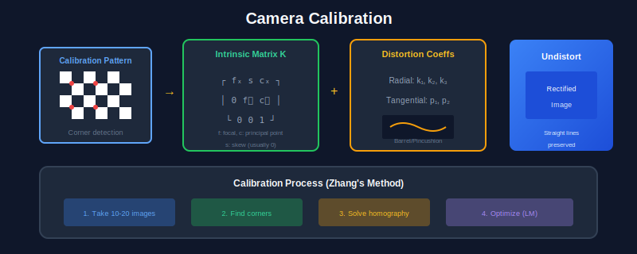

<div align="center">

# 📐 Geometry & Multi-View Vision

### *Camera Models, Epipolar Geometry, SfM, SLAM*

[](https://colab.research.google.com/drive/1geometry)

</div>

---

**Navigation:** [← Feature Detection](../05_Features_Detection/) | [🏠 Home](../README.md) | [Classical ML →](../07_Classical_ML/)

---

## 📖 Table of Contents
- [Complete Colab Code](#-complete-colab-code)
- [Camera Calibration](#-camera-calibration)
- [Epipolar Geometry](#-epipolar-geometry)
- [Homography](#-homography)
- [Interview Q&A](#-interview-questions--answers)

---

## 🎨 Visual Diagrams

<div align="center">

</div>

<div align="center">

</div>

<div align="center">

</div>

---

## 📓 Complete Colab Code

```python
#@title 📐 Multi-View Geometry - Complete Tutorial
#@markdown Camera Models, Homography, Epipolar, Bundle Adjustment!

!pip install opencv-python-headless numpy matplotlib scipy -q

import cv2
import numpy as np
import matplotlib.pyplot as plt
from mpl_toolkits.mplot3d import Axes3D
from scipy.optimize import least_squares

print("✅ Setup complete!")

#@title 1️⃣ Camera Projection Model

def camera_projection_demo():
    """Understand camera projection: World → Image"""
    
    # Intrinsic matrix K
    fx, fy = 800, 800  # Focal length (pixels)
    cx, cy = 320, 240  # Principal point
    K = np.array([
        [fx, 0, cx],
        [0, fy, cy],
        [0, 0, 1]
    ])
    
    # Extrinsic matrix [R|t] - camera at (0,0,-5) looking at origin
    R = np.eye(3)  # No rotation
    t = np.array([[0], [0], [5]])  # Camera 5 units back
    
    # Projection matrix P = K[R|t]
    Rt = np.hstack([R, t])
    P = K @ Rt
    
    # 3D World points (cube)
    cube_3d = np.array([
        [-1, -1, 0, 1],  # Bottom-left-front
        [1, -1, 0, 1],   # Bottom-right-front
        [1, 1, 0, 1],    # Top-right-front
        [-1, 1, 0, 1],   # Top-left-front
        [-1, -1, 2, 1],  # Bottom-left-back
        [1, -1, 2, 1],   # Bottom-right-back
        [1, 1, 2, 1],    # Top-right-back
        [-1, 1, 2, 1],   # Top-left-back
    ]).T  # 4 x 8
    
    # Project to image
    projected = P @ cube_3d  # 3 x 8
    projected_2d = projected[:2] / projected[2:]  # Divide by z
    
    # Visualize
    fig = plt.figure(figsize=(14, 5))
    
    # 3D View
    ax1 = fig.add_subplot(131, projection='3d')
    edges = [(0,1), (1,2), (2,3), (3,0), 
             (4,5), (5,6), (6,7), (7,4),
             (0,4), (1,5), (2,6), (3,7)]
    for e in edges:
        ax1.plot3D([cube_3d[0,e[0]], cube_3d[0,e[1]]],
                  [cube_3d[1,e[0]], cube_3d[1,e[1]]],
                  [cube_3d[2,e[0]], cube_3d[2,e[1]]], 'b-')
    ax1.scatter(0, 0, -5, s=200, c='red', marker='^', label='Camera')
    ax1.set_xlabel('X'); ax1.set_ylabel('Y'); ax1.set_zlabel('Z')
    ax1.set_title('3D World')
    ax1.legend()
    
    # 2D Projection
    ax2 = fig.add_subplot(132)
    for e in edges:
        ax2.plot([projected_2d[0,e[0]], projected_2d[0,e[1]]],
                [projected_2d[1,e[0]], projected_2d[1,e[1]]], 'b-')
    ax2.scatter(projected_2d[0], projected_2d[1], c='red', s=30)
    ax2.set_xlim(0, 640); ax2.set_ylim(480, 0)
    ax2.set_xlabel('u (pixels)'); ax2.set_ylabel('v (pixels)')
    ax2.set_title('2D Image')
    ax2.grid(True)
    
    # Matrices
    ax3 = fig.add_subplot(133)
    ax3.axis('off')
    ax3.text(0.1, 0.9, 'Intrinsic Matrix K:', fontsize=12, fontweight='bold', transform=ax3.transAxes)
    ax3.text(0.1, 0.75, f'[{fx}  0  {cx}]\n[ 0 {fy} {cy}]\n[ 0  0   1]', 
             fontsize=10, family='monospace', transform=ax3.transAxes)
    ax3.text(0.1, 0.5, 'Projection: p = K[R|t]P', fontsize=11, transform=ax3.transAxes)
    ax3.text(0.1, 0.35, 'x = p[0]/p[2], y = p[1]/p[2]', fontsize=10, transform=ax3.transAxes)
    ax3.set_title('Camera Model')
    
    plt.tight_layout()
    plt.show()
    
    print("📷 Camera Projection Equation:")
    print("   p = K @ [R|t] @ P_world")
    print("   u = p[0]/p[2], v = p[1]/p[2]")

camera_projection_demo()
print("✅ Camera projection complete!")

#@title 2️⃣ Homography (Planar Transformation)

def homography_demo():
    """Homography maps points on a plane between views"""
    
    # Source points (square)
    src_pts = np.float32([[100, 100], [400, 100], [400, 400], [100, 400]])
    
    # Destination points (perspective transformed)
    dst_pts = np.float32([[150, 150], [350, 100], [380, 380], [120, 350]])
    
    # Compute homography
    H, mask = cv2.findHomography(src_pts, dst_pts)
    
    # Create test image
    img = np.zeros((500, 500, 3), dtype=np.uint8)
    cv2.rectangle(img, (100, 100), (400, 400), (0, 255, 0), 3)
    cv2.putText(img, 'A', (230, 270), cv2.FONT_HERSHEY_SIMPLEX, 3, (255, 255, 255), 3)
    
    # Warp image
    warped = cv2.warpPerspective(img, H, (500, 500))
    
    # Visualize
    fig, axes = plt.subplots(1, 3, figsize=(15, 5))
    
    axes[0].imshow(cv2.cvtColor(img, cv2.COLOR_BGR2RGB))
    axes[0].scatter(src_pts[:, 0], src_pts[:, 1], c='red', s=100)
    axes[0].set_title('Source Image')
    axes[0].axis('off')
    
    axes[1].imshow(cv2.cvtColor(warped, cv2.COLOR_BGR2RGB))
    axes[1].scatter(dst_pts[:, 0], dst_pts[:, 1], c='blue', s=100)
    axes[1].set_title('Warped (Homography Applied)')
    axes[1].axis('off')
    
    # Show H matrix
    axes[2].axis('off')
    axes[2].text(0.1, 0.8, 'Homography Matrix H:', fontsize=12, fontweight='bold')
    h_str = '\n'.join([f'[{H[i,0]:7.3f} {H[i,1]:7.3f} {H[i,2]:7.3f}]' for i in range(3)])
    axes[2].text(0.1, 0.4, h_str, fontsize=11, family='monospace')
    axes[2].text(0.1, 0.2, "p' = H @ p (normalize by z)", fontsize=10)
    axes[2].set_title('Transformation')
    
    plt.tight_layout()
    plt.show()
    
    print("🔄 Homography Properties:")
    print("   • 8 DOF (9 elements, 1 scale)")
    print("   • Needs 4 point correspondences minimum")
    print("   • Works ONLY for planar scenes!")

homography_demo()
print("✅ Homography complete!")

#@title 3️⃣ Epipolar Geometry

def epipolar_demo():
    """Visualize epipolar geometry between two views"""
    
    # Camera intrinsics
    K = np.array([[800, 0, 320],
                  [0, 800, 240],
                  [0, 0, 1]], dtype=np.float32)
    
    # Camera poses
    R1 = np.eye(3)
    t1 = np.zeros((3, 1))
    
    # Camera 2: rotated and translated
    angle = np.pi / 8
    R2 = np.array([
        [np.cos(angle), 0, np.sin(angle)],
        [0, 1, 0],
        [-np.sin(angle), 0, np.cos(angle)]
    ])
    t2 = np.array([[2], [0], [0]])
    
    # Essential matrix E = [t]× @ R
    def skew(v):
        return np.array([[0, -v[2,0], v[1,0]],
                        [v[2,0], 0, -v[0,0]],
                        [-v[1,0], v[0,0], 0]])
    
    t_rel = t2 - R2 @ t1
    R_rel = R2 @ R1.T
    E = skew(t_rel) @ R_rel
    
    # Fundamental matrix F = K^-T @ E @ K^-1
    F = np.linalg.inv(K).T @ E @ np.linalg.inv(K)
    
    # Test point in image 1
    p1 = np.array([200, 300, 1])
    
    # Epipolar line in image 2: l2 = F @ p1
    l2 = F @ p1
    
    # Draw epipolar line: ax + by + c = 0 → y = -(ax + c) / b
    x = np.linspace(0, 640, 100)
    y = -(l2[0] * x + l2[2]) / l2[1]
    
    # Epipoles
    # e2 = null(F^T) - where all epipolar lines meet
    U, S, Vt = np.linalg.svd(F)
    e2 = Vt[-1] / Vt[-1, 2]  # Normalize
    
    # Visualize
    fig, axes = plt.subplots(1, 3, figsize=(16, 5))
    
    # Image 1
    axes[0].set_xlim(0, 640); axes[0].set_ylim(480, 0)
    axes[0].scatter(p1[0], p1[1], c='red', s=100, label='Point p1')
    axes[0].scatter(e2[0], e2[1], c='green', s=100, marker='x', label='Epipole e1')
    axes[0].set_title('Image 1 (Left Camera)')
    axes[0].legend()
    axes[0].grid(True)
    
    # Image 2 with epipolar line
    axes[1].set_xlim(0, 640); axes[1].set_ylim(480, 0)
    valid = (y > 0) & (y < 480)
    axes[1].plot(x[valid], y[valid], 'b-', linewidth=2, label='Epipolar line')
    axes[1].scatter(320, 240, c='orange', s=100, label='Possible matches')
    axes[1].set_title('Image 2 (Right Camera) - Point must lie on line!')
    axes[1].legend()
    axes[1].grid(True)
    
    # 3D setup
    ax3 = fig.add_subplot(133, projection='3d')
    ax3.scatter(0, 0, 0, s=100, c='red', marker='^', label='Camera 1')
    ax3.scatter(t2[0], t2[1], t2[2], s=100, c='blue', marker='^', label='Camera 2')
    ax3.plot([0, t2[0,0]], [0, t2[1,0]], [0, t2[2,0]], 'g--', label='Baseline')
    
    # World point
    P = np.array([0.5, 0.2, 5])
    ax3.scatter(*P, s=100, c='purple', label='3D Point')
    ax3.plot([0, P[0]], [0, P[1]], [0, P[2]], 'r-', alpha=0.5)
    ax3.plot([t2[0,0], P[0]], [t2[1,0], P[1]], [t2[2,0], P[2]], 'b-', alpha=0.5)
    
    ax3.set_xlabel('X'); ax3.set_ylabel('Y'); ax3.set_zlabel('Z')
    ax3.set_title('Epipolar Geometry')
    ax3.legend()
    
    plt.tight_layout()
    plt.show()
    
    print("📐 Epipolar Geometry:")
    print("   • Point in img1 → Line in img2")
    print("   • l2 = F @ p1")
    print("   • Reduces 2D search to 1D!")

epipolar_demo()
print("✅ Epipolar geometry complete!")

#@title 4️⃣ Triangulation

def triangulation_demo():
    """Reconstruct 3D point from 2 views"""
    
    # Camera 1 at origin
    K = np.array([[500, 0, 320],
                  [0, 500, 240],
                  [0, 0, 1]], dtype=np.float32)
    
    R1 = np.eye(3)
    t1 = np.zeros((3, 1))
    P1 = K @ np.hstack([R1, t1])
    
    # Camera 2 translated
    R2 = np.eye(3)
    t2 = np.array([[-1], [0], [0]])  # 1 unit to the left
    P2 = K @ np.hstack([R2, t2])
    
    # True 3D point
    X_true = np.array([0.5, 0.3, 5.0])
    
    # Project to both cameras
    p1_h = P1 @ np.append(X_true, 1)
    p2_h = P2 @ np.append(X_true, 1)
    p1 = p1_h[:2] / p1_h[2]
    p2 = p2_h[:2] / p2_h[2]
    
    # Add noise
    noise = 2  # pixels
    p1_noisy = p1 + np.random.randn(2) * noise
    p2_noisy = p2 + np.random.randn(2) * noise
    
    # Triangulate using DLT
    def triangulate_dlt(P1, P2, p1, p2):
        A = np.array([
            p1[0] * P1[2] - P1[0],
            p1[1] * P1[2] - P1[1],
            p2[0] * P2[2] - P2[0],
            p2[1] * P2[2] - P2[1]
        ])
        _, _, Vt = np.linalg.svd(A)
        X = Vt[-1]
        return X[:3] / X[3]
    
    X_reconstructed = triangulate_dlt(P1, P2, p1_noisy, p2_noisy)
    
    # Visualize
    fig = plt.figure(figsize=(14, 5))
    
    # 3D view
    ax1 = fig.add_subplot(131, projection='3d')
    ax1.scatter(0, 0, 0, s=100, c='red', marker='^', label='Camera 1')
    ax1.scatter(t2[0], t2[1], t2[2], s=100, c='blue', marker='^', label='Camera 2')
    ax1.scatter(*X_true, s=100, c='green', label='True 3D')
    ax1.scatter(*X_reconstructed, s=100, c='orange', marker='x', label='Reconstructed')
    ax1.plot([0, X_true[0]], [0, X_true[1]], [0, X_true[2]], 'g--', alpha=0.5)
    ax1.plot([t2[0,0], X_true[0]], [t2[1,0], X_true[1]], [t2[2,0], X_true[2]], 'g--', alpha=0.5)
    ax1.set_xlabel('X'); ax1.set_ylabel('Y'); ax1.set_zlabel('Z')
    ax1.set_title('Triangulation')
    ax1.legend()
    
    # Image 1
    ax2 = fig.add_subplot(132)
    ax2.scatter(p1[0], p1[1], c='green', s=100, label='True')
    ax2.scatter(p1_noisy[0], p1_noisy[1], c='red', s=100, marker='x', label='Noisy')
    ax2.set_xlim(0, 640); ax2.set_ylim(480, 0)
    ax2.set_title('Image 1')
    ax2.legend()
    ax2.grid(True)
    
    # Image 2
    ax3 = fig.add_subplot(133)
    ax3.scatter(p2[0], p2[1], c='green', s=100, label='True')
    ax3.scatter(p2_noisy[0], p2_noisy[1], c='red', s=100, marker='x', label='Noisy')
    ax3.set_xlim(0, 640); ax3.set_ylim(480, 0)
    ax3.set_title('Image 2')
    ax3.legend()
    ax3.grid(True)
    
    plt.tight_layout()
    plt.show()
    
    error = np.linalg.norm(X_true - X_reconstructed)
    print(f"📍 Triangulation Results:")
    print(f"   True 3D:   {X_true}")
    print(f"   Estimated: {X_reconstructed}")
    print(f"   Error:     {error:.4f} units")

triangulation_demo()
print("✅ Triangulation complete!")

#@title 5️⃣ Bundle Adjustment (Simplified)

def bundle_adjustment_demo():
    """Jointly optimize cameras and 3D points"""
    
    # Ground truth
    n_cameras = 3
    n_points = 20
    
    # Random 3D points
    points_3d_true = np.random.randn(n_points, 3) * 2
    points_3d_true[:, 2] += 10  # In front of cameras
    
    # Camera poses (looking at point cloud)
    camera_poses_true = []
    for i in range(n_cameras):
        angle = i * 2 * np.pi / n_cameras * 0.3
        t = np.array([5*np.sin(angle), 0, 5*np.cos(angle)])
        camera_poses_true.append(t)
    camera_poses_true = np.array(camera_poses_true)
    
    K = np.array([[500, 0, 320], [0, 500, 240], [0, 0, 1]])
    
    # Generate observations
    observations = []
    for i, cam_t in enumerate(camera_poses_true):
        for j, pt in enumerate(points_3d_true):
            p_cam = pt - cam_t  # Point in camera frame
            p_proj = K @ p_cam
            p_2d = p_proj[:2] / p_proj[2] + np.random.randn(2) * 2  # Add noise
            observations.append((i, j, p_2d))
    
    # Initialize with noisy estimates
    points_3d_init = points_3d_true + np.random.randn(n_points, 3) * 0.5
    cameras_init = camera_poses_true + np.random.randn(n_cameras, 3) * 0.5
    
    # Bundle adjustment cost function
    def residuals(params):
        cameras = params[:n_cameras*3].reshape(n_cameras, 3)
        points = params[n_cameras*3:].reshape(n_points, 3)
        
        res = []
        for cam_idx, pt_idx, obs_2d in observations:
            pt_cam = points[pt_idx] - cameras[cam_idx]
            proj = K @ pt_cam
            pred_2d = proj[:2] / proj[2]
            res.extend(pred_2d - obs_2d)
        return np.array(res)
    
    # Initial params
    x0 = np.concatenate([cameras_init.flatten(), points_3d_init.flatten()])
    
    # Optimize
    result = least_squares(residuals, x0, method='lm')
    
    # Extract optimized
    cameras_opt = result.x[:n_cameras*3].reshape(n_cameras, 3)
    points_opt = result.x[n_cameras*3:].reshape(n_points, 3)
    
    # Visualize
    fig = plt.figure(figsize=(15, 5))
    
    ax1 = fig.add_subplot(131, projection='3d')
    ax1.scatter(points_3d_true[:, 0], points_3d_true[:, 1], points_3d_true[:, 2], 
                c='green', s=30, label='True points')
    ax1.scatter(camera_poses_true[:, 0], camera_poses_true[:, 1], camera_poses_true[:, 2], 
                c='green', s=100, marker='^', label='True cameras')
    ax1.set_title('Ground Truth')
    ax1.legend()
    
    ax2 = fig.add_subplot(132, projection='3d')
    ax2.scatter(points_3d_init[:, 0], points_3d_init[:, 1], points_3d_init[:, 2], 
                c='red', s=30, label='Init points')
    ax2.scatter(cameras_init[:, 0], cameras_init[:, 1], cameras_init[:, 2], 
                c='red', s=100, marker='^', label='Init cameras')
    ax2.set_title('Initial (Noisy)')
    ax2.legend()
    
    ax3 = fig.add_subplot(133, projection='3d')
    ax3.scatter(points_opt[:, 0], points_opt[:, 1], points_opt[:, 2], 
                c='blue', s=30, label='Optimized points')
    ax3.scatter(cameras_opt[:, 0], cameras_opt[:, 1], cameras_opt[:, 2], 
                c='blue', s=100, marker='^', label='Optimized cameras')
    ax3.set_title('After Bundle Adjustment')
    ax3.legend()
    
    plt.tight_layout()
    plt.show()
    
    print("📊 Bundle Adjustment Results:")
    print(f"   Point error before: {np.mean(np.linalg.norm(points_3d_init - points_3d_true, axis=1)):.4f}")
    print(f"   Point error after:  {np.mean(np.linalg.norm(points_opt - points_3d_true, axis=1)):.4f}")
    print(f"   Reprojection error: {np.sqrt(np.mean(result.fun**2)):.4f} pixels")

bundle_adjustment_demo()
print("✅ Bundle adjustment complete!")

#@title 6️⃣ Camera Calibration with Checkerboard

def camera_calibration_demo():
    """Demonstrate camera calibration process"""
    
    # Create synthetic checkerboard
    square_size = 30  # pixels per square
    board_size = (7, 5)  # inner corners
    
    # Generate checkerboard image
    img = np.zeros((board_size[1]*square_size + 2*square_size, 
                   board_size[0]*square_size + 2*square_size), dtype=np.uint8)
    
    for i in range(board_size[1] + 1):
        for j in range(board_size[0] + 1):
            if (i + j) % 2 == 0:
                img[i*square_size:(i+1)*square_size, 
                    j*square_size:(j+1)*square_size] = 255
    
    # Find corners
    ret, corners = cv2.findChessboardCorners(img, board_size)
    
    if ret:
        # Object points
        objp = np.zeros((board_size[0]*board_size[1], 3), np.float32)
        objp[:, :2] = np.mgrid[0:board_size[0], 0:board_size[1]].T.reshape(-1, 2) * square_size
        
        objpoints = [objp]
        imgpoints = [corners]
        
        # Calibrate
        ret, K, dist, rvecs, tvecs = cv2.calibrateCamera(
            objpoints, imgpoints, img.shape[::-1], None, None)
    
    # Visualize
    fig, axes = plt.subplots(1, 2, figsize=(14, 5))
    
    img_color = cv2.cvtColor(img, cv2.COLOR_GRAY2BGR)
    if ret:
        cv2.drawChessboardCorners(img_color, board_size, corners, ret)
    
    axes[0].imshow(cv2.cvtColor(img_color, cv2.COLOR_BGR2RGB))
    axes[0].set_title('Checkerboard with Detected Corners')
    axes[0].axis('off')
    
    axes[1].axis('off')
    if ret:
        axes[1].text(0.1, 0.9, 'Intrinsic Matrix K:', fontsize=12, fontweight='bold')
        k_str = f'[{K[0,0]:.1f}  {K[0,1]:.1f}  {K[0,2]:.1f}]\n'
        k_str += f'[{K[1,0]:.1f}  {K[1,1]:.1f}  {K[1,2]:.1f}]\n'
        k_str += f'[{K[2,0]:.1f}  {K[2,1]:.1f}  {K[2,2]:.1f}]'
        axes[1].text(0.1, 0.6, k_str, fontsize=11, family='monospace')
        axes[1].text(0.1, 0.35, f'Distortion: {dist.flatten()[:2]}', fontsize=10)
    axes[1].set_title('Calibration Results')
    
    plt.tight_layout()
    plt.show()

camera_calibration_demo()

print("\n" + "="*50)
print("✅ ALL GEOMETRY TOPICS COMPLETE!")
print("="*50)
```

---

## ❓ Interview Questions & Answers

### Q1: Homography vs Fundamental matrix?
| Homography | Fundamental |
|------------|-------------|
| 8 DOF | 7 DOF |
| Planar scenes only | Any scene |
| 4 points needed | 8 points needed |
| p'=Hp | p'^T F p = 0 |

### Q2: What is the essential matrix?
**Answer:** E = [t]×R = K'^T F K
- Encodes rotation and translation
- Works in normalized coordinates
- Has special structure (2 equal singular values)

### Q3: Why bundle adjustment?
**Answer:** Jointly optimize:
- 3D point positions
- Camera poses (and optionally intrinsics)
- Minimizes reprojection error
- Global consistency

### Q4: What causes degeneracies in homography estimation?
**Answer:**
- Coplanar points (works but sensitive)
- Collinear points (underdetermined)
- Non-planar scene (homography invalid)

### Q5: SLAM vs SfM?
| SLAM | SfM |
|------|-----|
| Real-time | Offline |
| Sequential | Batch |
| Tracking focus | Reconstruction focus |
| Loop closure | Bundle adjustment |

---

<div align="center">

**[← Feature Detection](../05_Features_Detection/) | [🏠 Home](../README.md) | [Classical ML →](../07_Classical_ML/)**

</div>
