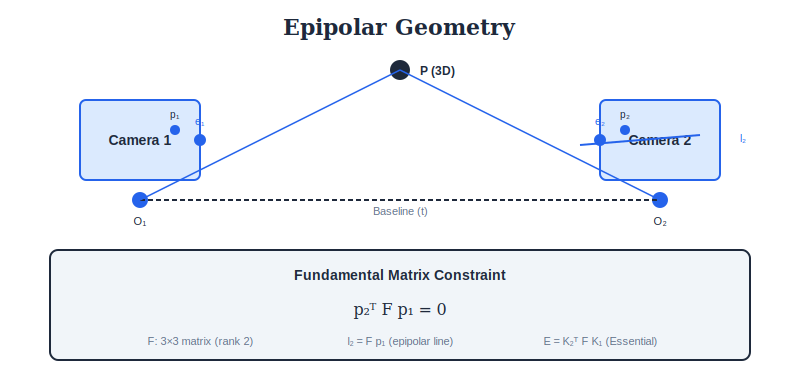
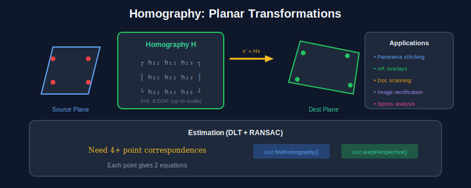

<div align="center">

<br/>

<a href="../05_Features_Detection/README.md"></a>
&nbsp;&nbsp;&nbsp;&nbsp;&nbsp;
<a href="../README.md"></a>
&nbsp;&nbsp;&nbsp;&nbsp;&nbsp;
<a href="../07_Classical_ML/README.md"></a>

<br/><br/>

---

<br/>

# 🌐 GEOMETRY & MULTI-VIEW

### 🌙 *3D from 2D*

<br/>


&nbsp;&nbsp;

&nbsp;&nbsp;


<br/><br/>

---

</div>

<br/>

## 🎯 Key Concepts

| Concept | Description | Use Case |
| :--- | :--- | :--- |
| **Homography** | Plane-to-plane mapping (3×3 matrix) | Panorama, AR |
| **Fundamental Matrix** | Encodes epipolar geometry (3×3, rank 2) | Stereo matching |
| **Essential Matrix** | F with calibrated cameras (3×3, rank 2) | Pose estimation |
| **Epipolar Line** | Constraint for correspondence search | Stereo |
| **Triangulation** | 3D point from 2+ 2D observations | Reconstruction |

---

## 🎨 Visual Overview

<div align="center">

</div>

<div align="center">

</div>

---

## 🔢 Mathematical Foundations

### 1. Homogeneous Coordinates

```
┌─────────────────────────────────────────────────────┐
│  2D POINT: (x, y) → [x, y, 1]ᵀ                      │
│                                                     │
│  Scale invariant: [x, y, 1] ~ [kx, ky, k]           │
│                                                     │
│  Point at infinity: [x, y, 0]ᵀ                      │
│                                                     │
│  Back to Cartesian: [x, y, w]ᵀ → (x/w, y/w)         │
│                                                     │
│  LINE: ax + by + c = 0 → l = [a, b, c]ᵀ             │
│                                                     │
│  Point on line: lᵀp = 0                             │
│  Line through 2 points: l = p₁ × p₂                 │
│  Intersection of 2 lines: p = l₁ × l₂               │
└─────────────────────────────────────────────────────┘
```

### 2. Homography (Projective Transform)

```
┌─────────────────────────────────────────────────────┐
│  MAPPING: x' = Hx  (3×3 matrix, 8 DOF)              │
│                                                     │
│  ┌    ┐   ┌           ┐ ┌   ┐                       │
│  │ x' │   │ h₁ h₂ h₃ │ │ x │                        │
│  │ y' │ = │ h₄ h₅ h₆ │ │ y │                        │
│  │ w' │   │ h₇ h₈ h₉ │ │ 1 │                        │
│  └    ┘   └           ┘ └   ┘                       │
│                                                     │
│  COMPUTING H (Direct Linear Transform):             │
│  Given 4+ point correspondences:                    │
│  - Set up linear system Ah = 0                      │
│  - Solve via SVD (h = last column of V)             │
│                                                     │
│  Preserves: collinearity, cross-ratio               │
│  Does NOT preserve: distances, angles               │
└─────────────────────────────────────────────────────┘
```

### 3. Fundamental Matrix

```
┌─────────────────────────────────────────────────────┐
│  EPIPOLAR CONSTRAINT                                │
│                                                     │
│  x'ᵀ F x = 0                                        │
│                                                     │
│  F: 3×3 matrix, rank 2, 7 DOF                       │
│                                                     │
│  Properties:                                        │
│  - F = [e']ₓ P' P⁺  (from camera matrices)          │
│  - det(F) = 0                                       │
│  - Fe = 0, Fᵀe' = 0  (epipoles)                     │
│                                                     │
│  EPIPOLAR LINE in image 2:                          │
│  l' = Fx    (line where x's match must lie)         │
│                                                     │
│  Computing F (8-point algorithm):                   │
│  - 8+ correspondences                               │
│  - SVD, enforce rank-2 constraint                   │
└─────────────────────────────────────────────────────┘
```

### 4. Essential Matrix

```
┌─────────────────────────────────────────────────────┐
│  FOR CALIBRATED CAMERAS                             │
│                                                     │
│  E = K'ᵀ F K                                        │
│                                                     │
│  x̂'ᵀ E x̂ = 0   (normalized coordinates)           │
│                                                     │
│  E = [t]ₓ R  = R[Rᵀt]ₓ                              │
│                                                     │
│  Properties:                                        │
│  - 5 DOF (3 rotation + 2 direction of t)            │
│  - Two equal singular values                        │
│  - 5-point algorithm for minimal case               │
│                                                     │
│  RECOVERING POSE:                                   │
│  SVD: E = U diag(1,1,0) Vᵀ                          │
│  R = U Wᵀ Vᵀ  or  U W Vᵀ                            │
│  t = ±u₃                                            │
│  (4 solutions, choose by triangulation test)        │
└─────────────────────────────────────────────────────┘
```

### 5. Triangulation

```
┌─────────────────────────────────────────────────────┐
│  Given: 2D points x, x' and cameras P, P'           │
│  Find: 3D point X                                   │
│                                                     │
│  LINEAR TRIANGULATION (DLT):                        │
│                                                     │
│  x × PX = 0   →   [x]ₓ PX = 0                       │
│  Stack for both views → AX = 0                      │
│  Solve via SVD                                      │
│                                                     │
│  OPTIMAL (minimize reprojection error):             │
│  min ||x - π(X)||² + ||x' - π'(X)||²                │
│                                                     │
│  where π is projection function                     │
└─────────────────────────────────────────────────────┘
```

### 6. Camera Calibration

```
┌─────────────────────────────────────────────────────┐
│  INTRINSIC MATRIX K (5 DOF)                         │
│                                                     │
│  K = │ fx  s  cx │                                  │
│      │  0 fy  cy │                                  │
│      │  0  0   1 │                                  │
│                                                     │
│  fx, fy: focal lengths                              │
│  cx, cy: principal point                            │
│  s: skew (usually 0)                                │
│                                                     │
│  ZHANG'S METHOD (checkerboard):                     │
│  1. Detect checkerboard corners                     │
│  2. Compute homography for each view                │
│  3. Solve for K using constraints from H            │
│  4. Estimate radial distortion k₁, k₂               │
│  5. Refine via bundle adjustment                    │
└─────────────────────────────────────────────────────┘
```

---

## ⚙️ Algorithms

### Algorithm 1: Homography Estimation (DLT)

```
┌─────────────────────────────────────────────────────┐
│  INPUT: 4+ point correspondences (xᵢ, x'ᵢ)          │
│  OUTPUT: Homography H                               │
│                                                     │
│  1. NORMALIZE points (improve conditioning):        │
│     T, T' = normalize(x), normalize(x')             │
│     x̃ = Tx, x̃' = T'x'                             │
│                                                     │
│  2. BUILD MATRIX A (2 rows per correspondence):     │
│     Aᵢ = │ -x̃ᵢᵀ    0ᵀ    x'ᵢx̃ᵢᵀ │                 │
│          │   0ᵀ  -x̃ᵢᵀ   y'ᵢx̃ᵢᵀ │                  │
│                                                     │
│  3. SOLVE Ah = 0:                                   │
│     SVD(A) = UΣVᵀ                                   │
│     h = last column of V                            │
│                                                     │
│  4. RESHAPE h → H̃ (3×3)                            │
│                                                     │
│  5. DENORMALIZE: H = T'⁻¹ H̃ T                      │
└─────────────────────────────────────────────────────┘
```

### Algorithm 2: 8-Point Algorithm (Fundamental Matrix)

```
┌─────────────────────────────────────────────────────┐
│  INPUT: 8+ correspondences (xᵢ, x'ᵢ)                │
│  OUTPUT: Fundamental matrix F                       │
│                                                     │
│  1. NORMALIZE coordinates                           │
│                                                     │
│  2. BUILD MATRIX A:                                 │
│     Aᵢ = [x'ᵢxᵢ, x'ᵢyᵢ, x'ᵢ, y'ᵢxᵢ, y'ᵢyᵢ, y'ᵢ,     │
│           xᵢ, yᵢ, 1]                                │
│                                                     │
│  3. SOLVE Af = 0 via SVD                            │
│                                                     │
│  4. RESHAPE f → F̃ (3×3)                            │
│                                                     │
│  5. ENFORCE RANK 2:                                 │
│     SVD(F̃) = UΣVᵀ                                  │
│     Σ' = diag(σ₁, σ₂, 0)                            │
│     F = UΣ'Vᵀ                                       │
│                                                     │
│  6. DENORMALIZE                                     │
└─────────────────────────────────────────────────────┘
```

### Algorithm 3: Structure from Motion (SfM)

```
┌─────────────────────────────────────────────────────┐
│  INPUT: Multiple images of same scene               │
│  OUTPUT: Camera poses + 3D points                   │
│                                                     │
│  1. FEATURE DETECTION & MATCHING                    │
│     - Extract SIFT/ORB features                     │
│     - Match across image pairs                      │
│                                                     │
│  2. INITIALIZE with 2 views:                        │
│     - Compute E from matches                        │
│     - Decompose E → R, t                            │
│     - Triangulate initial 3D points                 │
│                                                     │
│  3. INCREMENTAL RECONSTRUCTION:                     │
│     FOR each new image:                             │
│       - Find 2D-3D correspondences (PnP)            │
│       - Estimate camera pose                        │
│       - Triangulate new 3D points                   │
│                                                     │
│  4. BUNDLE ADJUSTMENT:                              │
│     Minimize Σᵢⱼ ||xᵢⱼ - π(Pⱼ, Xᵢ)||²               │
│     over all cameras P and points X                 │
└─────────────────────────────────────────────────────┘
```

---

---

## ❓ Interview Questions & Answers

<details>
<summary><b>Q1: What is the epipolar constraint?</b></summary>

**Constraint:** x'ᵀ F x = 0

**Meaning:** If x is a point in image 1, its corresponding point x' in image 2 MUST lie on the epipolar line l' = Fx.

**Use:** Reduces 2D search to 1D search in stereo matching.

</details>

<details>
<summary><b>Q2: Fundamental vs Essential matrix?</b></summary>

| Fundamental F | Essential E |
| :--- | :--- |
| Uncalibrated cameras | Calibrated cameras (K known) |
| 7 DOF | 5 DOF |
| x'ᵀFx = 0 | x̂'ᵀEx̂ = 0 (normalized coords) |
| E = K'ᵀFK | Contains R, t directly |

**Essential:** E = [t]ₓR, can decompose to get camera pose

</details>

<details>
<summary><b>Q3: How many point correspondences for homography?</b></summary>

**Minimum:** 4 points (8 equations for 8 DOF)

**Why 8 DOF:** H is 3×3 = 9 elements, but scale is arbitrary → 8 DOF

**Better:** More than 4 points + RANSAC for robustness

</details>

<details>
<summary><b>Q4: What is bundle adjustment?</b></summary>

**Joint optimization** of:
- Camera parameters (intrinsic + extrinsic)
- 3D point positions

**Minimizes:** Total reprojection error

min Σᵢⱼ ||xᵢⱼ - π(Pⱼ, Xᵢ)||²

**Method:** Levenberg-Marquardt (sparse structure exploitation)

</details>

<details>
<summary><b>Q5: Explain RANSAC for homography estimation.</b></summary>

**Steps:**
1. Randomly sample 4 correspondences
2. Compute H from these 4 points
3. Count inliers (reprojection error < threshold)
4. Repeat N times, keep best H
5. Refine H using all inliers

**N iterations:** log(1-p) / log(1-wⁿ)
- p = desired success probability (0.99)
- w = inlier ratio
- n = sample size (4)

</details>

<details>
<summary><b>Q6: What is the PnP problem?</b></summary>

**Perspective-n-Point:** Given n 3D-2D correspondences, find camera pose (R, t)

**Methods:**
- P3P: Minimal (3 points), 4 solutions
- EPnP: Efficient for n≥4
- PnP + RANSAC: Robust to outliers

**Use:** Camera localization given known 3D map

</details>

---

## 📚 Key Formulas Reference

| Formula | Description |
| :--- | :--- |
| x' = Hx | Homography transformation |
| x'ᵀFx = 0 | Epipolar constraint |
| E = [t]ₓR | Essential matrix decomposition |
| E = K'ᵀFK | E from F and intrinsics |
| l' = Fx | Epipolar line in image 2 |


---

<br/>

<div align="center">

## 📓 PRACTICE

<br/>

### 🚀 Open in Google Colab

<br/>

**Option 1: Direct Link (After pushing to GitHub)**
```
Replace YOUR_USERNAME with your GitHub username:
https://colab.research.google.com/github/YOUR_USERNAME/computer_vision_complete/blob/main/06_Geometry_MultiView/colab_tutorial.ipynb
```

**Option 2: Manual Upload (Works Immediately!)**
1. [📥 Download this notebook](./colab_tutorial.ipynb)
2. Go to [Google Colab](https://colab.research.google.com)
3. Click "Upload" → Select the downloaded `.ipynb` file
4. Run all cells!

**Option 3: Open from GitHub (if already pushed)**
- Click the notebook file on GitHub
- Click "Open in Colab" button (if available)
- Or copy the GitHub URL and paste it into Colab's "File → Open notebook → GitHub" option

<br/>

<a href="https://colab.research.google.com/">

</a>

</div>

<br/>


---

<br/>

<div align="center">

| | | |
| :--- |:---:|---:|
| **[◀ Features](../05_Features_Detection/README.md)** | **[🏠 HOME](../README.md)** | **[Classical ML ▶](../07_Classical_ML/README.md)** |

<br/>

---

🌙 Part of **[Computer Vision Complete](../README.md)** · Made with ❤️

<br/>

</div>
