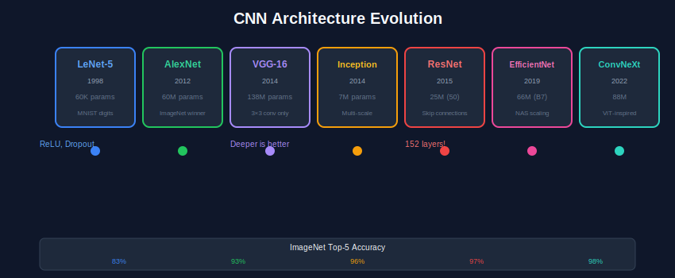
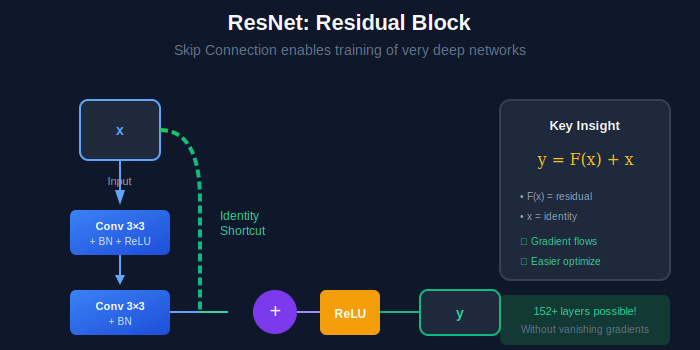

<div align="center">

<br/>

<a href="../08_Neural_Networks/README.md"></a>
&nbsp;&nbsp;&nbsp;&nbsp;&nbsp;
<a href="../README.md"></a>
&nbsp;&nbsp;&nbsp;&nbsp;&nbsp;
<a href="../10_Vision_Tasks/README.md"></a>

<br/><br/>

---

<br/>

# 🏗️ CNN ARCHITECTURES

### 🌙 *Convolutional Networks*

<br/>


&nbsp;&nbsp;

&nbsp;&nbsp;


<br/><br/>

---

</div>

<br/>

## 📖 Overview

> **CNNs revolutionized computer vision.** This module covers the evolution from LeNet (1998) to modern architectures like EfficientNet and ConvNeXt. You'll understand skip connections, batch normalization, and compound scaling.

<br/>

---

## 🎯 Key Concepts

| Concept | Description | Used In |
| :--- | :--- | :--- |
| **Convolution** | Sliding filter to detect features | All CNNs |
| **Pooling** | Downsample feature maps | LeNet, VGG |
| **Skip Connection** | Add input to output (residual) | ResNet, DenseNet |
| **Batch Normalization** | Normalize activations | ResNet+ |
| **1×1 Convolution** | Channel reduction/expansion | Inception, ResNet |
| **Depthwise Separable** | Factorized convolution | MobileNet, EfficientNet |

<br/>

---

## 🏗️ Architecture Evolution

```
1998        2012        2014        2015        2019        2022
 │           │           │           │           │           │
 ▼           ▼           ▼           ▼           ▼           ▼
LeNet → AlexNet → VGG/GoogLeNet → ResNet → EfficientNet → ConvNeXt
         │           │              │           │           │
       ReLU      3×3 only      Skip Conn   Compound    Modern
       Dropout   Inception               Scaling      Design
```

<br/>

---

## 📊 Architecture Comparison

| Architecture | Year | Key Innovation | Params | Top-1 |
| :--- | :---: | :--- | :---: | :---: |
| **LeNet-5** | 1998 | First CNN | 60K | - |
| **AlexNet** | 2012 | ReLU, Dropout, GPU | 60M | 63% |
| **VGG-16** | 2014 | 3×3 kernels only | 138M | 74% |
| **GoogLeNet** | 2014 | Inception modules | 7M | 75% |
| **ResNet-50** | 2015 | Skip connections | 25M | 76% |
| **DenseNet** | 2017 | Dense connections | 8M | 75% |
| **EfficientNet** | 2019 | Compound scaling | 5M | 77% |
| **ConvNeXt** | 2022 | Modernized ResNet | 29M | 82% |

<br/>

---

## 🔢 Key Formulas

<table align="center" width="100%">
<tr>
<td>

### Convolution
```
Output[i,j] = Σ Input[i+m,j+n] × Kernel[m,n]
```

### Output Size
```
O = ⌊(W - K + 2P) / S⌋ + 1
```
W=input, K=kernel, P=pad, S=stride

</td>
<td>

### Residual Block (ResNet)
```
y = F(x) + x
```
F = conv layers, x = skip connection

### Receptive Field
```
RF = RF_prev + (K-1) × stride_product
```

</td>
</tr>
</table>

<br/>

---

## ⚙️ Algorithms

### Algorithm 1: Forward Pass in CNN

```
┌─────────────────────────────────────────────────────┐
│  INPUT: Image x (H×W×C)                             │
│  OUTPUT: Class probabilities                        │
│                                                     │
│  FOR each convolutional layer:                      │
│    1. Convolve: z = x * W + b                       │
│    2. Batch Norm: z = BN(z)                         │
│    3. Activation: a = ReLU(z)                       │
│    4. (Optional) Pool: a = MaxPool(a)               │
│                                                     │
│  Flatten to vector                                  │
│  FOR each fully connected layer:                    │
│    1. Linear: z = Wa + b                            │
│    2. Activation: a = ReLU(z)                       │
│                                                     │
│  Output: softmax(z_final)                           │
└─────────────────────────────────────────────────────┘
```

### Algorithm 2: ResNet Residual Block

```
┌─────────────────────────────────────────────────────┐
│  INPUT: x (feature map)                             │
│  OUTPUT: y (residual output)                        │
│                                                     │
│  1. identity = x                                    │
│                                                     │
│  2. F(x) = Conv3x3 → BN → ReLU → Conv3x3 → BN       │
│                                                     │
│  3. IF dimensions change:                           │
│        identity = Conv1x1(x)  # projection          │
│                                                     │
│  4. y = ReLU(F(x) + identity)                       │
│                                                     │
│  Key: Gradient flows through identity path          │
└─────────────────────────────────────────────────────┘
```

### Algorithm 3: Batch Normalization

```
┌─────────────────────────────────────────────────────┐
│  INPUT: Mini-batch B = {x₁, ..., xₘ}                │
│  OUTPUT: Normalized batch                           │
│                                                     │
│  1. μ_B = (1/m) Σ xᵢ           (batch mean)         │
│  2. σ²_B = (1/m) Σ (xᵢ - μ_B)² (batch variance)     │
│  3. x̂ᵢ = (xᵢ - μ_B) / √(σ²_B + ε)                  │
│  4. yᵢ = γ x̂ᵢ + β            (scale & shift)       │
│                                                     │
│  γ, β are learned parameters                        │
│  At test time: use running mean/variance            │
└─────────────────────────────────────────────────────┘
```

<br/>

---

## 🏗️ Architecture Diagrams

<div align="center">

</div>

<br/>

<div align="center">

</div>

<br/>

---

## 🎨 Visual Diagrams

<div align="center">

</div>

<br/>

---

## ⚠️ Common Pitfalls

| ❌ Pitfall | ✅ Solution |
| --- | --- |
| Vanishing gradients in deep nets | Use skip connections (ResNet) |
| Overfitting on small datasets | Use pretrained models + fine-tune |
| Wrong input size | Check model's expected resolution |
| Batch norm issues at test time | Call `model.eval()` during inference |
| Forgetting to freeze layers | Set `param.requires_grad = False` |

<br/>

---

## 🛠️ Mini Projects

<details>
<summary><b>Project 1: Implement ResNet from Scratch</b></summary>

- Build basic residual block
- Stack blocks to create ResNet-18/34
- Train on CIFAR-10
- Compare with plain CNN (no skip connections)
- Visualize gradient flow with/without skip connections

</details>

<details>
<summary><b>Project 2: Architecture Comparison</b></summary>

- Load pretrained: VGG, ResNet, EfficientNet
- Compare inference speed
- Compare accuracy on ImageNet subset
- Measure model size (parameters, FLOPs)
- Create performance vs efficiency plot

</details>

<details>
<summary><b>Project 3: Transfer Learning</b></summary>

- Load pretrained ResNet-50
- Freeze early layers, fine-tune later layers
- Train on custom dataset (small)
- Compare with training from scratch
- Visualize learned features

</details>

<br/>

---

## ❓ Interview Q&A

<details>
<summary><b>Q1: Why do skip connections help?</b></summary>

1. **Gradient flow**: Gradients can bypass layers via identity path
2. **Easier optimization**: Network only needs to learn residual `F(x) = H(x) - x`
3. **Implicit ensembles**: Creates exponentially many paths through network
4. **Feature reuse**: Combines low and high-level features
</details>

<details>
<summary><b>Q2: VGG vs GoogLeNet - why same accuracy, different params?</b></summary>

| VGG-16 | GoogLeNet |
| --- | --- |
| 138M params | 7M params |
| Simple 3×3 stacks | Inception modules |
| Wide layers | Parallel paths (1×1, 3×3, 5×5) |
| FC layers at end | Global avg pool |

GoogLeNet uses 1×1 convolutions to reduce channels before expensive 3×3/5×5 convolutions.
</details>

<details>
<summary><b>Q3: What is compound scaling (EfficientNet)?</b></summary>

Scale all dimensions together:
- **Width**: More channels per layer
- **Depth**: More layers
- **Resolution**: Larger input images

EfficientNet uses a compound coefficient φ:
```
depth = α^φ
width = β^φ  
resolution = γ^φ
```
where α·β²·γ² ≈ 2
</details>

<details>
<summary><b>Q4: Receptive field calculation?</b></summary>

*See Colab notebook for implementation*

Example: Three 3×3 conv layers
- After layer 1: RF = 3
- After layer 2: RF = 5  
- After layer 3: RF = 7

Two 3×3 = One 5×5 receptive field, but fewer params!
</details>

<br/>

---

## 📚 Resources

**Papers:**
- [AlexNet (2012)](https://papers.nips.cc/paper/4824-imagenet-classification-with-deep-convolutional-neural-networks)
- [VGG (2014)](https://arxiv.org/abs/1409.1556)
- [ResNet (2015)](https://arxiv.org/abs/1512.03385)
- [EfficientNet (2019)](https://arxiv.org/abs/1905.11946)
- [ConvNeXt (2022)](https://arxiv.org/abs/2201.03545)

**Videos:**
- [Stanford CS231n - CNNs](https://www.youtube.com/watch?v=bNb2fEVKeEo)

<br/>


---

<br/>

<div align="center">

## 📓 PRACTICE

<br/>

### 🚀 Open in Google Colab

<br/>

**Option 1: Direct Link (After pushing to GitHub)**
```
Replace YOUR_USERNAME with your GitHub username:
https://colab.research.google.com/github/YOUR_USERNAME/computer_vision_complete/blob/main/09_CNN_Architectures/colab_tutorial.ipynb
```

**Option 2: Manual Upload (Works Immediately!)**
1. [📥 Download this notebook](./colab_tutorial.ipynb)
2. Go to [Google Colab](https://colab.research.google.com)
3. Click "Upload" → Select the downloaded `.ipynb` file
4. Run all cells!

**Option 3: Open from GitHub (if already pushed)**
- Click the notebook file on GitHub
- Click "Open in Colab" button (if available)
- Or copy the GitHub URL and paste it into Colab's "File → Open notebook → GitHub" option

<br/>

<a href="https://colab.research.google.com/">

</a>

</div>

<br/>


---

<br/>

<div align="center">

| | | |
| :--- |:---:|---:|
| **[◀ Neural Nets](../08_Neural_Networks/README.md)** | **[🏠 HOME](../README.md)** | **[Vision Tasks ▶](../10_Vision_Tasks/README.md)** |

<br/>

---

🌙 Part of **[Computer Vision Complete](../README.md)** · Made with ❤️

<br/>

</div>
