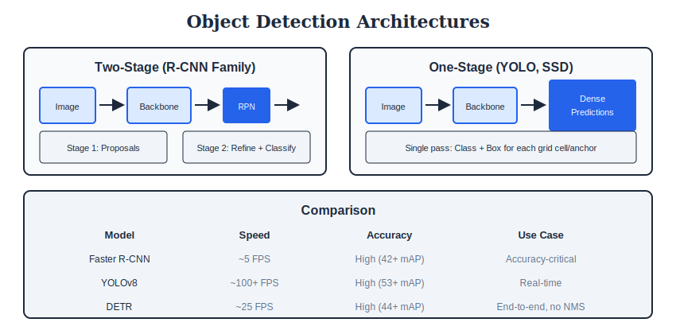

<div align="center">

# 🎯 Vision Tasks

### *Detection, Segmentation & Beyond*

| Level | Time | Prerequisites |
|:-----:|:----:|:-------------:|
| 🟡 Intermediate | 3 hours | CNNs, Deep Learning basics |

</div>

---

**Navigation:** [← CNN Architectures](../09_CNN_Architectures/) | [🏠 Home](../README.md) | [Vision Transformers →](../11_Vision_Transformers/)

---

## 📖 Table of Contents
- [Key Concepts](#-key-concepts)
- [Mathematical Foundations](#-mathematical-foundations)
- [Algorithms](#-algorithms)
- [Visual Overview](#-visual-overview)
- [Practice](#-practice)
- [Interview Q&A](#-interview-questions--answers)

---

## 🎯 Key Concepts

| Task | Input | Output | Metric |
|:-----|:------|:-------|:-------|
| **Classification** | Image | Class label | Accuracy, Top-5 |
| **Detection** | Image | Boxes + labels | mAP@IoU |
| **Semantic Seg** | Image | Pixel-wise labels | mIoU |
| **Instance Seg** | Image | Masks + labels | AP |
| **Panoptic Seg** | Image | Things + Stuff | PQ |

---

## 🎨 Visual Overview

<div align="center">

</div>

---

## 🔢 Mathematical Foundations

### 1. Intersection over Union (IoU)

```
┌─────────────────────────────────────────────────────┐
│  IoU = |A ∩ B| / |A ∪ B|                           │
│                                                     │
│  For boxes:                                         │
│  A = (x1, y1, x2, y2)                              │
│  B = (x1', y1', x2', y2')                          │
│                                                     │
│  Intersection:                                      │
│  xi1 = max(x1, x1')                                │
│  yi1 = max(y1, y1')                                │
│  xi2 = min(x2, x2')                                │
│  yi2 = min(y2, y2')                                │
│  area_i = max(0, xi2-xi1) × max(0, yi2-yi1)       │
│                                                     │
│  Union:                                             │
│  area_u = area_A + area_B - area_i                 │
│                                                     │
│  IoU = area_i / area_u                             │
│                                                     │
│  Range: [0, 1], higher is better                   │
└─────────────────────────────────────────────────────┘
```

### 2. Mean Average Precision (mAP)

```
┌─────────────────────────────────────────────────────┐
│  PRECISION-RECALL CURVE                             │
│                                                     │
│  Precision = TP / (TP + FP)                        │
│  Recall = TP / (TP + FN)                           │
│                                                     │
│  AVERAGE PRECISION (per class)                     │
│                                                     │
│  AP = ∫₀¹ p(r) dr  ≈ Σ (rᵢ - rᵢ₋₁) × pᵢₙₜₑᵣₚ     │
│                                                     │
│  11-point interpolation (PASCAL VOC):              │
│  AP = (1/11) Σ max(p(r')) for r' ≥ r              │
│       r∈{0,0.1,...,1}                              │
│                                                     │
│  MEAN AVERAGE PRECISION                            │
│                                                     │
│  mAP = (1/C) Σ APc                                 │
│                                                     │
│  mAP@0.5: IoU threshold = 0.5                      │
│  mAP@0.5:0.95: average over IoU thresholds         │
└─────────────────────────────────────────────────────┘
```

### 3. Non-Maximum Suppression (NMS)

```
┌─────────────────────────────────────────────────────┐
│  INPUT: Boxes B, Scores S, IoU threshold τ         │
│  OUTPUT: Filtered boxes                             │
│                                                     │
│  1. Sort boxes by score (descending)               │
│  2. Select box with highest score → D              │
│  3. Remove all boxes with IoU(box, D) > τ          │
│  4. Repeat until no boxes remain                   │
│                                                     │
│  SOFT-NMS (alternative):                           │
│  Instead of hard removal, decay scores:            │
│  sᵢ = sᵢ × exp(-IoU²/σ)                           │
│                                                     │
│  Typical τ = 0.5 for detection                     │
└─────────────────────────────────────────────────────┘
```

### 4. Focal Loss (for class imbalance)

```
┌─────────────────────────────────────────────────────┐
│  CROSS-ENTROPY LOSS                                 │
│                                                     │
│  CE(p, y) = -log(pₜ)                               │
│  where pₜ = p if y=1, else (1-p)                   │
│                                                     │
│  FOCAL LOSS                                         │
│                                                     │
│  FL(p, y) = -αₜ(1-pₜ)ᵞ log(pₜ)                     │
│                                                     │
│  (1-pₜ)ᵞ: modulating factor                        │
│  - Easy examples (pₜ → 1): factor → 0              │
│  - Hard examples (pₜ → 0): factor → 1              │
│                                                     │
│  Typical: γ = 2, α = 0.25                          │
│                                                     │
│  Addresses: foreground-background imbalance        │
└─────────────────────────────────────────────────────┘
```

### 5. Segmentation Losses

```
┌─────────────────────────────────────────────────────┐
│  CROSS-ENTROPY (per pixel)                          │
│                                                     │
│  L = -(1/N) Σᵢ Σc yᵢc log(pᵢc)                     │
│                                                     │
│  DICE LOSS                                          │
│                                                     │
│  Dice = 2|X ∩ Y| / (|X| + |Y|)                     │
│  L_dice = 1 - Dice                                 │
│                                                     │
│  For soft predictions:                              │
│  L_dice = 1 - (2Σpᵢyᵢ + ε) / (Σpᵢ + Σyᵢ + ε)      │
│                                                     │
│  IoU LOSS                                           │
│                                                     │
│  L_iou = 1 - IoU(pred, target)                     │
│                                                     │
│  Dice good for: imbalanced classes                 │
└─────────────────────────────────────────────────────┘
```

---

## ⚙️ Algorithms

### Algorithm 1: Two-Stage Detection (Faster R-CNN)

```
┌─────────────────────────────────────────────────────┐
│  1. BACKBONE: Extract feature maps                 │
│     - ResNet/VGG → multi-scale features           │
│                                                     │
│  2. REGION PROPOSAL NETWORK (RPN):                 │
│     - Slide 3×3 window over feature map           │
│     - At each location: k anchors (scales/ratios) │
│     - Predict: objectness + box regression         │
│     - Output: ~2000 region proposals               │
│                                                     │
│  3. ROI POOLING/ALIGN:                             │
│     - Extract fixed-size features from proposals  │
│     - ROI Align: bilinear interpolation           │
│                                                     │
│  4. DETECTION HEAD:                                 │
│     - Classification: C+1 classes (+ background)  │
│     - Bounding box regression: 4C outputs         │
│                                                     │
│  5. POST-PROCESSING:                               │
│     - Apply NMS per class                         │
└─────────────────────────────────────────────────────┘
```

### Algorithm 2: One-Stage Detection (YOLO)

```
┌─────────────────────────────────────────────────────┐
│  1. BACKBONE + NECK:                               │
│     - CSPDarknet + PANet (YOLOv4)                 │
│     - Multi-scale feature pyramids                │
│                                                     │
│  2. DETECTION HEAD (at each scale):                │
│     - Grid: S×S cells                             │
│     - Each cell predicts B boxes:                 │
│       * 4 coordinates (x, y, w, h)                │
│       * 1 objectness score                        │
│       * C class probabilities                     │
│                                                     │
│  3. OUTPUT ENCODING:                               │
│     - (x, y): offset from cell corner             │
│     - (w, h): relative to anchor size             │
│                                                     │
│  4. LOSS FUNCTION:                                 │
│     L = λ_coord × L_box                           │
│       + λ_obj × L_obj                             │
│       + λ_cls × L_cls                             │
│                                                     │
│  5. NMS on all predictions                        │
└─────────────────────────────────────────────────────┘
```

### Algorithm 3: Semantic Segmentation (DeepLab)

```
┌─────────────────────────────────────────────────────┐
│  1. ENCODER (with dilated/atrous convolutions):    │
│     - Preserve resolution with dilation           │
│     - Output stride = 8 or 16                     │
│                                                     │
│  2. ATROUS SPATIAL PYRAMID POOLING (ASPP):         │
│     - Parallel dilated convs at rates (6,12,18)   │
│     - 1×1 conv (global features)                  │
│     - Concatenate all                             │
│                                                     │
│  3. DECODER:                                       │
│     - Upsample ASPP output                        │
│     - Concatenate with low-level features         │
│     - Refine boundaries                           │
│                                                     │
│  4. OUTPUT:                                        │
│     - 1×1 conv → C channels                       │
│     - Bilinear upsample to input resolution       │
│     - Softmax per pixel                           │
│                                                     │
│  Key: Dilated convs capture multi-scale context   │
└─────────────────────────────────────────────────────┘
```

---

## 📓 Practice

See the Colab notebook for hands-on coding: [`colab_tutorial.ipynb`](./colab_tutorial.ipynb)

---

## ❓ Interview Questions & Answers

<details>
<summary><b>Q1: One-stage vs two-stage detectors?</b></summary>

| Two-Stage (Faster R-CNN) | One-Stage (YOLO, SSD) |
|:-------------------------|:----------------------|
| Region proposals first | Direct prediction |
| Higher accuracy | Faster inference |
| Slower (~5 FPS) | Real-time (30+ FPS) |
| Better for small objects | May miss small objects |

**Modern:** One-stage closing accuracy gap (YOLOv5, FCOS)

</details>

<details>
<summary><b>Q2: What is Feature Pyramid Network (FPN)?</b></summary>

**Problem:** Objects at different scales

**Solution:** Multi-scale feature maps with top-down pathway

**Architecture:**
1. Bottom-up: standard backbone
2. Top-down: upsample + lateral connections
3. Output: pyramid of feature maps

**Benefit:** Strong features at all scales for detection

</details>

<details>
<summary><b>Q3: How does anchor-free detection work?</b></summary>

**Anchor-based:** Predefined box sizes/ratios
**Anchor-free:** Directly predict box coordinates

**Methods:**
- **FCOS:** Predict distance to edges at each point
- **CenterNet:** Predict center heatmap + size
- **CornerNet:** Predict top-left, bottom-right corners

**Advantage:** No anchor hyperparameter tuning

</details>

<details>
<summary><b>Q4: Explain dilated/atrous convolution.</b></summary>

**Standard conv:** Adjacent pixels
**Dilated conv:** Insert gaps (dilation rate r)

**Effective receptive field:** k' = k + (k-1)(r-1)

**Use in segmentation:**
- Large receptive field
- No resolution loss (no pooling)
- Multi-scale via different dilation rates (ASPP)

</details>

<details>
<summary><b>Q5: What is panoptic segmentation?</b></summary>

**Combines:**
- **Instance seg:** Things (countable: person, car)
- **Semantic seg:** Stuff (uncountable: sky, road)

**Metric:** Panoptic Quality (PQ) = SQ × RQ
- SQ: Segmentation Quality (IoU of matched)
- RQ: Recognition Quality (like F1)

**Challenge:** Unified handling of things + stuff

</details>

<details>
<summary><b>Q6: How to handle class imbalance in detection?</b></summary>

**Problem:** Many more background than foreground

**Solutions:**
1. **Hard negative mining:** Sample hard negatives
2. **Focal loss:** Down-weight easy examples
3. **OHEM:** Online hard example mining
4. **Class weights:** Higher weight for rare classes

**Focal loss:** FL = -αₜ(1-pₜ)ᵞ log(pₜ), γ=2 typical

</details>

---

## 📚 Key Formulas Reference

| Formula | Description |
|:--------|:------------|
| IoU = \|A∩B\| / \|A∪B\| | Intersection over Union |
| mAP = (1/C)ΣAPc | Mean Average Precision |
| FL = -αₜ(1-pₜ)ᵞlog(pₜ) | Focal Loss |
| Dice = 2\|X∩Y\|/(\|X\|+\|Y\|) | Dice coefficient |
| k' = k + (k-1)(r-1) | Dilated conv receptive field |

---

<div align="center">

**[← CNN Architectures](../09_CNN_Architectures/) | [🏠 Home](../README.md) | [Vision Transformers →](../11_Vision_Transformers/)**

</div>
