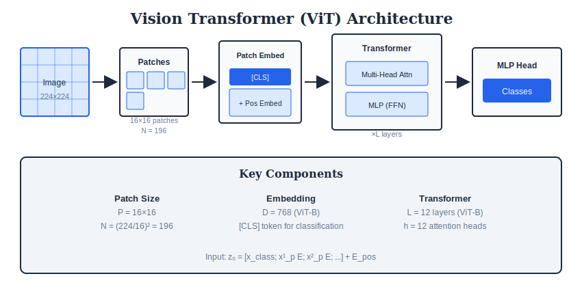
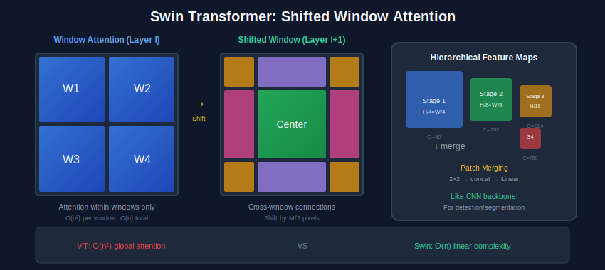

<div align="center">

<br/>

<a href="../10_Vision_Tasks/README.md"></a>
&nbsp;&nbsp;&nbsp;&nbsp;
<a href="../README.md"></a>
&nbsp;&nbsp;&nbsp;&nbsp;
<a href="../12_Self_Supervised/README.md"></a>

<br/><br/>

---

<br/>

# 👁️ VISION TRANSFORMERS

### 🌙 *Attention is All You Need*

<br/>


&nbsp;&nbsp;

&nbsp;&nbsp;


<br/><br/>

---

</div>

<br/>

## 📖 Overview

> **Vision Transformers treat images as sequences of patches.** No convolutions—just attention! This module covers ViT fundamentals, Swin Transformer's window attention, and self-supervised methods like DINO and MAE.

<br/>

---

## 🎯 Key Concepts

| Concept | Description | Used In |
| :--- | :--- | :--- |
| **Patch Embedding** | Split image into patches, project to tokens | ViT, DeiT, Swin |
| **Self-Attention** | Compute pairwise relationships between tokens | All Transformers |
| **Position Embedding** | Add spatial information (learned or sinusoidal) | All ViTs |
| **CLS Token** | Learnable token for classification | ViT, DeiT |
| **Window Attention** | Attention within local windows | Swin Transformer |
| **Shifted Windows** | Cross-window connections | Swin Transformer |

<br/>

---

## 🏗️ ViT Architecture

```
Image → Patch Split → Linear Projection → + Position → Transformer → Class Token
224×224    14×14×196      196×768          Embedding    12 blocks      → MLP Head
```

<br/>

---

## 📊 Model Comparison

| Model | Year | Key Innovation | ImageNet | Speed |
| :--- | :---: | :--- | :---: | :---: |
| **ViT-B/16** | 2020 | Patch tokens + Transformer | 77.9% | Medium |
| **DeiT-S** | 2021 | Knowledge distillation | 79.8% | Fast |
| **Swin-T** | 2021 | Window + shifted attention | 81.3% | Fast |
| **BEiT** | 2021 | BERT-style pretraining | 83.2% | Medium |
| **MAE** | 2022 | Masked autoencoder | 83.6% | Slow |
| **DINOv2** | 2023 | Self-supervised foundation | 86.5% | Medium |

<br/>

---

## 🔢 Key Formulas

<table>
<tr>
<td>

### Patch Embedding
```
patches = split(image, P×P)  # N = H×W / P²
tokens = Linear(flatten(patches))
z₀ = [CLS] + tokens + pos_embed
```

</td>
<td>

### Self-Attention
```
Q, K, V = Linear(x)
Attn = softmax(QKᵀ / √d) × V
```

</td>
</tr>
<tr>
<td>

### Multi-Head Attention
```
MultiHead = Concat(head₁...headₕ)Wᴼ
headᵢ = Attention(QWᵢQ, KWᵢK, VWᵢV)
```

</td>
<td>

### Transformer Block
```
x' = x + MSA(LayerNorm(x))
x'' = x' + MLP(LayerNorm(x'))
```

</td>
</tr>
</table>

<br/>

---

## ⚙️ Algorithms

### Algorithm 1: ViT Forward Pass

```
┌─────────────────────────────────────────────────────┐
│  INPUT: Image x (H×W×3)                             │
│  OUTPUT: Class probabilities                        │
│                                                     │
│  1. PATCH EMBEDDING:                                │
│     patches = split(x, 16×16) → N patches           │
│     tokens = Linear(flatten(patches)) → (N, D)      │
│                                                     │
│  2. ADD CLS TOKEN + POSITION:                       │
│     z₀ = [CLS; tokens] + pos_embed → (N+1, D)       │
│                                                     │
│  3. TRANSFORMER ENCODER (L layers):                 │
│     FOR l = 1 to L:                                 │
│       z' = z + MSA(LayerNorm(z))                    │
│       z = z' + MLP(LayerNorm(z'))                   │
│                                                     │
│  4. CLASSIFICATION:                                 │
│     output = MLP_head(z[0])  # CLS token only       │
│     probs = softmax(output)                         │
└─────────────────────────────────────────────────────┘
```

### Algorithm 2: Multi-Head Self-Attention

```
┌─────────────────────────────────────────────────────┐
│  INPUT: Tokens z (N×D)                              │
│  OUTPUT: Attended tokens (N×D)                      │
│                                                     │
│  1. PROJECT to Q, K, V:                             │
│     Q = z @ Wq  (N × d_k)                           │
│     K = z @ Wk  (N × d_k)                           │
│     V = z @ Wv  (N × d_v)                           │
│                                                     │
│  2. COMPUTE ATTENTION:                              │
│     scores = Q @ K.T / √d_k   (N × N)               │
│     attn = softmax(scores)                          │
│     output = attn @ V          (N × d_v)            │
│                                                     │
│  3. MULTI-HEAD (h heads):                           │
│     Split Q,K,V into h heads                        │
│     Compute attention per head                      │
│     Concat and project: out @ Wo                    │
│                                                     │
│  Complexity: O(N²·D)                                │
└─────────────────────────────────────────────────────┘
```

### Algorithm 3: Swin Window Attention

```
┌─────────────────────────────────────────────────────┐
│  INPUT: Feature map (H×W×C)                         │
│  OUTPUT: Transformed features                       │
│                                                     │
│  1. PARTITION into windows:                         │
│     windows = split_into_windows(x, M×M)            │
│     # Each window: M×M tokens                       │
│                                                     │
│  2. WINDOW ATTENTION (per window):                  │
│     Q, K, V = project(window)                       │
│     attn = softmax(Q @ K.T / √d + bias)             │
│     out = attn @ V                                  │
│                                                     │
│  3. MERGE windows back                              │
│                                                     │
│  4. SHIFT (alternate layers):                       │
│     Shift by (M/2, M/2) before windowing            │
│     Allows cross-window information                 │
│                                                     │
│  Complexity: O(N·M²) instead of O(N²)               │
└─────────────────────────────────────────────────────┘
```

<br/>

---

## 🏗️ Architecture Diagrams

<div align="center">

</div>

<br/>

<div align="center">

</div>

<br/>

<div align="center">

</div>

<br/>

---

## 💻 Complete Code

> **Copy this entire code block and paste into Google Colab!**

*See Colab notebook for implementation*

<br/>

---

## ⚠️ Common Pitfalls

| ❌ Pitfall | ✅ Solution |
| --- | --- |
| ViT needs huge data | Use pretrained or DeiT distillation |
| Wrong image size | ViT-B/16 expects 224×224 |
| Forgetting CLS token | Classification uses CLS, not avg |
| Position embedding size | Must match number of patches |
| Slow attention | Use window attention (Swin) |

<br/>

---

## ❓ Interview Q&A

<details>
<summary><b>Q1: Why does ViT need more data than CNN?</b></summary>

CNNs have **inductive biases**:
- **Locality**: Conv kernels look at local regions
- **Translation equivariance**: Same kernel everywhere

ViT has **no such biases**—must learn everything from data!

**Solutions:**
- Pretrain on large datasets (JFT-300M)
- Knowledge distillation (DeiT)
- Self-supervised pretraining (MAE, DINO)
</details>

<details>
<summary><b>Q2: What is the CLS token?</b></summary>

A **learnable embedding** prepended to patch tokens:
```
[CLS, patch1, patch2, ..., patch196]
```

- Attends to all patches through transformer layers
- Aggregates global information
- Used for final classification
- Similar to BERT's [CLS] token
</details>

<details>
<summary><b>Q3: How does Swin Transformer reduce complexity?</b></summary>

| Standard ViT | Swin Transformer |
| --- | --- |
| Global attention | Window attention |
| O(N²) | O(N) per window |
| All patches | 7×7 windows |
| No hierarchy | Hierarchical (merge patches) |

**Shifted windows** allow cross-window information flow.
</details>

<details>
<summary><b>Q4: ViT vs CNN - when to use which?</b></summary>

| Use CNN | Use ViT |
| --- | --- |
| Small datasets | Large datasets |
| Need locality | Global context matters |
| Edge deployment | Server inference |
| Real-time | Accuracy priority |
</details>

<br/>

---

## 📚 Resources

**Papers:**
- [ViT (2020)](https://arxiv.org/abs/2010.11929) - Original Vision Transformer
- [DeiT (2021)](https://arxiv.org/abs/2012.12877) - Data-efficient training
- [Swin (2021)](https://arxiv.org/abs/2103.14030) - Hierarchical ViT
- [MAE (2022)](https://arxiv.org/abs/2111.06377) - Masked Autoencoder

**Videos:**
- [Yannic Kilcher - ViT](https://www.youtube.com/watch?v=TrdevFK_am4)

<br/>

---

<br/>

<div align="center">

## 📓 PRACTICE

<br/>

```
┏━━━━━━━━━━━━━━━━━━━━━━━━━━━━━━━━━━━━━━━━━━━━━━━━━━━━━━━━━━━━━━━━━━━━━━━━━━━━━━━┓
┃                                                                               ┃
┃   📥 Download .ipynb  →  🌐 Open colab.google  →  📤 Upload  →  ▶️ Run All   ┃
┃                                                                               ┃
┗━━━━━━━━━━━━━━━━━━━━━━━━━━━━━━━━━━━━━━━━━━━━━━━━━━━━━━━━━━━━━━━━━━━━━━━━━━━━━━━┛
```

<br/>

<a href="./colab_tutorial.ipynb"></a>
&nbsp;&nbsp;&nbsp;&nbsp;
<a href="https://colab.research.google.com"></a>

</div>

<br/>


---

<br/>

<div align="center">

| | | |
|:---|:---:|---:|
| **[◀ Tasks](../10_Vision_Tasks/README.md)** | **[🏠 HOME](../README.md)** | **[Self-Supervised ▶](../12_Self_Supervised/README.md)** |

<br/>

---

🌙 Part of **[Computer Vision Complete](../README.md)** · Made with ❤️

<br/>

</div>
