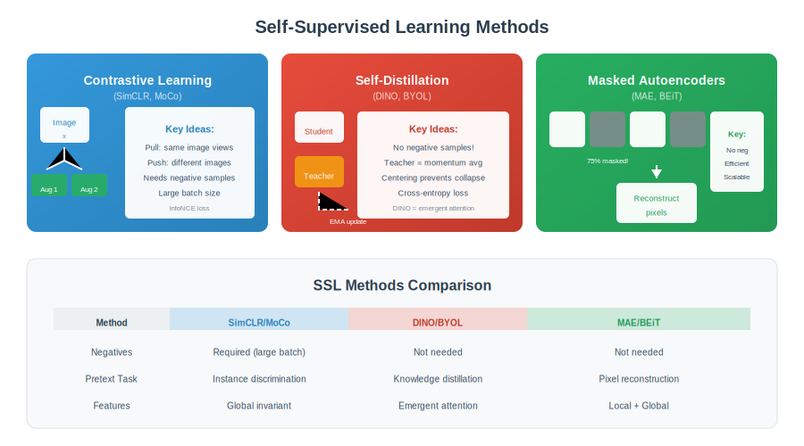

<div align="center">

# 🔄 Self-Supervised Learning

### *Contrastive Learning, MAE & DINO*

| Level | Time | Prerequisites |
|:-----:|:----:|:-------------:|
| 🔴 Advanced | 2.5 hours | Deep Learning, Vision Transformers |

</div>

---

**Navigation:** [← Vision Transformers](../11_Vision_Transformers/) | [🏠 Home](../README.md) | [Video & Temporal →](../13_Video_Temporal/)

---

## 📖 Table of Contents
- [Key Concepts](#-key-concepts)
- [Mathematical Foundations](#-mathematical-foundations)
- [Algorithms](#-algorithms)
- [Visual Overview](#-visual-overview)
- [Practice](#-practice)
- [Interview Q&A](#-interview-questions--answers)

---

## 🎯 Key Concepts

| Method | Key Idea | Architecture |
|:-------|:---------|:-------------|
| **SimCLR** | Contrastive + strong augmentation | Dual encoder + projector |
| **MoCo** | Momentum encoder + queue | Encoder + momentum encoder |
| **BYOL** | No negatives, EMA target | Online + target network |
| **MAE** | Masked autoencoding | Encoder + decoder |
| **DINO** | Self-distillation | Student + teacher (EMA) |

---

## 🎨 Visual Overview

<div align="center">

</div>

---

## 🔢 Mathematical Foundations

### 1. Contrastive Loss (InfoNCE / NT-Xent)

```
┌─────────────────────────────────────────────────────┐
│  INFONCE LOSS                                       │
│                                                     │
│  L = -log [ exp(sim(zᵢ, zⱼ)/τ) ]                   │
│           [ ―――――――――――――――――――――― ]                │
│           [ Σₖ exp(sim(zᵢ, zₖ)/τ) ]                │
│                                                     │
│  zᵢ, zⱼ: positive pair (same image, diff augment)  │
│  zₖ: negatives (other images in batch)             │
│  τ: temperature (0.07-0.5 typical)                 │
│  sim: cosine similarity                            │
│                                                     │
│  NT-XENT (SimCLR):                                 │
│  L = Σᵢ -log [ exp(zᵢ·zⱼ/τ) / Σₖ≠ᵢ exp(zᵢ·zₖ/τ) ] │
│                                                     │
│  Intuition: Pull positives together,               │
│             push negatives apart                   │
└─────────────────────────────────────────────────────┘
```

### 2. BYOL Loss (No Negatives)

```
┌─────────────────────────────────────────────────────┐
│  BYOL ARCHITECTURE                                  │
│                                                     │
│  Online: encoder fθ → projector gθ → predictor qθ  │
│  Target: encoder fξ → projector gξ (EMA of online) │
│                                                     │
│  LOSS (MSE after normalization):                   │
│                                                     │
│  L = 2 - 2 · <qθ(zθ), sg(zξ)>                      │
│        ―――――――――――――――――――――――                      │
│        ||qθ(zθ)|| · ||sg(zξ)||                     │
│                                                     │
│  where sg = stop gradient                          │
│                                                     │
│  EMA UPDATE:                                        │
│  ξ ← τξ + (1-τ)θ   (τ = 0.996 → 1.0)              │
│                                                     │
│  Why no collapse?                                   │
│  - Asymmetric architecture (predictor)             │
│  - EMA target (slowly moving)                      │
│  - BatchNorm plays role                            │
└─────────────────────────────────────────────────────┘
```

### 3. Masked Autoencoder (MAE) Loss

```
┌─────────────────────────────────────────────────────┐
│  MASKING STRATEGY                                   │
│                                                     │
│  1. Divide image into patches (16×16)              │
│  2. Randomly mask 75% of patches                   │
│  3. Encode ONLY visible patches                    │
│                                                     │
│  RECONSTRUCTION LOSS (MSE on pixels):              │
│                                                     │
│  L = (1/|M|) Σᵢ∈M ||xᵢ - x̂ᵢ||²                    │
│                                                     │
│  M = set of masked patches                         │
│  xᵢ = original patch pixels                        │
│  x̂ᵢ = reconstructed patch pixels                   │
│                                                     │
│  ALTERNATIVE: Predict normalized pixels            │
│  L = ||norm(x) - norm(x̂)||²                       │
│                                                     │
│  Key insight: High masking ratio forces            │
│  learning meaningful representations               │
└─────────────────────────────────────────────────────┘
```

### 4. DINO Loss (Self-Distillation)

```
┌─────────────────────────────────────────────────────┐
│  STUDENT-TEACHER SETUP                              │
│                                                     │
│  Student: gθₛ (trained)                            │
│  Teacher: gθₜ (EMA of student)                     │
│                                                     │
│  MULTI-CROP STRATEGY:                              │
│  - 2 global views (224×224)                        │
│  - 8 local views (96×96)                          │
│  - Student sees all, teacher sees only global     │
│                                                     │
│  CENTERING (prevent collapse):                     │
│  teacher_out = teacher_out - center               │
│  center ← m·center + (1-m)·mean(teacher_out)      │
│                                                     │
│  LOSS (cross-entropy with soft targets):           │
│                                                     │
│  L = -Σᵥ Pₜ(v) log Pₛ(v)                           │
│                                                     │
│  Pₜ = softmax(teacher_out / τₜ)                   │
│  Pₛ = softmax(student_out / τₛ)                   │
│  τₜ < τₛ (sharper teacher targets)                │
└─────────────────────────────────────────────────────┘
```

---

## ⚙️ Algorithms

### Algorithm 1: SimCLR Training

```
┌─────────────────────────────────────────────────────┐
│  FOR each batch of N images:                       │
│                                                     │
│  1. AUGMENT:                                        │
│     x̃₁, x̃₂ = T₁(x), T₂(x) for each image         │
│     (Crop, flip, color, blur, grayscale)          │
│                                                     │
│  2. ENCODE:                                         │
│     hᵢ = f(x̃ᵢ)  (backbone)                        │
│     zᵢ = g(hᵢ)  (projector MLP)                   │
│                                                     │
│  3. COMPUTE SIMILARITY:                             │
│     sᵢⱼ = zᵢᵀzⱼ / (||zᵢ|| ||zⱼ|| τ)              │
│                                                     │
│  4. LOSS:                                           │
│     L = -(1/2N) Σᵢ [log exp(sᵢ,ᵢ₊ₙ)/Σₖ exp(sᵢ,ₖ)] │
│     for positive pair (i, i+N)                    │
│                                                     │
│  5. UPDATE encoder and projector                   │
│                                                     │
│  Large batch (4096+) is critical                   │
└─────────────────────────────────────────────────────┘
```

### Algorithm 2: MoCo Training

```
┌─────────────────────────────────────────────────────┐
│  INIT: Queue Q of size K (e.g., 65536)             │
│        Momentum encoder fₖ = copy(f)               │
│                                                     │
│  FOR each batch:                                    │
│                                                     │
│  1. ENCODE:                                         │
│     q = f(x₁)   (query encoder)                   │
│     k = fₖ(x₂)  (momentum encoder, no grad)       │
│                                                     │
│  2. POSITIVE: k⁺ = k from same image              │
│     NEGATIVES: all keys in queue Q                │
│                                                     │
│  3. LOSS:                                           │
│     L = -log [ exp(q·k⁺/τ) ]                      │
│              [ ―――――――――――――――― ]                   │
│              [ exp(q·k⁺/τ) + Σ exp(q·kⁿ/τ) ]      │
│                                                     │
│  4. UPDATE QUEUE:                                   │
│     Enqueue current keys                          │
│     Dequeue oldest keys                           │
│                                                     │
│  5. MOMENTUM UPDATE:                               │
│     fₖ ← m·fₖ + (1-m)·f   (m=0.999)              │
│                                                     │
│  Advantage: Large negative set without big batch  │
└─────────────────────────────────────────────────────┘
```

### Algorithm 3: MAE Pre-training

```
┌─────────────────────────────────────────────────────┐
│  FOR each image:                                    │
│                                                     │
│  1. PATCHIFY:                                       │
│     patches = split(image, 16×16)  (N patches)    │
│                                                     │
│  2. RANDOM MASKING:                                 │
│     mask = random_sample(N, ratio=0.75)           │
│     visible = patches[~mask]                      │
│                                                     │
│  3. ENCODER (ViT):                                 │
│     - Add positional embeddings                   │
│     - Process ONLY visible patches                │
│     - Output: encoded visible tokens              │
│                                                     │
│  4. DECODER:                                        │
│     - Add mask tokens at masked positions         │
│     - Add positional embeddings                   │
│     - Light transformer decoder                   │
│     - Predict pixel values for masked patches     │
│                                                     │
│  5. LOSS:                                           │
│     L = MSE(pred_masked, true_masked)             │
│     Only on masked patches                        │
│                                                     │
│  Key: Encoder never sees mask tokens (efficient)  │
└─────────────────────────────────────────────────────┘
```

---

## 📓 Practice

See the Colab notebook for hands-on coding: [`colab_tutorial.ipynb`](./colab_tutorial.ipynb)

---

## ❓ Interview Questions & Answers

<details>
<summary><b>Q1: Why does contrastive learning need large batch sizes?</b></summary>

**Reason:** More negatives → better gradient signal

**SimCLR:** Needs 4096+ batch for good performance
- 2N-2 negatives per positive
- More negatives = harder task = better features

**MoCo solution:** Memory bank/queue of 65K negatives
- Decouples batch size from negative count

</details>

<details>
<summary><b>Q2: How does BYOL avoid collapse without negatives?</b></summary>

**Naive approach would collapse:** Everything maps to same point

**BYOL prevents this via:**
1. **Asymmetric architecture:** Predictor only on online network
2. **EMA target:** Teacher moves slowly, provides stable target
3. **BatchNorm:** Implicit contrastive effect (debated)

**Key insight:** Predictor must predict something the target doesn't have

</details>

<details>
<summary><b>Q3: Why does MAE use 75% masking ratio?</b></summary>

**High masking forces semantic understanding:**
- Can't just copy from neighbors
- Must understand global context
- Information-dense task

**Comparison:**
- BERT: 15% masking (language is discrete)
- MAE: 75% masking (images have spatial redundancy)

**Benefit:** Also makes training faster (process fewer patches)

</details>

<details>
<summary><b>Q4: What is the InfoNCE loss?</b></summary>

**Formula:**

L = -log [ exp(sim(zᵢ,zⱼ)/τ) / Σₖ exp(sim(zᵢ,zₖ)/τ) ]

**Interpretation:**
- Numerator: positive pair similarity
- Denominator: sum over positives + negatives
- Maximize positive, minimize negatives

**Relation to mutual information:** Lower bound on I(x;z)

</details>

<details>
<summary><b>Q5: How does DINO create good features without labels?</b></summary>

**Self-distillation:**
1. Student learns from teacher (EMA of student)
2. Multi-crop: Teacher sees global, student sees local+global
3. Centering: Prevents mode collapse

**Emergent properties:**
- Attention maps highlight objects
- Features support k-NN classification
- No explicit supervision needed

</details>

<details>
<summary><b>Q6: Compare data augmentation requirements.</b></summary>

| Method | Augmentation |
|:-------|:-------------|
| SimCLR | Strong (crop, color, blur) - critical |
| MoCo | Moderate |
| BYOL | Strong (similar to SimCLR) |
| MAE | Minimal (just crop) |
| DINO | Multi-crop strategy |

**SimCLR insight:** Stronger augmentations = better invariances

</details>

---

## 📚 Key Formulas Reference

| Formula | Description |
|:--------|:------------|
| L = -log[exp(s⁺/τ)/Σexp(s/τ)] | InfoNCE/NT-Xent |
| ξ ← τξ + (1-τ)θ | EMA update |
| L = \|\|q(z) - sg(z')\|\|² | BYOL loss |
| L = Σ\|\|xᵢ - x̂ᵢ\|\|² | MAE reconstruction |
| L = -Σ Pₜ log Pₛ | DINO cross-entropy |

---

<div align="center">

**[← Vision Transformers](../11_Vision_Transformers/) | [🏠 Home](../README.md) | [Video & Temporal →](../13_Video_Temporal/)**

</div>
