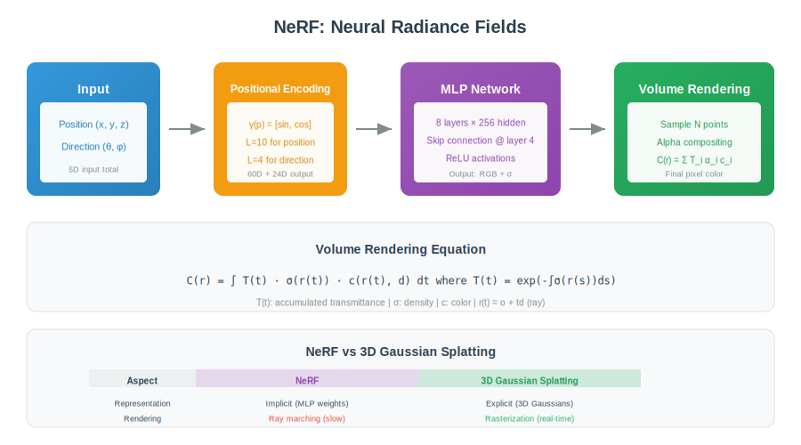

<div align="center">

<br/>

<a href="../13_Video_Temporal/README.md"></a>
&nbsp;&nbsp;&nbsp;&nbsp;
<a href="../README.md"></a>
&nbsp;&nbsp;&nbsp;&nbsp;
<a href="../15_Generative_Vision/README.md"></a>

<br/><br/>

---

<br/>

# 🎲 3D VISION

### 🌙 *Three Dimensions*

<br/>


&nbsp;&nbsp;

&nbsp;&nbsp;


<br/><br/>

---

</div>

<br/>

## 🎯 Key Concepts

| Concept | Description | Application |
| :--- | :--- | :--- |
| **Depth Estimation** | Per-pixel distance | AR, robotics |
| **Stereo Vision** | Depth from disparity | Autonomous driving |
| **Point Cloud** | 3D point set (x,y,z) | LiDAR processing |
| **NeRF** | Neural implicit 3D | Novel view synthesis |
| **Gaussian Splatting** | 3D Gaussians for rendering | Real-time 3D |

---

## 🎨 Visual Overview

<div align="center">

</div>

---

## 🔢 Mathematical Foundations

### 1. Stereo Depth Estimation

```
┌─────────────────────────────────────────────────────┐
│  DISPARITY-DEPTH RELATIONSHIP                       │
│                                                     │
│  Z = f × B / d                                      │
│                                                     │
│  Z: depth                                           │
│  f: focal length (pixels)                           │
│  B: baseline (distance between cameras)             │
│  d: disparity (pixel difference between views)      │
│                                                     │
│  TRIANGULATION                                      │
│                                                     │
│  d = xₗ - xᵣ  (corresponding points)                │
│                                                     │
│  Inverse depth relationship:                        │
│  - Large disparity → close object                   │
│  - Small disparity → far object                     │
│  - d=0 → infinity                                   │
└─────────────────────────────────────────────────────┘
```

### 2. Point Cloud Representation

```
┌─────────────────────────────────────────────────────┐
│  POINT CLOUD: P = {(xᵢ, yᵢ, zᵢ)}ᵢ₌₁ᴺ                │
│                                                     │
│  Optional attributes per point:                     │
│  - Color (RGB)                                      │
│  - Normal vector (nx, ny, nz)                       │
│  - Intensity (from LiDAR)                           │
│  - Semantic label                                   │
│                                                     │
│  PROCESSING CHALLENGES:                             │
│  - Unordered: permutation invariant needed          │
│  - Unstructured: no grid                            │
│  - Variable size                                    │
│                                                     │
│  POINTNET:                                          │
│  f(P) = g(MAX{h(xᵢ)})                               │
│  - h: per-point MLP                                 │
│  - MAX: symmetric function (permutation invariant)  │
│  - g: output MLP                                    │
└─────────────────────────────────────────────────────┘
```

### 3. NeRF (Neural Radiance Fields)

```
┌─────────────────────────────────────────────────────┐
│  SCENE REPRESENTATION                               │
│                                                     │
│  F: (x, y, z, θ, φ) → (c, σ)                        │
│                                                     │
│  Input: 3D position (x,y,z) + view direction (θ,φ)  │
│  Output: color c = (r,g,b) + density σ              │
│                                                     │
│  VOLUME RENDERING                                   │
│                                                     │
│  C(r) = ∫ T(t) σ(r(t)) c(r(t), d) dt                │
│                                                     │
│  T(t) = exp(-∫₀ᵗ σ(r(s)) ds)  (transmittance)       │
│                                                     │
│  Discrete approximation:                            │
│  C = Σᵢ Tᵢ (1 - exp(-σᵢδᵢ)) cᵢ                      │
│  Tᵢ = exp(-Σⱼ₌₁ⁱ⁻¹ σⱼδⱼ)                            │
│  δᵢ = tᵢ₊₁ - tᵢ  (distance between samples)         │
└─────────────────────────────────────────────────────┘
```

### 4. 3D Gaussian Splatting

```
┌─────────────────────────────────────────────────────┐
│  REPRESENTATION: Set of 3D Gaussians                │
│                                                     │
│  Each Gaussian:                                     │
│  - Position μ ∈ R³                                  │
│  - Covariance Σ (3×3, for shape/orientation)        │
│  - Color (spherical harmonics for view-dependent)   │
│  - Opacity α                                        │
│                                                     │
│  GAUSSIAN FUNCTION:                                 │
│                                                     │
│  G(x) = exp(-½(x-μ)ᵀ Σ⁻¹ (x-μ))                     │
│                                                     │
│  RENDERING (differentiable rasterization):          │
│                                                     │
│  1. Project 3D Gaussians to 2D                      │
│  2. Sort by depth                                   │
│  3. Alpha-blend front-to-back:                      │
│     C = Σᵢ cᵢ αᵢ Gᵢ(x) ∏ⱼ<ᵢ (1 - αⱼGⱼ(x))           │
│                                                     │
│  Advantage: Real-time rendering (100+ FPS)          │
└─────────────────────────────────────────────────────┘
```

### 5. Depth Estimation Loss

```
┌─────────────────────────────────────────────────────┐
│  L1/L2 LOSS                                         │
│                                                     │
│  L₁ = (1/n) Σᵢ |dᵢ - d̂ᵢ|                           │
│  L₂ = (1/n) Σᵢ (dᵢ - d̂ᵢ)²                          │
│                                                     │
│  SCALE-INVARIANT LOG LOSS                           │
│                                                     │
│  L = (1/n) Σ(log dᵢ - log d̂ᵢ)²                     │
│    - (1/n²) (Σ(log dᵢ - log d̂ᵢ))²                  │
│                                                     │
│  Handles scale ambiguity in monocular depth         │
│                                                     │
│  GRADIENT MATCHING LOSS                             │
│                                                     │
│  L_grad = |∇ₓd - ∇ₓd̂| + |∇ᵧd - ∇ᵧd̂|               │
│                                                     │
│  Encourages smooth depth with sharp edges           │
└─────────────────────────────────────────────────────┘
```

---

## ⚙️ Algorithms

### Algorithm 1: Stereo Matching (SGM)

```
┌─────────────────────────────────────────────────────┐
│  SEMI-GLOBAL MATCHING                               │
│                                                     │
│  1. COMPUTE COST VOLUME:                            │
│     C(x,y,d) = matching_cost(Iₗ(x,y), Iᵣ(x-d,y))    │
│     for all disparities d ∈ [0, D_max]              │
│                                                     │
│  2. AGGREGATE ALONG PATHS (8 or 16 directions):     │
│     Lᵣ(p,d) = C(p,d) + min(                         │
│       Lᵣ(p-r, d),                                   │
│       Lᵣ(p-r, d±1) + P₁,                            │
│       min_i Lᵣ(p-r, i) + P₂                         │
│     )                                               │
│                                                     │
│  3. SUM ALL DIRECTIONS:                             │
│     S(p,d) = Σᵣ Lᵣ(p,d)                             │
│                                                     │
│  4. WINNER-TAKE-ALL:                                │
│     d*(p) = argmin_d S(p,d)                         │
│                                                     │
│  5. LEFT-RIGHT CONSISTENCY CHECK                    │
└─────────────────────────────────────────────────────┘
```

### Algorithm 2: NeRF Training

```
┌─────────────────────────────────────────────────────┐
│  INPUT: Multi-view images with camera poses         │
│  OUTPUT: Trained MLP F_θ                            │
│                                                     │
│  FOR each iteration:                                │
│                                                     │
│  1. SAMPLE RAY:                                     │
│     - Pick random image, random pixel               │
│     - Ray r(t) = o + td through pixel               │
│                                                     │
│  2. SAMPLE POINTS ALONG RAY:                        │
│     - Stratified: divide [near,far] into bins       │
│     - Uniform random within each bin                │
│                                                     │
│  3. QUERY NETWORK:                                  │
│     - Positional encoding: γ(x) = [sin,cos] at      │
│       multiple frequencies                          │
│     - (cᵢ, σᵢ) = F_θ(γ(xᵢ), γ(d))                   │
│                                                     │
│  4. VOLUME RENDER:                                  │
│     Ĉ = Σᵢ Tᵢ (1-exp(-σᵢδᵢ)) cᵢ                     │
│                                                     │
│  5. LOSS:                                           │
│     L = ||Ĉ - C_gt||²                               │
│                                                     │
│  HIERARCHICAL SAMPLING: Coarse + fine networks      │
└─────────────────────────────────────────────────────┘
```

### Algorithm 3: PointNet Classification

```
┌─────────────────────────────────────────────────────┐
│  INPUT: Point cloud P = {x₁, ..., xₙ}, xᵢ ∈ R³      │
│  OUTPUT: Class label                                │
│                                                     │
│  1. INPUT TRANSFORM (optional T-Net):               │
│     T = predict_transform(P)  (3×3 matrix)          │
│     P' = P × T                                      │
│                                                     │
│  2. PER-POINT MLP:                                  │
│     hᵢ = MLP(xᵢ)  for each point                    │
│     MLP: 64 → 64 → 64 → 128 → 1024                  │
│                                                     │
│  3. SYMMETRIC AGGREGATION:                          │
│     g = MAX_POOL({hᵢ})  (permutation invariant)     │
│                                                     │
│  4. CLASSIFICATION MLP:                             │
│     output = MLP(g)  → K classes                    │
│     MLP: 1024 → 512 → 256 → K                       │
│                                                     │
│  Key: MAX_POOL makes it order-invariant             │
└─────────────────────────────────────────────────────┘
```

---

---

## ❓ Interview Questions & Answers

<details>
<summary><b>Q1: How does NeRF achieve view synthesis?</b></summary>

**Key ideas:**
1. **Implicit representation:** MLP maps (x,y,z,θ,φ) → (color, density)
2. **Volume rendering:** Integrate color along rays
3. **Positional encoding:** High-frequency details via sin/cos

**Training:**
- Supervise rendered pixels with ground truth
- Learn continuous 3D representation
- Novel views via querying any camera pose

</details>

<details>
<summary><b>Q2: What makes point clouds challenging?</b></summary>

**Challenges:**
1. **Unordered:** No natural ordering (unlike images)
2. **Irregular:** No grid structure
3. **Variable size:** Different scenes have different point counts
4. **Sparse:** Points don't cover all surfaces

**Solutions:**
- PointNet: Symmetric functions (max-pool)
- Voxelization: Convert to regular grid
- Graph networks: KNN for local structure

</details>

<details>
<summary><b>Q3: Monocular vs stereo depth estimation?</b></summary>

| Monocular | Stereo |
| :--- | :--- |
| Single image | Two cameras |
| Learning-based (CNN) | Geometry-based + learning |
| Scale ambiguous | Metric depth (known baseline) |
| Works everywhere | Needs texture |
| Fails on novel scenes | Generalizes well |

**Monocular cues:** Size, occlusion, texture gradient, linear perspective

</details>

<details>
<summary><b>Q4: How does 3D Gaussian Splatting differ from NeRF?</b></summary>

| NeRF | 3D Gaussian Splatting |
| :--- | :--- |
| Implicit (MLP) | Explicit (point-based) |
| Ray marching | Rasterization |
| Slow render (~30s) | Real-time (100+ FPS) |
| Hard to edit | Easy to edit |
| Memory efficient | More memory |

**Key insight:** Gaussians are differentiable and fast to render

</details>

<details>
<summary><b>Q5: What is the disparity-depth relationship?</b></summary>

**Formula:** Z = f × B / d

- Z: depth
- f: focal length
- B: baseline
- d: disparity

**Key points:**
- Inverse relationship: larger d → smaller Z
- Depth resolution decreases with distance
- Zero disparity = infinite distance

</details>

<details>
<summary><b>Q6: Why does NeRF use positional encoding?</b></summary>

**Problem:** MLPs have spectral bias toward low frequencies

**Solution:** Positional encoding γ(x) = [sin(2ⁿπx), cos(2ⁿπx)]ₙ

**Effect:**
- Maps low-dim input to high-dim
- Enables learning high-frequency details
- Without it: blurry reconstructions

</details>

---

## 📚 Key Formulas Reference

| Formula | Description |
| :--- | :--- |
| Z = fB/d | Stereo depth |
| C(r) = ∫ T(t)σ(t)c(t)dt | NeRF volume rendering |
| T(t) = exp(-∫σ(s)ds) | Transmittance |
| f(P) = g(MAX{h(xᵢ)}) | PointNet |
| γ(x) = [sin(2ⁿπx), cos(2ⁿπx)] | Positional encoding |


---

<br/>

<div align="center">

## 📓 PRACTICE

<br/>

### 🚀 Click to Open Directly in Google Colab

<br/>

<a href="https://colab.research.google.com/github/USERNAME/computer_vision_complete/blob/main/14_3D_Vision/colab_tutorial.ipynb">

</a>

<br/><br/>

> ⚠️ **First time?** Push this repo to GitHub, then replace `USERNAME` in the link above with your GitHub username.

<br/>

**Or manually:** [📥 Download](./colab_tutorial.ipynb) → [🌐 Colab](https://colab.research.google.com) → Upload

</div>

<br/>


---

<br/>

<div align="center">

| | | |
|:---|:---:|---:|
| **[◀ Video](../13_Video_Temporal/README.md)** | **[🏠 HOME](../README.md)** | **[Generative ▶](../15_Generative_Vision/README.md)** |

<br/>

---

🌙 Part of **[Computer Vision Complete](../README.md)** · Made with ❤️

<br/>

</div>
