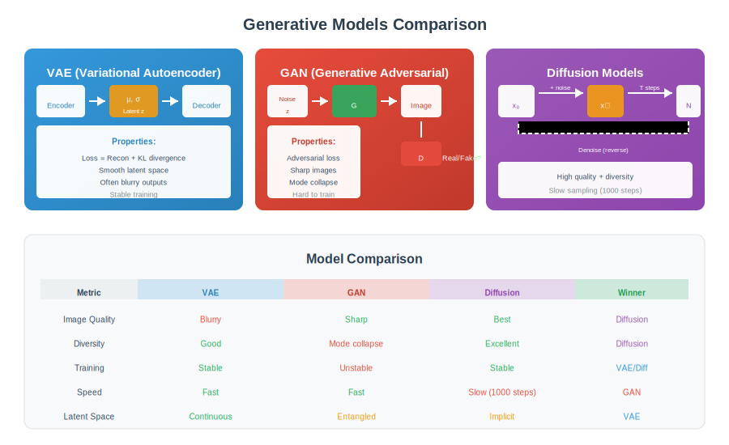

<div align="center">

<br/>

<a href="../14_3D_Vision/README.md"></a>
&nbsp;&nbsp;&nbsp;&nbsp;&nbsp;
<a href="../README.md"></a>
&nbsp;&nbsp;&nbsp;&nbsp;&nbsp;
<a href="../16_Vision_Language/README.md"></a>

<br/><br/>

---

<br/>

# 🎭 GENERATIVE MODELS

### 🌙 *Creating Images*

<br/>


&nbsp;&nbsp;

&nbsp;&nbsp;


<br/><br/>

---

</div>

<br/>

## 🎯 Key Concepts

| Model | Key Idea | Training | Sampling |
| :--- | :--- | :--- | :--- |
| **VAE** | Latent space + reconstruction | ELBO maximization | Decode z ~ N(0,I) |
| **GAN** | Adversarial game | Min-max | Decode z ~ N(0,I) |
| **Diffusion** | Iterative denoising | Predict noise | Iterative denoising |
| **Flow** | Invertible transforms | Exact likelihood | Invert transform |

---

## 🎨 Visual Overview

<div align="center">

</div>

---

## 🔢 Mathematical Foundations

### 1. Variational Autoencoder (VAE)

```
┌─────────────────────────────────────────────────────┐
│  GENERATIVE MODEL                                   │
│                                                     │
│  p(x) = ∫ p(x|z) p(z) dz                            │
│                                                     │
│  p(z) = N(0, I)  (prior)                            │
│  p(x|z) = decoder (learned)                         │
│                                                     │
│  INFERENCE MODEL                                    │
│                                                     │
│  q(z|x) = N(μ(x), σ²(x))  (encoder output)          │
│                                                     │
│  ELBO (Evidence Lower Bound)                        │
│                                                     │
│  log p(x) ≥ E_q[log p(x|z)] - KL(q(z|x) || p(z))    │
│           = reconstruction   - regularization       │
│                                                     │
│  REPARAMETERIZATION TRICK                           │
│                                                     │
│  z = μ + σ ⊙ ε,  ε ~ N(0,I)                         │
│  (enables gradient through sampling)                │
└─────────────────────────────────────────────────────┘
```

### 2. GAN (Generative Adversarial Network)

```
┌─────────────────────────────────────────────────────┐
│  MIN-MAX GAME                                       │
│                                                     │
│  min_G max_D  E_x[log D(x)] + E_z[log(1-D(G(z)))]   │
│                                                     │
│  D: Discriminator (real vs fake)                    │
│  G: Generator (z → image)                           │
│                                                     │
│  ALTERNATIVE LOSSES                                 │
│                                                     │
│  Non-saturating: min_G -E_z[log D(G(z))]            │
│  (Better gradients when D wins)                     │
│                                                     │
│  Wasserstein GAN:                                   │
│  min_G max_D  E_x[D(x)] - E_z[D(G(z))]              │
│  with Lipschitz constraint on D                     │
│                                                     │
│  CONDITIONAL GAN: G(z, c), D(x, c)                  │
│  c = class label or other condition                 │
└─────────────────────────────────────────────────────┘
```

### 3. Diffusion Models

```
┌─────────────────────────────────────────────────────┐
│  FORWARD PROCESS (add noise)                        │
│                                                     │
│  q(xₜ|xₜ₋₁) = N(xₜ; √(1-βₜ)xₜ₋₁, βₜI)               │
│                                                     │
│  Closed form:                                       │
│  q(xₜ|x₀) = N(xₜ; √ᾱₜ x₀, (1-ᾱₜ)I)                  │
│  where ᾱₜ = ∏ᵢ₌₁ᵗ (1-βᵢ)                            │
│                                                     │
│  REVERSE PROCESS (denoise)                          │
│                                                     │
│  p_θ(xₜ₋₁|xₜ) = N(xₜ₋₁; μ_θ(xₜ,t), σₜ²I)            │
│                                                     │
│  TRAINING OBJECTIVE (simplified DDPM)               │
│                                                     │
│  L = E_t,x₀,ε [||ε - ε_θ(xₜ, t)||²]                 │
│                                                     │
│  Network predicts the noise ε added at step t       │
└─────────────────────────────────────────────────────┘
```

### 4. Latent Diffusion (Stable Diffusion)

```
┌─────────────────────────────────────────────────────┐
│  KEY INSIGHT: Diffusion in latent space             │
│                                                     │
│  1. ENCODE: z = E(x)  (pretrained VAE encoder)      │
│  2. DIFFUSE: Apply diffusion to z (smaller!)        │
│  3. DECODE: x = D(z)  (pretrained VAE decoder)      │
│                                                     │
│  CONDITIONING (text-to-image)                       │
│                                                     │
│  Cross-attention in U-Net:                          │
│  Attention(Q, K, V) where:                          │
│  - Q from image features                            │
│  - K, V from text embeddings (CLIP)                 │
│                                                     │
│  CLASSIFIER-FREE GUIDANCE                           │
│                                                     │
│  ε̃ = ε_θ(z, ∅) + s·(ε_θ(z, c) - ε_θ(z, ∅))         │
│                                                     │
│  s > 1: Stronger conditioning                       │
│  (interpolate between conditional and unconditional)│
└─────────────────────────────────────────────────────┘
```

### 5. Score Matching

```
┌─────────────────────────────────────────────────────┐
│  SCORE FUNCTION                                     │
│                                                     │
│  s(x) = ∇_x log p(x)                                │
│                                                     │
│  SCORE MATCHING OBJECTIVE                           │
│                                                     │
│  L = E_x [½||s_θ(x) - ∇_x log p(x)||²]              │
│                                                     │
│  DENOISING SCORE MATCHING                           │
│                                                     │
│  L = E_x,ε [||s_θ(x+σε) - (-ε/σ)||²]                │
│                                                     │
│  Connection to diffusion:                           │
│  - Score = direction to denoise                     │
│  - ε_θ(xₜ,t) ∝ -s_θ(xₜ,t)                           │
│                                                     │
│  LANGEVIN DYNAMICS for sampling:                    │
│  x_{i+1} = x_i + (η/2)∇_x log p(x) + √η ε           │
└─────────────────────────────────────────────────────┘
```

---

## ⚙️ Algorithms

### Algorithm 1: VAE Training

```
┌─────────────────────────────────────────────────────┐
│  FOR each batch x:                                  │
│                                                     │
│  1. ENCODE:                                         │
│     μ, log σ² = Encoder(x)                          │
│                                                     │
│  2. REPARAMETERIZE:                                 │
│     ε ~ N(0, I)                                     │
│     z = μ + σ ⊙ ε                                   │
│                                                     │
│  3. DECODE:                                         │
│     x̂ = Decoder(z)                                 │
│                                                     │
│  4. COMPUTE LOSS:                                   │
│     L_recon = ||x - x̂||² or BCE(x, x̂)             │
│     L_KL = -½ Σ(1 + log σ² - μ² - σ²)               │
│     L = L_recon + β·L_KL                            │
│                                                     │
│  5. BACKPROP and update                             │
│                                                     │
│  β-VAE: β > 1 for disentangled latents              │
└─────────────────────────────────────────────────────┘
```

### Algorithm 2: GAN Training

```
┌─────────────────────────────────────────────────────┐
│  FOR each iteration:                                │
│                                                     │
│  1. TRAIN DISCRIMINATOR (k steps):                  │
│     FOR k steps:                                    │
│       Sample real x ~ data                          │
│       Sample fake G(z), z ~ N(0,I)                  │
│       L_D = -[log D(x) + log(1-D(G(z)))]            │
│       Update D                                      │
│                                                     │
│  2. TRAIN GENERATOR (1 step):                       │
│     Sample z ~ N(0,I)                               │
│     L_G = -log D(G(z))   (non-saturating)           │
│     Update G                                        │
│                                                     │
│  TIPS:                                              │
│  - Feature matching: match D features               │
│  - Spectral normalization for D                     │
│  - Progressive growing (StyleGAN)                   │
│  - R1 regularization                                │
└─────────────────────────────────────────────────────┘
```

### Algorithm 3: DDPM Sampling

```
┌─────────────────────────────────────────────────────┐
│  START: x_T ~ N(0, I)                               │
│                                                     │
│  FOR t = T, T-1, ..., 1:                            │
│                                                     │
│  1. PREDICT NOISE:                                  │
│     ε̂ = ε_θ(x_t, t)                                │
│                                                     │
│  2. COMPUTE MEAN:                                   │
│     μ = (1/√αₜ)(x_t - (βₜ/√(1-ᾱₜ))ε̂)               │
│                                                     │
│  3. SAMPLE:                                         │
│     if t > 1: z ~ N(0, I)                           │
│     else: z = 0                                     │
│     x_{t-1} = μ + σₜz                               │
│                                                     │
│  RETURN x_0                                         │
│                                                     │
│  DDIM (deterministic, faster):                      │
│  Skip steps, use deterministic update               │
└─────────────────────────────────────────────────────┘
```

---

---

## ❓ Interview Questions & Answers

<details>
<summary><b>Q1: VAE vs GAN - when to use which?</b></summary>

| VAE | GAN |
| :--- | :--- |
| Stable training | Training can be tricky |
| Blurry samples | Sharp samples |
| Meaningful latent | Latent less interpretable |
| Good for compression | Good for generation |
| Explicit likelihood | No likelihood |

**Use VAE:** When you need latent representations
**Use GAN:** When you need high-quality images

</details>

<details>
<summary><b>Q2: Why do diffusion models produce better images than GANs?</b></summary>

**Reasons:**
1. **Stable training:** No adversarial dynamics
2. **Mode coverage:** Don't suffer from mode collapse
3. **Iterative refinement:** Correct errors over many steps
4. **Strong theoretical foundation:** Score matching

**Trade-off:** Slower sampling (many denoising steps)

</details>

<details>
<summary><b>Q3: What is the reparameterization trick?</b></summary>

**Problem:** Can't backprop through random sampling

**Solution:** z = μ + σ ⊙ ε, where ε ~ N(0,I)

**Why it works:**
- Randomness moved to ε (external)
- z is deterministic function of μ, σ, ε
- Gradients flow through μ, σ

</details>

<details>
<summary><b>Q4: What is classifier-free guidance?</b></summary>

**Idea:** Amplify conditioning without a classifier

**Method:**
1. Train model with both conditional and unconditional (random drop c)
2. At inference: ε̃ = ε(z,∅) + s·(ε(z,c) - ε(z,∅))

**s > 1:** Stronger adherence to condition (but may reduce diversity)

**Advantage:** No separate classifier needed

</details>

<details>
<summary><b>Q5: Why is latent diffusion more efficient?</b></summary>

**Problem:** Diffusion on pixels is expensive (e.g., 512×512×3)

**Solution:** Diffuse in latent space (e.g., 64×64×4)

**Steps:**
1. Encode x → z (64x smaller)
2. Diffuse z (fast!)
3. Decode z → x

**Result:** Same quality, 10x faster training

</details>

<details>
<summary><b>Q6: What is mode collapse in GANs?</b></summary>

**Problem:** Generator produces only a few modes (ignores diversity)

**Why:** G finds "safe" outputs that fool D

**Solutions:**
1. **Minibatch discrimination:** D sees batches
2. **Feature matching:** Match statistics, not just fool D
3. **Unrolled GAN:** G anticipates D updates
4. **Wasserstein GAN:** Better loss landscape

</details>

---

## 📚 Key Formulas Reference

| Formula | Description |
| :--- | :--- |
| ELBO = E[log p(x\|z)] - KL(q\|\|p) | VAE objective |
| min_G max_D E[log D] + E[log(1-D(G))] | GAN objective |
| L = E[\|\|ε - ε_θ(xₜ,t)\|\|²] | DDPM loss |
| z = μ + σ ⊙ ε | Reparameterization |
| q(xₜ\|x₀) = N(√ᾱₜx₀, (1-ᾱₜ)I) | Forward diffusion |


---

<br/>

<div align="center">

## 📓 PRACTICE

<br/>

### 🚀 Open in Google Colab

<br/>

**Option 1: Direct Link (After pushing to GitHub)**
```
Replace YOUR_USERNAME with your GitHub username:
https://colab.research.google.com/github/YOUR_USERNAME/computer_vision_complete/blob/main/15_Generative_Vision/colab_tutorial.ipynb
```

**Option 2: Manual Upload (Works Immediately!)**
1. [📥 Download this notebook](./colab_tutorial.ipynb)
2. Go to [Google Colab](https://colab.research.google.com)
3. Click "Upload" → Select the downloaded `.ipynb` file
4. Run all cells!

**Option 3: Open from GitHub (if already pushed)**
- Click the notebook file on GitHub
- Click "Open in Colab" button (if available)
- Or copy the GitHub URL and paste it into Colab's "File → Open notebook → GitHub" option

<br/>

<a href="https://colab.research.google.com/">

</a>

</div>

<br/>


---

<br/>

<div align="center">

| | | |
| :--- |:---:|---:|
| **[◀ 3D Vision](../14_3D_Vision/README.md)** | **[🏠 HOME](../README.md)** | **[Vision-Language ▶](../16_Vision_Language/README.md)** |

<br/>

---

🌙 Part of **[Computer Vision Complete](../README.md)** · Made with ❤️

<br/>

</div>
