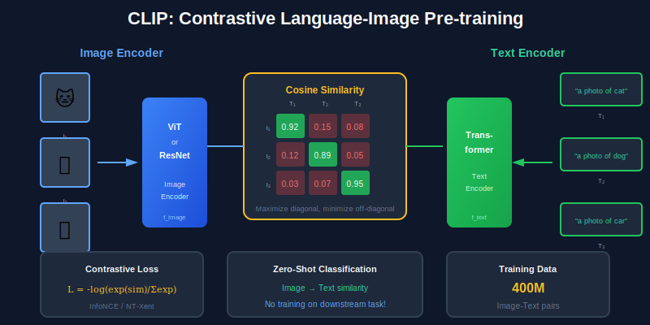

<div align="center">

<br/>

<a href="../15_Generative_Vision/README.md"></a>
&nbsp;&nbsp;&nbsp;&nbsp;&nbsp;
<a href="../README.md"></a>
&nbsp;&nbsp;&nbsp;&nbsp;&nbsp;
<a href="../17_Computational_Photography/README.md"></a>

<br/><br/>

---

<br/>

# 💬 VISION-LANGUAGE

### 🌙 *Images Meet Words*

<br/>


&nbsp;&nbsp;

&nbsp;&nbsp;


<br/><br/>

---

</div>

<br/>

## 🎯 Key Concepts

| Model | Task | Architecture | Training |
| :--- | :--- | :--- | :--- |
| **CLIP** | Zero-shot classification | Dual encoder | Contrastive |
| **BLIP** | Captioning, VQA | Encoder-decoder | Unified |
| **Flamingo** | Few-shot multimodal | Cross-attention | Interleaved |
| **LLaVA** | Visual chat | Vision + LLM | Instruction tuning |
| **GPT-4V** | General vision | Unified | Massive scale |

---

## 🎨 Visual Overview

<div align="center">

</div>

---

## 🔢 Mathematical Foundations

### 1. CLIP - Contrastive Language-Image Pre-training

```
┌─────────────────────────────────────────────────────┐
│  ARCHITECTURE                                       │
│                                                     │
│  Image Encoder: f_img(I) → z_img ∈ ℝᵈ               │
│  Text Encoder:  f_txt(T) → z_txt ∈ ℝᵈ               │
│                                                     │
│  CONTRASTIVE LOSS (InfoNCE)                         │
│                                                     │
│  L = -log[exp(sim(I,T)/τ) / Σⱼexp(sim(I,Tⱼ)/τ)]     │
│                                                     │
│  Where:                                             │
│    sim(I,T) = z_imgᵀ z_txt / (||z_img|| ||z_txt||)  │
│    τ = temperature (learned or fixed ~0.07)         │
│                                                     │
│  Symmetrized: L = (L_img→txt + L_txt→img) / 2       │
└─────────────────────────────────────────────────────┘
```

### 2. Zero-Shot Classification

```
┌─────────────────────────────────────────────────────┐
│  INFERENCE (No training on target classes!)         │
│                                                     │
│  1. Encode image: z_img = f_img(I)                  │
│                                                     │
│  2. Create text prompts: "a photo of a {class}"     │
│     T₁ = "a photo of a cat"                         │
│     T₂ = "a photo of a dog"                         │
│     ...                                             │
│                                                     │
│  3. Encode texts: z_tₖ = f_txt(Tₖ)                  │
│                                                     │
│  4. Compute similarities:                           │
│     sₖ = cosine(z_img, z_tₖ)                        │
│                                                     │
│  5. Predict: ŷ = argmax softmax(s/τ)                │
└─────────────────────────────────────────────────────┘
```

### 3. Image Captioning

```
┌─────────────────────────────────────────────────────┐
│  ENCODER-DECODER ARCHITECTURE                       │
│                                                     │
│  Encoder: Extract visual features                   │
│    V = CNN(I) or ViT(I)  → [v₁, ..., vₙ]            │
│                                                     │
│  Decoder: Generate caption autoregressively         │
│    P(wₜ|w₁:ₜ₋₁, V) = Decoder(w₁:ₜ₋₁, V)             │
│                                                     │
│  Cross-attention:                                   │
│    Attn(Q, K, V) where Q=text, K,V=image            │
│                                                     │
│  Training loss (cross-entropy):                     │
│    L = -Σₜ log P(wₜ|w₁:ₜ₋₁, V)                      │
└─────────────────────────────────────────────────────┘
```

### 4. Visual Question Answering (VQA)

```
┌─────────────────────────────────────────────────────┐
│  INPUT: Image I, Question Q                         │
│  OUTPUT: Answer A                                   │
│                                                     │
│  APPROACHES:                                        │
│                                                     │
│  1. Classification (closed-set):                    │
│     A = argmax P(a|I, Q)                            │
│     where a ∈ {yes, no, color, number, ...}         │
│                                                     │
│  2. Generation (open-set):                          │
│     A = Decoder(I, Q)                               │
│     Autoregressive text generation                  │
│                                                     │
│  FUSION METHODS:                                    │
│     - Early: concat features                        │
│     - Attention: cross-attention                    │
│     - Late: separate encoders, merge                │
└─────────────────────────────────────────────────────┘
```

### 5. Cross-Modal Attention

```
┌─────────────────────────────────────────────────────┐
│  CROSS-ATTENTION MECHANISM                          │
│                                                     │
│  Q = W_q × text_tokens                              │
│  K = W_k × image_tokens                             │
│  V = W_v × image_tokens                             │
│                                                     │
│  Attn(Q, K, V) = softmax(QKᵀ/√d) V                  │
│                                                     │
│  Allows text to attend to relevant image regions    │
│                                                     │
│  GATED CROSS-ATTENTION (Flamingo):                  │
│  output = text + tanh(α) × CrossAttn(text, image)   │
│  α = learnable gate (initialized to 0)              │
└─────────────────────────────────────────────────────┘
```

### 6. Visual Instruction Tuning (LLaVA)

```
┌─────────────────────────────────────────────────────┐
│  ARCHITECTURE                                       │
│                                                     │
│  1. Visual Encoder: CLIP ViT → image features       │
│  2. Projection: Linear layer to LLM dimension       │
│  3. LLM: Process [image tokens, text tokens]        │
│                                                     │
│  INPUT FORMAT:                                      │
│  "<image> [img_tokens] </image> User: {question}    │
│   Assistant: {answer}"                              │
│                                                     │
│  TRAINING STAGES:                                   │
│  Stage 1: Pretrain projection (frozen encoders)     │
│  Stage 2: Instruction tuning (unfreeze all)         │
└─────────────────────────────────────────────────────┘
```

---

## ⚙️ Algorithms

### Algorithm 1: CLIP Training

```
┌─────────────────────────────────────────────────────┐
│  INPUT: Image-text pairs (I, T)                     │
│  OUTPUT: Trained encoders f_img, f_txt              │
│                                                     │
│  FOR each mini-batch of N pairs:                    │
│    1. Encode: z_img = f_img(I), z_txt = f_txt(T)    │
│    2. L2 normalize embeddings                       │
│    3. Compute NxN similarity matrix:                │
│       S[i,j] = z_img[i]ᵀ z_txt[j] / τ               │
│    4. Labels: y = [0, 1, ..., N-1] (diagonal)       │
│    5. Loss (symmetric):                             │
│       L_i2t = CrossEntropy(S, y)    (rows)          │
│       L_t2i = CrossEntropy(Sᵀ, y)   (columns)       │
│       L = (L_i2t + L_t2i) / 2                       │
│    6. Backprop and update                           │
│                                                     │
│  Key: Diagonal elements are positive pairs          │
│       Off-diagonal are negative pairs               │
└─────────────────────────────────────────────────────┘
```

### Algorithm 2: Beam Search for Captioning

```
┌─────────────────────────────────────────────────────┐
│  INPUT: Image features V, beam width k              │
│  OUTPUT: Best caption                               │
│                                                     │
│  1. Initialize: beams = {("<start>", 0)}            │
│  2. FOR t = 1 to max_length:                        │
│     3. candidates = []                              │
│     4. FOR each (seq, score) in beams:              │
│        5. Get P(w|seq, V) for all words w           │
│        6. FOR top-k words w:                        │
│           7. new_score = score + log P(w|seq, V)    │
│           8. candidates.add((seq + w, new_score))   │
│     9. beams = top-k candidates by score            │
│    10. IF all beams end with "<end>": break         │
│  11. RETURN beam with highest score                 │
│                                                     │
│  Beam search balances quality vs diversity          │
└─────────────────────────────────────────────────────┘
```

### Algorithm 3: Zero-Shot CLIP Inference

```
┌─────────────────────────────────────────────────────┐
│  INPUT: Image I, class names [c₁, ..., cₙ]          │
│  OUTPUT: Predicted class                            │
│                                                     │
│  1. Encode image: z_img = normalize(f_img(I))       │
│  2. FOR each class c:                               │
│     3. Create prompt: T = "a photo of a {c}"        │
│     4. Encode: z_txt = normalize(f_txt(T))          │
│  3. Compute similarities: s = z_img @ Z_txtᵀ        │
│  4. Probabilities: P = softmax(s / τ)               │
│  5. Predict: ŷ = argmax(P)                          │
│                                                     │
│  PROMPT ENGINEERING (improves accuracy):            │
│  - "a photo of a {c}"                               │
│  - "a {c} in the wild"                              │
│  - Ensemble multiple prompts                        │
└─────────────────────────────────────────────────────┘
```

---

## ❓ Interview Questions & Answers

<details>
<summary><b>Q1: How does CLIP enable zero-shot classification?</b></summary>

**Answer:**

**Training:** Learn joint image-text embedding space with 400M+ pairs

**Zero-shot inference:**
1. No training on target classes
2. Create text prompts: "a photo of a {class}"
3. Compare image embedding with text embeddings
4. Highest similarity = predicted class

**Why it works:**
- Learned general visual-semantic alignment
- Text describes visual concepts
- New classes = new text prompts

</details>

<details>
<summary><b>Q2: What is the difference between CLIP and BLIP?</b></summary>

**Answer:**

| Aspect | CLIP | BLIP |
| :--- | :--- | :--- |
| Training | Contrastive only | Contrastive + Generative |
| Architecture | Dual encoder | Unified encoder-decoder |
| Tasks | Classification, retrieval | + Captioning, VQA |
| Data cleaning | None | Bootstrap filtering |
| Generation | No | Yes |

**BLIP innovations:**
- Multimodal mixture of encoder-decoder
- Caption filtering to remove noisy web data
- Can both understand and generate

</details>

<details>
<summary><b>Q3: What is visual grounding?</b></summary>

**Answer:**

**Task:** Localize image regions described by text

**Input:** Image + text query ("the red car on the left")
**Output:** Bounding box or segmentation mask

**Methods:**
- Two-stage: Propose regions, match with text
- One-stage: Predict box directly from text
- Transformer: Cross-attention between text and image patches

**Applications:** Robotics, image editing, accessibility

</details>

<details>
<summary><b>Q4: How does cross-attention work in multimodal models?</b></summary>

**Answer:**

**Mechanism:**
- Query: from one modality (e.g., text)
- Key, Value: from other modality (e.g., image)
- Allows text to "look at" image regions

**Formula:** Attn(Q_text, K_image, V_image)

**Benefits:**
- Dynamic attention based on query
- Learns alignment between modalities
- No fixed pooling

**Gated version (Flamingo):**
- Gate controls how much vision influences text
- Initialized to 0 for stable training

</details>

<details>
<summary><b>Q5: What are the challenges in vision-language models?</b></summary>

**Answer:**

1. **Data:** Need aligned image-text pairs (noisy web data)
2. **Compute:** Very large models (billions of params)
3. **Grounding:** Text about visual details
4. **Hallucination:** Generating text not in image
5. **Compositionality:** "red cube on blue table" vs "blue cube on red table"
6. **Evaluation:** Hard to evaluate open-ended generation

</details>

<details>
<summary><b>Q6: Explain the InfoNCE loss.</b></summary>

**Answer:**

**Formula:**
L = -log[exp(sim(I,T)/τ) / Σⱼexp(sim(I,Tⱼ)/τ)]

**Interpretation:**
- Numerator: Score of positive pair (matching I, T)
- Denominator: Scores of all pairs in batch
- Maximize ratio → pull positives, push negatives

**Temperature τ:**
- Small τ: Sharper distribution, harder negatives
- Large τ: Softer distribution
- Typically 0.05-0.1 or learned

</details>

<details>
<summary><b>Q7: What is instruction tuning for VLMs?</b></summary>

**Answer:**

**Concept:** Fine-tune on (instruction, response) pairs

**Example:**
- Instruction: "Describe what's happening in this image"
- Response: "A dog is playing fetch in the park..."

**Benefits:**
- Follow user instructions
- Generalize to new tasks
- More controllable outputs

**LLaVA approach:**
- Stage 1: Align vision encoder to LLM
- Stage 2: Instruction tuning on 150K examples

</details>

<details>
<summary><b>Q8: How do you evaluate VQA models?</b></summary>

**Answer:**

**Metrics:**
- Accuracy: Exact match with ground truth
- Soft accuracy: min(#humans who gave that answer / 3, 1)
- F1: For open-ended answers

**VQA v2 dataset:** ~1M questions, ~200K images

**Challenges:**
- Multiple valid answers
- Language bias (can answer without image)
- Compositionality

**VQA-v2 innovation:** Complementary pairs to reduce bias

</details>

---

## 📚 Key Formulas Reference

| Formula | Description |
| :--- | :--- |
| L = -log[exp(s⁺/τ) / Σexp(sⱼ/τ)] | InfoNCE loss |
| sim(I,T) = (z_I · z_T) / (\|\|z_I\|\| \|\|z_T\|\|) | Cosine similarity |
| Attn(Q,K,V) = softmax(QKᵀ/√d)V | Cross-attention |
| P(wₜ\|w₁:ₜ₋₁, V) | Autoregressive captioning |


---

<br/>

<div align="center">

## 📓 PRACTICE

### 🚀 *Ready to code? Let's get started!*

<br/>

### 🚀 Open in Google Colab

<br/>

<p align="center">
  <a href="https://colab.research.google.com/github/falkomeAI/computer_vision_complete/blob/main/16_Vision_Language/colab_tutorial.ipynb">
    
  </a>
</p>

<br/>

<p align="center">
  <strong>✨ Click the badge above to open this notebook directly in Google Colab!</strong>
</p>

<br/>


</div>

<br/>


---

<br/>

<div align="center">

| | | |
| :--- |:---:|---:|
| **[◀ Generative](../15_Generative_Vision/README.md)** | **[🏠 HOME](../README.md)** | **[Photo ▶](../17_Computational_Photography/README.md)** |

<br/>

---

🌙 Part of **[Computer Vision Complete](../README.md)**

<p align="center">
  Made with ❤️ by <a href="https://github.com/falkomeAI">falkomeAI</a>
</p>

<p align="center">
  
</p>

<br/>

</div>
