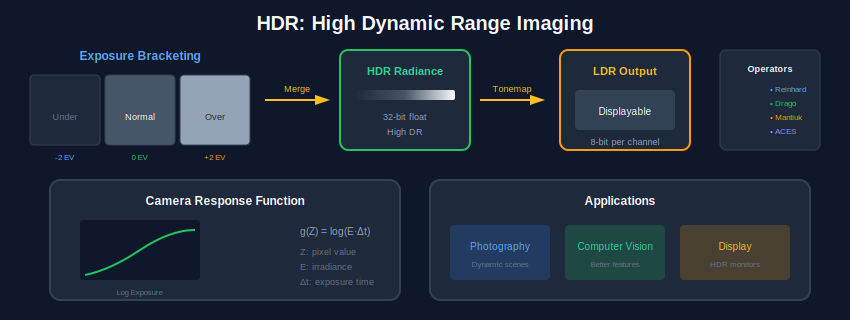

<div align="center">

<br/>

<a href="../16_Vision_Language/README.md"></a>
&nbsp;&nbsp;&nbsp;&nbsp;
<a href="../README.md"></a>
&nbsp;&nbsp;&nbsp;&nbsp;
<a href="../18_Deployment_Systems/README.md"></a>

<br/><br/>

---

<br/>

# 📸 COMPUTATIONAL PHOTO

### 🌙 *Beyond the Camera*

<br/>


&nbsp;&nbsp;

&nbsp;&nbsp;


<br/><br/>

---

</div>

<br/>

## 🎯 Key Concepts

| Technique | Problem | Solution | Application |
| :--- | :--- | :--- | :--- |
| **HDR** | Limited dynamic range | Multi-exposure fusion | Landscape, architecture |
| **Panorama** | Limited field of view | Image stitching | 360° photos |
| **Deblurring** | Motion/defocus blur | Deconvolution | Action photos |
| **Inpainting** | Missing regions | Fill from context | Object removal |
| **Super-resolution** | Low resolution | Upscaling | Enhance photos |

---

## 🎨 Visual Overview

<div align="center">

</div>

---

## 🔢 Mathematical Foundations

### 1. High Dynamic Range (HDR) Imaging

```
┌─────────────────────────────────────────────────────┐
│  CAMERA RESPONSE FUNCTION                           │
│                                                     │
│  Pixel value: Z = f(E × Δt)                         │
│                                                     │
│  Where:                                             │
│    E = scene irradiance (what we want)              │
│    Δt = exposure time                               │
│    f = camera response function (non-linear)        │
│                                                     │
│  INVERSE: E = f⁻¹(Z) / Δt                           │
│                                                     │
│  DEBEVEC'S METHOD                                   │
│                                                     │
│  g(Z) = ln(f⁻¹(Z)) = ln(E) + ln(Δt)                 │
│                                                     │
│  Solve: min Σᵢⱼ[g(Zᵢⱼ) - ln(Eᵢ) - ln(Δtⱼ)]²         │
│            + λ Σ g''(z)²  (smoothness)              │
└─────────────────────────────────────────────────────┘
```

### 2. Tone Mapping Operators

| Operator | Formula | Properties |
| :--- | :--- | :--- |
| **Gamma** | L_out = L_in^(1/γ) | Simple, global |
| **Reinhard** | L_out = L / (1 + L) | Photographic, global |
| **Bilateral** | Local contrast preservation | Edge-aware |
| **Exposure Fusion** | Mertens method | No HDR assembly |

```
┌─────────────────────────────────────────────────────┐
│  REINHARD GLOBAL OPERATOR                           │
│                                                     │
│  L_white = max luminance to map to white            │
│                                                     │
│  L_out = L(1 + L/L_white²) / (1 + L)                │
│                                                     │
│  LOCAL OPERATOR adds spatial adaptation             │
└─────────────────────────────────────────────────────┘
```

### 3. Panorama Stitching

```
┌─────────────────────────────────────────────────────┐
│  PIPELINE                                           │
│                                                     │
│  1. Feature detection (SIFT, ORB)                   │
│  2. Feature matching (FLANN, brute force)           │
│  3. RANSAC for homography estimation                │
│  4. Image warping: I' = H · I                       │
│  5. Blending: seamless transition                   │
│                                                     │
│  HOMOGRAPHY (planar scene or rotation only)         │
│                                                     │
│  [x']   [h₁ h₂ h₃] [x]                              │
│  [y'] = [h₄ h₅ h₆] [y]                              │
│  [1 ]   [h₇ h₈ h₉] [1]                              │
│                                                     │
│  8 DOF, need 4 point correspondences minimum        │
└─────────────────────────────────────────────────────┘
```

### 4. Image Blending

```
┌─────────────────────────────────────────────────────┐
│  LAPLACIAN PYRAMID BLENDING                         │
│                                                     │
│  1. Build Laplacian pyramid for each image          │
│     Lᵢ = Gᵢ - expand(Gᵢ₊₁)                          │
│                                                     │
│  2. Build Gaussian pyramid for mask                 │
│     Mᵢ = reduce(Mᵢ₋₁)                               │
│                                                     │
│  3. Blend at each level                             │
│     Bᵢ = Mᵢ × L1ᵢ + (1-Mᵢ) × L2ᵢ                    │
│                                                     │
│  4. Reconstruct from blended pyramid                │
│     Result = collapse(B)                            │
│                                                     │
│  POISSON BLENDING (gradient domain)                 │
│  min ∫∫ |∇f - v|² dΩ, subject to f|∂Ω = f*|∂Ω       │
└─────────────────────────────────────────────────────┘
```

### 5. Deblurring / Deconvolution

```
┌─────────────────────────────────────────────────────┐
│  BLUR MODEL                                         │
│                                                     │
│  g = h * f + n                                      │
│                                                     │
│  Where:                                             │
│    g = blurred image                                │
│    f = sharp image (unknown)                        │
│    h = blur kernel (PSF)                            │
│    n = noise                                        │
│                                                     │
│  In frequency domain: G = H · F + N                 │
│                                                     │
│  WIENER FILTER                                      │
│                                                     │
│  F̂ = (H* / (|H|² + 1/SNR)) · G                     │
│                                                     │
│  Balances inverse filtering vs noise amplification  │
└─────────────────────────────────────────────────────┘
```

### 6. Super-Resolution

| Type | Method | Key Idea |
| :--- | :--- | :--- |
| **Single-image** | SRCNN, ESPCN | Learn upscaling CNN |
| **Multi-image** | Burst SR | Combine multiple frames |
| **GAN-based** | SRGAN, Real-ESRGAN | Perceptual loss |
| **Diffusion** | SR3, StableSR | Generative prior |

```
┌─────────────────────────────────────────────────────┐
│  PERCEPTUAL LOSS (SRGAN)                            │
│                                                     │
│  L = L_content + λ_adv L_adversarial                │
│                                                     │
│  L_content = ||VGG(I_SR) - VGG(I_HR)||²             │
│  L_adversarial = -log(D(I_SR))                      │
│                                                     │
│  Encourages realistic textures, not just PSNR       │
└─────────────────────────────────────────────────────┘
```

---

## ⚙️ Algorithms

### Algorithm 1: HDR Merge (Debevec)

```
┌─────────────────────────────────────────────────────┐
│  INPUT: Images {Zⱼ} with exposure times {Δtⱼ}       │
│  OUTPUT: HDR radiance map E                         │
│                                                     │
│  1. Sample pixels across exposure range             │
│  2. Solve for response curve g(Z) using SVD         │
│     - Overconstrained linear system                 │
│     - Add smoothness constraint                     │
│  3. Compute radiance:                               │
│     ln(Eᵢ) = (Σⱼ w(Zᵢⱼ)[g(Zᵢⱼ) - ln(Δtⱼ)]) /        │
│              (Σⱼ w(Zᵢⱼ))                            │
│                                                     │
│  Weight function w(Z):                              │
│  - Low weight at 0 and 255 (clipped)                │
│  - High weight in middle (well-exposed)             │
│                                                     │
│  4. Apply tone mapping for display                  │
└─────────────────────────────────────────────────────┘
```

### Algorithm 2: Panorama Stitching

```
┌─────────────────────────────────────────────────────┐
│  INPUT: Images I₁, I₂, ...                          │
│  OUTPUT: Panorama                                   │
│                                                     │
│  1. Detect features (SIFT/ORB) in all images        │
│  2. Match features between adjacent pairs           │
│  3. FOR each pair (Iₐ, Iᵦ):                         │
│     4. RANSAC to find homography H:                 │
│        a. Sample 4 random matches                   │
│        b. Compute H from 4 points                   │
│        c. Count inliers (matches fitting H)         │
│        d. Repeat, keep H with most inliers          │
│     5. Refine H using all inliers (least squares)   │
│  6. Warp all images to reference frame              │
│  7. Multi-band blending to merge                    │
│                                                     │
│  8. RETURN stitched panorama                        │
└─────────────────────────────────────────────────────┘
```

### Algorithm 3: Poisson Image Editing

```
┌─────────────────────────────────────────────────────┐
│  INPUT: Source region S, target image T, mask M     │
│  OUTPUT: Seamlessly blended result                  │
│                                                     │
│  1. Compute gradient field of source: v = ∇S        │
│  2. Set up Poisson equation:                        │
│     ∇²f = div(v) inside region                      │
│     f = T on boundary                               │
│  3. Discretize as linear system:                    │
│     For each pixel p inside M:                      │
│     4f(p) - Σ_q∈N(p) f(q) = Σ_q∈N(p) vₚ_q           │
│  4. Solve sparse linear system (conjugate gradient) │
│  5. Composite: result = blend(T, f, M)              │
│                                                     │
│  Result: Gradients from source, colors from target  │
└─────────────────────────────────────────────────────┘
```

---

## ❓ Interview Questions & Answers

<details>
<summary><b>Q1: How does HDR imaging work?</b></summary>

**Answer:**

**Problem:** Cameras have limited dynamic range (~8-12 stops)

**Solution:**
1. Capture multiple exposures (bracket)
2. Recover camera response function
3. Merge into HDR radiance map
4. Tone map for display

**Key insight:** Different exposures capture different parts of scene luminance

**Challenges:**
- Ghost artifacts (moving objects)
- Alignment between exposures
- Noise in dark regions

</details>

<details>
<summary><b>Q2: What is the difference between global and local tone mapping?</b></summary>

**Answer:**

| Aspect | Global | Local |
| :--- | :--- | :--- |
| Operation | Same function for all pixels | Spatially varying |
| Detail | May lose local contrast | Preserves local contrast |
| Speed | Fast | Slower |
| Artifacts | None | Halos possible |
| Example | Reinhard, Gamma | Bilateral filter |

**Local operators** adapt to neighborhood → more detail but risk halos

</details>

<details>
<summary><b>Q3: How does Laplacian pyramid blending work?</b></summary>

**Answer:**

**Idea:** Blend different frequencies at different scales

**Steps:**
1. Build Laplacian pyramids (band-pass) for images
2. Build Gaussian pyramid for mask (smooth transitions)
3. Blend each level: L_blend = mask × L1 + (1-mask) × L2
4. Collapse pyramid to get result

**Why it works:**
- Low frequencies blend over large area (smooth)
- High frequencies blend over small area (preserves edges)
- Result: seamless transition

</details>

<details>
<summary><b>Q4: What is Poisson blending and when to use it?</b></summary>

**Answer:**

**Concept:** Match gradients, not colors

**Use cases:**
- Object insertion with different lighting
- Texture transfer
- Seamless cloning

**Formula:** min ∫|∇f - ∇source|², with f = target on boundary

**Result:** Source gradients + target colors = natural blend

**Limitation:** Entire region shifts to match boundary colors

</details>

<details>
<summary><b>Q5: How does deconvolution work for deblurring?</b></summary>

**Answer:**

**Model:** g = h * f (blur = kernel * sharp)

**Naive:** f = F⁻¹(G/H) - unstable (noise amplification)

**Wiener filter:** F̂ = H*/(|H|² + 1/SNR) × G
- Regularizes near zeros of H
- Balances sharpness vs noise

**Blind deconvolution:** Estimate both h and f simultaneously

</details>

<details>
<summary><b>Q6: What is the difference between interpolation and super-resolution?</b></summary>

**Answer:**

| Aspect | Interpolation | Super-Resolution |
| :--- | :--- | :--- |
| Method | Mathematical (bilinear, bicubic) | Learning-based |
| Detail | No new information | Hallucinates details |
| Quality | Blurry at high upscale | Sharper, more realistic |
| Training | None | Needs LR-HR pairs |

**SR adds plausible high-frequency details** based on learned priors

</details>

<details>
<summary><b>Q7: How do you handle moving objects in HDR?</b></summary>

**Answer:**

**Problem:** Ghost artifacts from misalignment

**Solutions:**
1. **Alignment:** Optical flow / feature matching
2. **Reference selection:** Choose one exposure as reference
3. **Motion detection:** Identify moving regions
4. **Weighted merge:** Lower weight for inconsistent pixels
5. **Deep learning:** End-to-end HDR with motion handling

</details>

<details>
<summary><b>Q8: What is exposure fusion vs HDR?</b></summary>

**Answer:**

| Aspect | HDR + Tone Mapping | Exposure Fusion |
| :--- | :--- | :--- |
| Creates HDR | Yes | No |
| Needs response curve | Yes | No |
| Quality measures | Exposure, contrast, saturation | Same |
| Result | LDR from HDR | LDR directly |
| Artifacts | Tone mapping artifacts | Blending artifacts |

**Mertens' exposure fusion:** Weight by quality metrics, blend with Laplacian pyramid

</details>

---

## 📚 Key Formulas Reference

| Formula | Description |
| :--- | :--- |
| g(Z) = ln(E) + ln(Δt) | Camera response |
| L_out = L/(1+L) | Reinhard tone mapping |
| H: x' = Hx | Homography transformation |
| ∇²f = div(v) | Poisson equation |
| F̂ = H*G/(|H|² + 1/SNR) | Wiener deconvolution |


---

<br/>

<div align="center">

## 📓 PRACTICE

<br/>

### 🚀 Click to Open Directly in Google Colab

<br/>

<a href="https://colab.research.google.com/github/USERNAME/computer_vision_complete/blob/main/17_Computational_Photography/colab_tutorial.ipynb">

</a>

<br/><br/>

> ⚠️ **First time?** Push this repo to GitHub, then replace `USERNAME` in the link above with your GitHub username.

<br/>

**Or manually:** [📥 Download](./colab_tutorial.ipynb) → [🌐 Colab](https://colab.research.google.com) → Upload

</div>

<br/>


---

<br/>

<div align="center">

| | | |
|:---|:---:|---:|
| **[◀ VL Models](../16_Vision_Language/README.md)** | **[🏠 HOME](../README.md)** | **[Deployment ▶](../18_Deployment_Systems/README.md)** |

<br/>

---

🌙 Part of **[Computer Vision Complete](../README.md)** · Made with ❤️

<br/>

</div>
