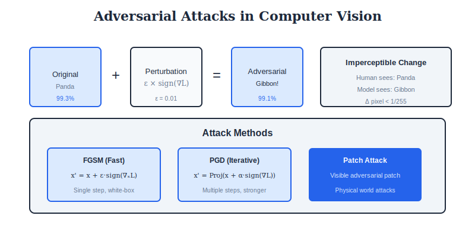

<div align="center">

<br/>

<a href="../18_Deployment_Systems/README.md"></a>
&nbsp;&nbsp;&nbsp;&nbsp;&nbsp;
<a href="../README.md"></a>
&nbsp;&nbsp;&nbsp;&nbsp;&nbsp;
<a href="../20_Research_Frontiers/README.md"></a>

<br/><br/>

---

<br/>

# 🛡️ ETHICS & SAFETY

### 🌙 *Responsible AI*

<br/>


&nbsp;&nbsp;

&nbsp;&nbsp;


<br/><br/>

---

</div>

<br/>

## 🎯 Key Concepts

| Topic | Issue | Mitigation |
| :--- | :--- | :--- |
| **Adversarial** | Small perturbations fool models | Adversarial training |
| **Bias** | Unfair performance across groups | Dataset balancing |
| **Privacy** | Models memorize data | Differential privacy |
| **Explainability** | Black-box decisions | Saliency maps, LIME |
| **Robustness** | Distribution shift | Domain adaptation |

---

## 🎨 Visual Overview

<div align="center">

</div>

---

## 🔢 Mathematical Foundations

### 1. Adversarial Examples

```
┌─────────────────────────────────────────────────────┐
│  DEFINITION                                         │
│                                                     │
│  x_adv = x + δ                                      │
│                                                     │
│  Such that:                                         │
│  - ||δ|| ≤ ε (imperceptible)                        │
│  - f(x_adv) ≠ f(x) (misclassification)              │
│                                                     │
│  ATTACK TYPES                                       │
│                                                     │
│  Untargeted: f(x_adv) ≠ y_true                      │
│  Targeted:   f(x_adv) = y_target                    │
│  White-box:  Attacker knows model                   │
│  Black-box:  Attacker queries model                 │
└─────────────────────────────────────────────────────┘
```

### 2. FGSM (Fast Gradient Sign Method)

```
┌─────────────────────────────────────────────────────┐
│  ATTACK                                             │
│                                                     │
│  x_adv = x + ε · sign(∇ₓ L(θ, x, y))                │
│                                                     │
│  - One step, fast                                   │
│  - Uses gradient direction to maximize loss         │
│  - ε controls perturbation magnitude                │
│                                                     │
│  INTUITION                                          │
│                                                     │
│  Move in direction that increases loss most         │
│  (steepest ascent in L∞ ball)                       │
└─────────────────────────────────────────────────────┘
```

### 3. PGD (Projected Gradient Descent)

```
┌─────────────────────────────────────────────────────┐
│  ITERATIVE ATTACK                                   │
│                                                     │
│  x₀ = x + noise  (random start)                     │
│                                                     │
│  FOR t = 1 to T:                                    │
│    xₜ = xₜ₋₁ + α · sign(∇ₓ L(θ, xₜ₋₁, y))           │
│    xₜ = Π_Bε(x)(xₜ)  (project back to ε-ball)       │
│                                                     │
│  Stronger than FGSM but slower                      │
│                                                     │
│  PROJECTION (L∞ ball)                               │
│  Π(x') = clip(x', x-ε, x+ε)                         │
└─────────────────────────────────────────────────────┘
```

### 4. Adversarial Training

```
┌─────────────────────────────────────────────────────┐
│  ROBUST OPTIMIZATION                                │
│                                                     │
│  min_θ E[(x,y)~D] [max_{||δ||≤ε} L(θ, x+δ, y)]      │
│                                                     │
│  Inner max: Find worst-case perturbation (PGD)      │
│  Outer min: Minimize loss on adversarial examples   │
│                                                     │
│  TRAINING LOOP                                      │
│                                                     │
│  1. Sample batch (x, y)                             │
│  2. Generate x_adv using PGD                        │
│  3. Compute loss on x_adv                           │
│  4. Update model                                    │
│                                                     │
│  Trade-off: Clean accuracy vs robust accuracy       │
└─────────────────────────────────────────────────────┘
```

### 5. Fairness Metrics

```
┌─────────────────────────────────────────────────────┐
│  DEMOGRAPHIC PARITY                                 │
│                                                     │
│  P(ŷ = 1 | A = 0) = P(ŷ = 1 | A = 1)                │
│                                                     │
│  Prediction rate same across groups                 │
│                                                     │
│  EQUALIZED ODDS                                     │
│                                                     │
│  P(ŷ = 1 | Y = y, A = 0) = P(ŷ = 1 | Y = y, A = 1)  │
│                                                     │
│  TPR and FPR same across groups                     │
│                                                     │
│  CALIBRATION                                        │
│                                                     │
│  P(Y = 1 | ŷ = p, A = a) = p  ∀a                    │
│                                                     │
│  Probability estimates are accurate per group       │
└─────────────────────────────────────────────────────┘
```

### 6. Explainability Methods

| Method | Type | Output |
| :--- | :--- | :--- |
| **Gradient** | White-box | ∂f/∂x (pixel importance) |
| **Grad-CAM** | White-box | Class activation map |
| **LIME** | Black-box | Local linear model |
| **SHAP** | Black-box | Shapley values |
| **Attention** | Model-based | Attention weights |

```
┌─────────────────────────────────────────────────────┐
│  GRAD-CAM                                           │
│                                                     │
│  1. Get feature maps Aᵏ from last conv layer        │
│  2. Compute gradients: ∂yᶜ/∂Aᵏ                      │
│  3. Global average pool: αₖᶜ = GAP(∂yᶜ/∂Aᵏ)         │
│  4. Weighted combination: L = ReLU(Σₖ αₖᶜ Aᵏ)       │
│                                                     │
│  Result: Heatmap of important regions               │
└─────────────────────────────────────────────────────┘
```

### 7. Differential Privacy

```
┌─────────────────────────────────────────────────────┐
│  (ε, δ)-DIFFERENTIAL PRIVACY                        │
│                                                     │
│  For neighboring datasets D, D':                    │
│  P(M(D) ∈ S) ≤ eᵋ P(M(D') ∈ S) + δ                  │
│                                                     │
│  ε: Privacy budget (lower = more private)           │
│  δ: Probability of failure                          │
│                                                     │
│  DP-SGD                                             │
│                                                     │
│  1. Clip gradients: g̃ = g / max(1, ||g||/C)        │
│  2. Add noise: g̃ₙₒᵢₛₑ = g̃ + N(0, σ²C²I)           │
│  3. Average and update                              │
│                                                     │
│  Privacy amplification via subsampling              │
└─────────────────────────────────────────────────────┘
```

---

## ⚙️ Algorithms

### Algorithm 1: FGSM Attack

```
┌─────────────────────────────────────────────────────┐
│  INPUT: Model f, image x, label y, epsilon ε        │
│  OUTPUT: Adversarial image x_adv                    │
│                                                     │
│  1. x.requires_grad = True                          │
│  2. output = f(x)                                   │
│  3. loss = CrossEntropy(output, y)                  │
│  4. loss.backward()                                 │
│  5. perturbation = ε × sign(x.grad)                 │
│  6. x_adv = clip(x + perturbation, 0, 1)            │
│  7. RETURN x_adv                                    │
│                                                     │
│  Note: For targeted attack, use -gradient           │
└─────────────────────────────────────────────────────┘
```

### Algorithm 2: PGD Attack

```
┌─────────────────────────────────────────────────────┐
│  INPUT: Model f, image x, label y, ε, α, T          │
│  OUTPUT: Adversarial image x_adv                    │
│                                                     │
│  1. x_adv = x + uniform(-ε, ε)  (random start)      │
│  2. FOR t = 1 to T:                                 │
│     3. x_adv.requires_grad = True                   │
│     4. loss = CrossEntropy(f(x_adv), y)             │
│     5. loss.backward()                              │
│     6. x_adv = x_adv + α × sign(x_adv.grad)         │
│     7. x_adv = clip(x_adv, x-ε, x+ε)  (project)     │
│     8. x_adv = clip(x_adv, 0, 1)      (valid)       │
│  9. RETURN x_adv                                    │
│                                                     │
│  Typical: T=20, α=ε/T × 2.5                         │
└─────────────────────────────────────────────────────┘
```

### Algorithm 3: Adversarial Training

```
┌─────────────────────────────────────────────────────┐
│  INPUT: Dataset D, model f, epochs, ε               │
│  OUTPUT: Robust model f                             │
│                                                     │
│  FOR epoch = 1 to epochs:                           │
│    FOR batch (x, y) in D:                           │
│      1. Generate x_adv = PGD(f, x, y, ε)            │
│      2. Compute loss = L(f(x_adv), y)               │
│      3. Optionally add clean loss:                  │
│         loss += λ × L(f(x), y)                      │
│      4. Backprop and update f                       │
│                                                     │
│  TRADES (improved):                                 │
│  L = CE(f(x), y) + β × KL(f(x), f(x_adv))           │
│                                                     │
│  Balances clean and robust accuracy                 │
└─────────────────────────────────────────────────────┘
```

### Algorithm 4: LIME (Local Interpretable Model-agnostic Explanations)

```
┌─────────────────────────────────────────────────────┐
│  INPUT: Model f, image x, num_samples N             │
│  OUTPUT: Feature importance weights                 │
│                                                     │
│  1. Segment image into superpixels S = {s₁,...,sₖ}  │
│  2. FOR i = 1 to N:                                 │
│     3. z'ᵢ = random binary vector (turn off parts)  │
│     4. xᵢ = apply z'ᵢ mask to x (gray out)          │
│     5. yᵢ = f(xᵢ) (model prediction)                │
│     6. wᵢ = exp(-d(x, xᵢ)²/σ²) (locality weight)    │
│  3. Fit weighted linear model:                      │
│     g = argmin_g Σᵢ wᵢ(f(xᵢ) - g(z'ᵢ))²             │
│  4. RETURN coefficients of g as importance          │
│                                                     │
│  Linear model g explains f locally around x         │
└─────────────────────────────────────────────────────┘
```

---

## ❓ Interview Questions & Answers

<details>
<summary><b>Q1: What are adversarial examples and why do they exist?</b></summary>

**Answer:**

**What:** Inputs with small perturbations that cause misclassification

**Why they exist:**
1. **High dimensionality:** Small perturbations in many dimensions can have large effects
2. **Linear nature:** Deep networks are locally linear, vulnerable to gradient direction
3. **Decision boundaries:** Models have near-linear boundaries near training data

**Example:** Adding ||δ||∞ ≤ 8/255 noise can flip predictions

</details>

<details>
<summary><b>Q2: Difference between FGSM and PGD?</b></summary>

**Answer:**

| Aspect | FGSM | PGD |
| :--- | :--- | :--- |
| Steps | 1 | Multiple (T) |
| Strength | Weaker | Stronger |
| Speed | Fast | Slower |
| Random start | No | Yes |
| Use | Quick test | Adversarial training |

**PGD** is considered the strongest first-order attack

</details>

<details>
<summary><b>Q3: What is the trade-off in adversarial training?</b></summary>

**Answer:**

**Problem:** Adversarial training reduces clean accuracy

**Typical:** ~5-10% drop in clean accuracy for robust models

**Why:**
- Robust features may differ from most predictive features
- Model capacity split between clean and robust performance

**Solutions:**
- Larger models (more capacity)
- TRADES: Explicitly balance clean and robust

</details>

<details>
<summary><b>Q4: What are different types of fairness?</b></summary>

**Answer:**

| Type | Definition | Issue |
| :--- | :--- | :--- |
| **Demographic Parity** | Equal positive rate | May violate if base rates differ |
| **Equalized Odds** | Equal TPR and FPR | Harder to achieve |
| **Predictive Parity** | Equal precision | Can conflict with others |
| **Calibration** | Accurate probabilities per group | May not ensure equal outcomes |

**Impossibility theorem:** Can't satisfy all fairness criteria simultaneously

</details>

<details>
<summary><b>Q5: How does Grad-CAM work?</b></summary>

**Answer:**

**Goal:** Visualize which image regions influence prediction

**Steps:**
1. Forward pass to get feature maps A from last conv layer
2. Compute gradient of class score w.r.t feature maps
3. Global average pool gradients to get importance weights α
4. Weighted sum: L = ReLU(Σ αₖAᵏ)

**Result:** Coarse localization heatmap

**Limitation:** Low resolution (from conv layer size)

</details>

<details>
<summary><b>Q6: What is differential privacy in ML?</b></summary>

**Answer:**

**Goal:** Limit information leakage about individual training examples

**DP-SGD:**
1. Clip per-sample gradients (bound sensitivity)
2. Add Gaussian noise to gradient
3. Privacy budget ε tracks total leakage

**Trade-off:** More noise = more privacy = less accuracy

**Applications:** Medical data, user data training

</details>

<details>
<summary><b>Q7: What are common sources of bias in vision models?</b></summary>

**Answer:**

**Data bias:**
- Imbalanced representation
- Skewed geography/demographics
- Historical biases in labels

**Model bias:**
- Learns shortcuts (spurious correlations)
- Amplifies training biases

**Evaluation bias:**
- Benchmarks not representative
- Single aggregate metrics hide disparities

**Mitigation:** Diverse data, fairness constraints, disaggregated evaluation

</details>

<details>
<summary><b>Q8: LIME vs SHAP for explainability?</b></summary>

**Answer:**

| Aspect | LIME | SHAP |
| :--- | :--- | :--- |
| Basis | Local linear model | Shapley values |
| Consistency | May vary with sampling | Mathematically consistent |
| Speed | Fast | Can be slow |
| Features | Superpixels | Any features |
| Theory | Heuristic | Game theory |

**SHAP** provides theoretical guarantees but LIME is more practical for images

</details>

---

## 📚 Key Formulas Reference

| Formula | Description |
| :--- | :--- |
| x_adv = x + ε·sign(∇L) | FGSM attack |
| xₜ = Π(xₜ₋₁ + α·sign(∇L)) | PGD step |
| L = ReLU(Σ αₖAᵏ) | Grad-CAM |
| P(M(D)∈S) ≤ eᵋP(M(D')∈S)+δ | Differential privacy |


---

<br/>

<div align="center">

## 📓 PRACTICE

<br/>

### 🚀 Open in Google Colab

<br/>

**Option 1: Direct Link (After pushing to GitHub)**
```
Replace YOUR_USERNAME with your GitHub username:
https://colab.research.google.com/github/YOUR_USERNAME/computer_vision_complete/blob/main/19_Ethics_Safety/colab_tutorial.ipynb
```

**Option 2: Manual Upload (Works Immediately!)**
1. [📥 Download this notebook](./colab_tutorial.ipynb)
2. Go to [Google Colab](https://colab.research.google.com)
3. Click "Upload" → Select the downloaded `.ipynb` file
4. Run all cells!

**Option 3: Open from GitHub (if already pushed)**
- Click the notebook file on GitHub
- Click "Open in Colab" button (if available)
- Or copy the GitHub URL and paste it into Colab's "File → Open notebook → GitHub" option

<br/>

<a href="https://colab.research.google.com/">

</a>

</div>

<br/>


---

<br/>

<div align="center">

| | | |
| :--- |:---:|---:|
| **[◀ Deploy](../18_Deployment_Systems/README.md)** | **[🏠 HOME](../README.md)** | **[Research ▶](../20_Research_Frontiers/README.md)** |

<br/>

---

🌙 Part of **[Computer Vision Complete](../README.md)** · Made with ❤️

<br/>

</div>
