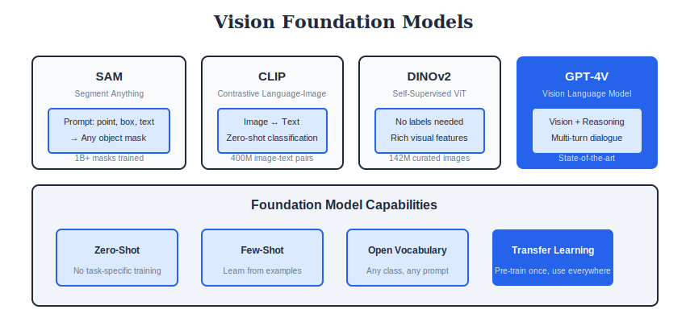

<div align="center">

<br/>

<a href="../19_Ethics_Safety/README.md"></a>
&nbsp;&nbsp;&nbsp;&nbsp;&nbsp;
<a href="../README.md"></a>
&nbsp;&nbsp;&nbsp;&nbsp;&nbsp;


<br/><br/>

---

<br/>

# 🔬 RESEARCH FRONTIERS

### 🌙 *The Cutting Edge*

<br/>


&nbsp;&nbsp;

&nbsp;&nbsp;


<br/><br/>

---

</div>

<br/>

## 🎯 Key Concepts

| Topic | Description | Examples |
| :--- | :--- | :--- |
| **Foundation Models** | Large-scale pretrained models | SAM, CLIP, DINOv2 |
| **Zero-Shot** | Generalize without task-specific training | CLIP, GPT-4V |
| **Few-Shot** | Learn from few examples | Prototypical Networks |
| **World Models** | Learn environment dynamics | Dreamer, JEPA |
| **Neuro-Symbolic** | Combine neural + symbolic AI | CLEVR, VQA |

---

## 🎨 Visual Overview

<div align="center">

</div>

---

## 🔢 Mathematical Foundations

### 1. Foundation Models

```
┌─────────────────────────────────────────────────────┐
│  DEFINITION                                         │
│                                                     │
│  Large models trained on broad data that can be     │
│  adapted to many downstream tasks                   │
│                                                     │
│  KEY PROPERTIES                                     │
│                                                     │
│  1. Scale: Billions of parameters                   │
│  2. Generality: Works across tasks                  │
│  3. Emergence: Capabilities emerge at scale         │
│  4. Transfer: Pretrain once, adapt many             │
│                                                     │
│  VISION FOUNDATION MODELS                           │
│                                                     │
│  - SAM: Segment Anything (promptable segmentation)  │
│  - DINOv2: Self-supervised features                 │
│  - CLIP: Vision-language alignment                  │
└─────────────────────────────────────────────────────┘
```

### 2. Zero-Shot Learning

```
┌─────────────────────────────────────────────────────┐
│  DEFINITION                                         │
│                                                     │
│  Classify classes never seen during training        │
│                                                     │
│  ATTRIBUTE-BASED                                    │
│                                                     │
│  f(x) = argmax_c sim(φ(x), a_c)                     │
│                                                     │
│  Where a_c = attribute vector of class c            │
│  (e.g., "has stripes", "four legs")                 │
│                                                     │
│  EMBEDDING-BASED (CLIP)                             │
│                                                     │
│  f(x) = argmax_c sim(f_img(x), f_txt("a {c}"))      │
│                                                     │
│  Use text descriptions as class definitions         │
└─────────────────────────────────────────────────────┘
```

### 3. Few-Shot Learning

```
┌─────────────────────────────────────────────────────┐
│  N-WAY K-SHOT CLASSIFICATION                        │
│                                                     │
│  Support set: K examples per N classes              │
│  Query set: Samples to classify                     │
│                                                     │
│  PROTOTYPICAL NETWORKS                              │
│                                                     │
│  1. Compute prototype per class:                    │
│     c_n = (1/K) Σₖ f_θ(x_n,k)                       │
│                                                     │
│  2. Classify query by nearest prototype:            │
│     p(y=n|x) ∝ exp(-d(f_θ(x), c_n))                 │
│                                                     │
│  MAML (Model-Agnostic Meta-Learning)                │
│                                                     │
│  θ* = θ - α∇θ L(D_support)                          │
│  Meta-update: θ ← θ - β∇θ L(D_query; θ*)            │
└─────────────────────────────────────────────────────┘
```

### 4. Segment Anything (SAM)

```
┌─────────────────────────────────────────────────────┐
│  PROMPTABLE SEGMENTATION                            │
│                                                     │
│  Input: Image I + Prompt P (point, box, text)       │
│  Output: Segmentation mask M                        │
│                                                     │
│  ARCHITECTURE                                       │
│                                                     │
│  1. Image Encoder (ViT-H): I → features F           │
│  2. Prompt Encoder: P → prompt embedding            │
│  3. Mask Decoder: F + prompt → M                    │
│                                                     │
│  TRAINING (SA-1B dataset)                           │
│                                                     │
│  - 11M images, 1B+ masks                            │
│  - Interactive annotation with model in the loop    │
│  - Focal loss + dice loss for masks                 │
│                                                     │
│  Loss = λ_focal × L_focal + λ_dice × L_dice         │
└─────────────────────────────────────────────────────┘
```

### 5. World Models

```
┌─────────────────────────────────────────────────────┐
│  LEARN ENVIRONMENT DYNAMICS                         │
│                                                     │
│  Components:                                        │
│  1. Encoder: o_t → z_t (observation to latent)      │
│  2. Dynamics: z_t, a_t → z_{t+1} (prediction)       │
│  3. Decoder: z_t → ô_t (reconstruction)             │
│                                                     │
│  DREAMER                                            │
│                                                     │
│  Learn in imagination:                              │
│  - Train world model from real experience           │
│  - Train policy in imagined rollouts                │
│                                                     │
│  JEPA (Joint Embedding Predictive Architecture)     │
│                                                     │
│  Predict in embedding space, not pixel space        │
│  z_{y} = predictor(z_x, Δ)                          │
│  Loss = ||z_y - z_{y_true}||²                       │
└─────────────────────────────────────────────────────┘
```

### 6. Continual Learning

```
┌─────────────────────────────────────────────────────┐
│  PROBLEM: Catastrophic Forgetting                   │
│                                                     │
│  Learning task B hurts performance on task A        │
│                                                     │
│  APPROACHES                                         │
│                                                     │
│  1. REPLAY: Store/generate old examples             │
│     L = L_new + L_replay                            │
│                                                     │
│  2. REGULARIZATION (EWC):                           │
│     L = L_new + λΣᵢ Fᵢ(θᵢ - θ*ᵢ)²                   │
│     Fᵢ = Fisher information (importance)            │
│                                                     │
│  3. ARCHITECTURE:                                   │
│     Add task-specific modules                       │
│     Freeze old, add new                             │
│                                                     │
│  4. PARAMETER ISOLATION:                            │
│     Different subsets for different tasks           │
└─────────────────────────────────────────────────────┘
```

### 7. Neuro-Symbolic AI

```
┌─────────────────────────────────────────────────────┐
│  COMBINE NEURAL + SYMBOLIC                          │
│                                                     │
│  Neural: Pattern recognition, learning              │
│  Symbolic: Reasoning, compositionality              │
│                                                     │
│  NEURAL SCENE REPRESENTATIONS                       │
│                                                     │
│  Image → Object detector → Scene graph              │
│  Scene graph + Question → Reasoning → Answer        │
│                                                     │
│  PROGRAM SYNTHESIS                                  │
│                                                     │
│  Learn to generate programs from data               │
│  Neural network outputs symbolic program            │
│                                                     │
│  DIFFERENTIABLE REASONING                           │
│                                                     │
│  Soft logic: ∧ = min, ∨ = max, ¬ = 1-x              │
│  End-to-end trainable reasoning                     │
└─────────────────────────────────────────────────────┘
```

---

## ⚙️ Algorithms

### Algorithm 1: Prototypical Networks (Few-Shot)

```
┌─────────────────────────────────────────────────────┐
│  INPUT: Support set S, Query set Q                  │
│  OUTPUT: Class predictions for Q                    │
│                                                     │
│  1. COMPUTE PROTOTYPES (per class c):               │
│     p_c = (1/|S_c|) Σ f(x)  for x in S_c            │
│     f = embedding network                           │
│                                                     │
│  2. CLASSIFY QUERIES:                               │
│     FOR each query q:                               │
│       d_c = ||f(q) - p_c||²  (distance to proto)    │
│       P(y=c|q) = softmax(-d_c)                      │
│                                                     │
│  3. TRAIN with episodic learning                    │
│     Sample N-way K-shot episodes                    │
│     Minimize cross-entropy on queries               │
└─────────────────────────────────────────────────────┘
```

### Algorithm 2: SAM (Segment Anything)

```
┌─────────────────────────────────────────────────────┐
│  INPUT: Image, prompts (points/boxes/text)          │
│  OUTPUT: Segmentation masks                         │
│                                                     │
│  1. IMAGE ENCODER (ViT-H):                          │
│     image_embedding = MAE_encoder(image)            │
│     Run once per image                              │
│                                                     │
│  2. PROMPT ENCODER:                                 │
│     prompt_embedding = encode(points/boxes/text)    │
│                                                     │
│  3. MASK DECODER (lightweight):                     │
│     masks = decode(image_emb, prompt_emb)           │
│     Output multiple mask candidates                 │
│                                                     │
│  Key: Promptable - any type of prompt works         │
└─────────────────────────────────────────────────────┘
```

### Algorithm 3: CLIP Zero-Shot Classification

```
┌─────────────────────────────────────────────────────┐
│  INPUT: Image, class names                          │
│  OUTPUT: Class prediction                           │
│                                                     │
│  1. ENCODE IMAGE:                                   │
│     z_img = ImageEncoder(image)                     │
│     z_img = z_img / ||z_img||  (normalize)          │
│                                                     │
│  2. ENCODE TEXT (for each class):                   │
│     text_c = "a photo of a {class_name}"            │
│     z_text_c = TextEncoder(text_c)                  │
│     z_text_c = z_text_c / ||z_text_c||              │
│                                                     │
│  3. COMPUTE SIMILARITY:                             │
│     sim_c = z_img · z_text_c  (dot product)         │
│     probs = softmax(sim / temperature)              │
│                                                     │
│  No training on target classes needed!              │
└─────────────────────────────────────────────────────┘
```

---

## 🌟 Emerging Paradigms

### 1. In-Context Learning

```
┌─────────────────────────────────────────────────────┐
│  LEARN FROM EXAMPLES IN PROMPT                      │
│                                                     │
│  Prompt: [Example 1] [Example 2] ... [Query]        │
│                                                     │
│  No gradient updates, just conditioning             │
│  Emergent ability at scale                          │
│                                                     │
│  Vision: GPT-4V, Gemini with image examples         │
└─────────────────────────────────────────────────────┘
```

### 2. Multimodal Reasoning

```
┌─────────────────────────────────────────────────────┐
│  BEYOND PERCEPTION                                  │
│                                                     │
│  - Chain-of-thought for visual reasoning            │
│  - Tool use (code, search, calculators)             │
│  - Multi-step problem solving                       │
│                                                     │
│  Examples: GPT-4V math, diagram understanding       │
└─────────────────────────────────────────────────────┘
```

### 3. 3D Generation from Text/Images

```
┌─────────────────────────────────────────────────────┐
│  TEXT/IMAGE → 3D                                    │
│                                                     │
│  - Score Distillation: Use 2D diffusion for 3D      │
│  - Multi-view generation + reconstruction           │
│  - NeRF/3D Gaussian from single image               │
│                                                     │
│  Methods: DreamFusion, Zero123, Magic3D             │
└─────────────────────────────────────────────────────┘
```

---

## ❓ Interview Questions & Answers

<details>
<summary><b>Q1: What makes a model a "foundation model"?</b></summary>

**Answer:**

**Characteristics:**
1. **Scale:** Very large (billions of parameters)
2. **Broad data:** Trained on diverse, large-scale data
3. **Generality:** Applicable to many downstream tasks
4. **Emergence:** Capabilities emerge that weren't explicitly trained

**Examples in Vision:**
- SAM: Promptable segmentation on any image
- DINOv2: General visual features
- CLIP: Vision-language alignment

**Key shift:** From task-specific to general-purpose

</details>

<details>
<summary><b>Q2: How does zero-shot learning differ from few-shot?</b></summary>

**Answer:**

| Aspect | Zero-Shot | Few-Shot |
| :--- | :--- | :--- |
| Training examples | 0 | 1-10 per class |
| Class definition | Attributes/text | Example images |
| Generalization | Semantic transfer | Example matching |
| Example | CLIP text prompts | Prototypical networks |

**Zero-shot** requires semantic knowledge of new classes
**Few-shot** adapts from small support set

</details>

<details>
<summary><b>Q3: What is SAM and why is it significant?</b></summary>

**Answer:**

**Segment Anything Model:**
- Promptable: Point, box, or text input
- Zero-shot: Works on any image without fine-tuning
- Dataset: SA-1B (1B+ masks, 11M images)

**Significance:**
1. Foundation model for segmentation
2. Enables interactive segmentation
3. Works across domains (medical, satellite, etc.)
4. Promptable interface → flexible applications

</details>

<details>
<summary><b>Q4: Explain the idea of world models.</b></summary>

**Answer:**

**Concept:** Learn a model of environment dynamics

**Components:**
- Encoder: Observation → latent state
- Dynamics: Predict next state from action
- (Optional) Decoder: Latent → observation

**Uses:**
1. **Planning:** Simulate before acting
2. **Sample efficiency:** Learn in imagination
3. **Robustness:** Handle distribution shift

**JEPA innovation:** Predict in latent space (not pixels)

</details>

<details>
<summary><b>Q5: What is catastrophic forgetting?</b></summary>

**Answer:**

**Problem:** Training on new task degrades old task performance

**Why:** Neural networks overwrite old knowledge with new

**Solutions:**

| Method | Approach |
| :--- | :--- |
| Replay | Store/generate old examples |
| Regularization | Protect important weights (EWC) |
| Architecture | Task-specific modules |
| Isolation | Different params per task |

</details>

<details>
<summary><b>Q6: What is neuro-symbolic AI?</b></summary>

**Answer:**

**Combine:**
- Neural: Pattern recognition, learning from data
- Symbolic: Logic, reasoning, compositionality

**Approaches:**
1. Neural perception → symbolic reasoning
2. Differentiable logic (soft constraints)
3. Neural program synthesis

**Advantages:**
- Interpretable reasoning
- Data efficient (structure)
- Compositional generalization

</details>

<details>
<summary><b>Q7: How does in-context learning work?</b></summary>

**Answer:**

**Mechanism:** Condition on examples in prompt, no weight updates

**Example prompt:**
```
Image1: cat → "cat"
Image2: dog → "dog"  
Image3: ? → [model predicts]
```

**Why it works:** Large models learn to pattern match

**Requirements:** Very large model (emergent ability)

**Vision:** GPT-4V can do few-shot classification from examples in prompt

</details>

<details>
<summary><b>Q8: What are current frontiers in vision research?</b></summary>

**Answer:**

1. **Foundation models:** SAM, DINOv2 for general features
2. **Multimodal reasoning:** GPT-4V, Gemini for complex tasks
3. **3D generation:** Text/image to 3D (DreamFusion)
4. **Video understanding:** Long context, temporal reasoning
5. **Embodied AI:** Vision for robotics
6. **Efficient models:** On-device, real-time
7. **Robust/fair:** Distribution shift, fairness

</details>

---

## 📚 Key Formulas Reference

| Formula | Description |
| :--- | :--- |
| c_n = (1/K)Σf(x_k) | Prototype computation |
| θ* = θ - α∇L_support | MAML inner loop |
| L = λ_focal L_focal + λ_dice L_dice | SAM loss |
| L = L_new + λΣF(θ-θ*)² | EWC regularization |
| z' = predictor(z, Δ) | JEPA prediction |


---

<br/>

<div align="center">

## 📓 PRACTICE

### 🚀 *Ready to code? Let's get started!*

<br/>

### 🚀 Open in Google Colab

<br/>

<p align="center">
  <a href="https://colab.research.google.com/github/falkomeAI/computer_vision_complete/blob/main/20_Research_Frontiers/colab_tutorial.ipynb">
    
  </a>
</p>

<br/>

<p align="center">
  <strong>✨ Click the badge above to open this notebook directly in Google Colab!</strong>
</p>

<br/>


</div>

<br/>


---

<br/>

<div align="center">

| | | |
| :--- |:---:|---:|
| **[◀ Ethics](../19_Ethics_Safety/README.md)** | **[🏠 HOME](../README.md)** |  |

<br/>

---

🌙 Part of **[Computer Vision Complete](../README.md)**

<p align="center">
  Made with ❤️ by <a href="https://github.com/falkomeAI">falkomeAI</a>
</p>

<p align="center">
  
</p>

<br/>

</div>
