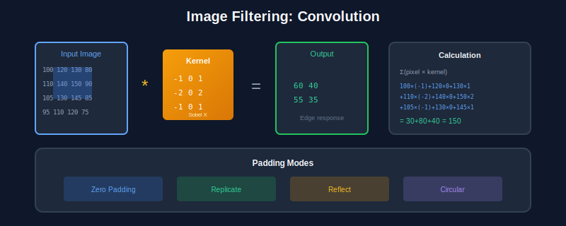
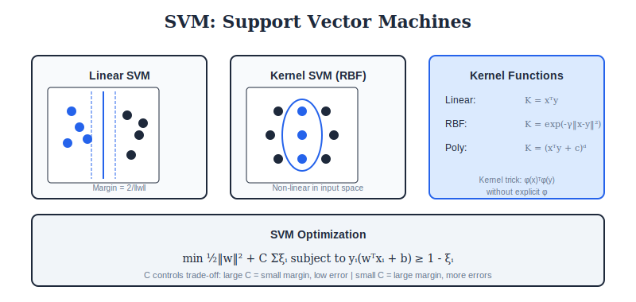
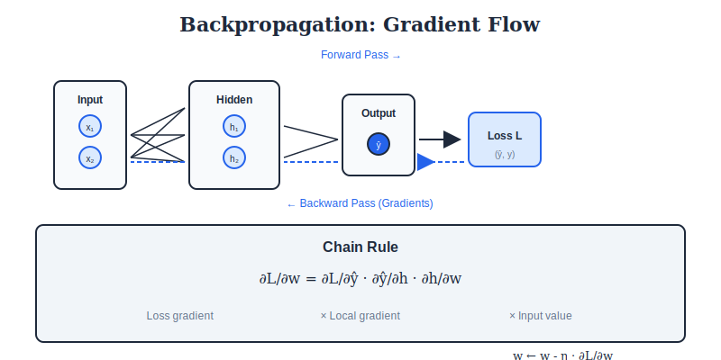
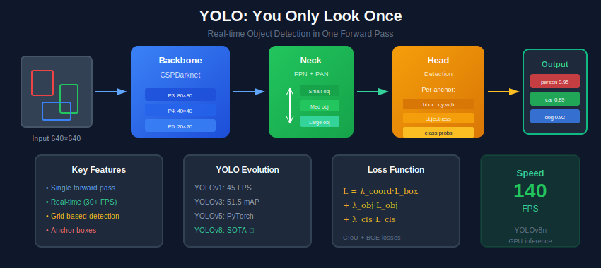
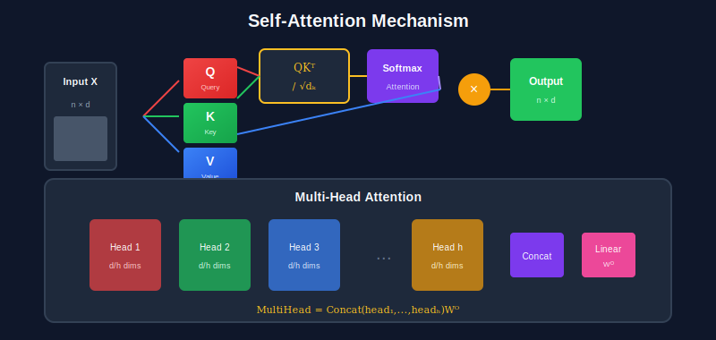
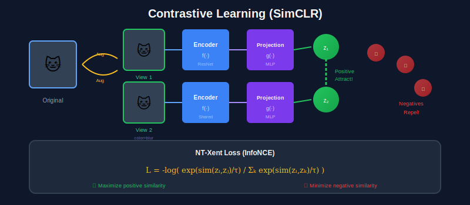
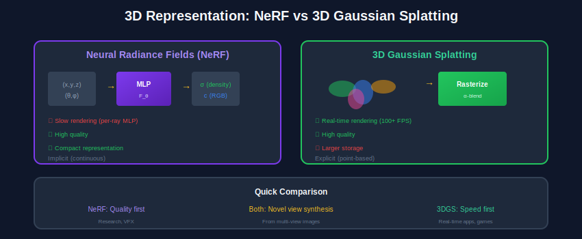
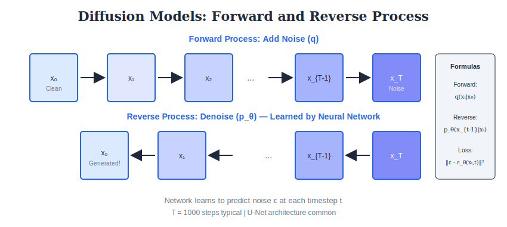
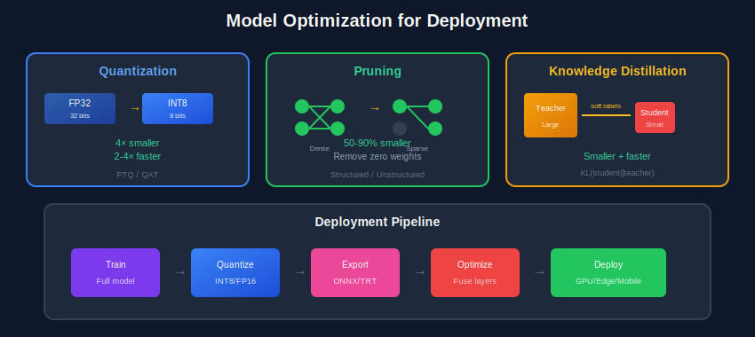
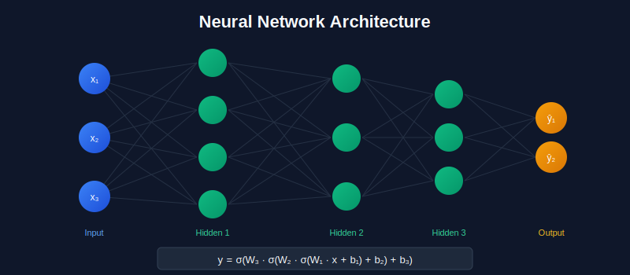

<div align="center">

<br/>

<!-- ▀▀▀▀▀▀▀▀▀▀▀▀▀▀▀▀▀▀▀▀▀▀▀▀▀▀▀▀▀▀▀▀▀▀▀▀▀▀▀▀▀▀▀▀▀▀▀▀▀▀▀▀▀▀▀▀▀▀▀▀▀▀▀▀▀▀▀▀▀▀▀▀▀▀▀▀▀▀
                              COMPUTER VISION COMPLETE
    ▄▄▄▄▄▄▄▄▄▄▄▄▄▄▄▄▄▄▄▄▄▄▄▄▄▄▄▄▄▄▄▄▄▄▄▄▄▄▄▄▄▄▄▄▄▄▄▄▄▄▄▄▄▄▄▄▄▄▄▄▄▄▄▄▄▄▄▄▄▄▄▄▄▄▄▄▄▄ -->


<br/>
<br/>

# 🌙 COMPUTER VISION COMPLETE

<br/>


<br/>
<br/>

<!-- ████████████████████████████████████████████████████████████████████████████
                                   STATS CARDS
     ████████████████████████████████████████████████████████████████████████████ -->

<p>


</p>

<br/>

<!-- Tech Stack -->
<p>


</p>

<br/>

---

</div>

<br/>

<!-- ████████████████████████████████████████████████████████████████████████████
                                  QUICK START
     ████████████████████████████████████████████████████████████████████████████ -->

<div align="center">

## ⚡ QUICK START

<br/>

```
┏━━━━━━━━━━━━━━━━━━━━━━━━━━━━━━━━━━━━━━━━━━━━━━━━━━━━━━━━━━━━━━━━━━━━━━━━━━━━━━━┓
┃                                                                               ┃
┃   📥 Download .ipynb  →  🌐 Open colab.google  →  📤 Upload  →  ▶️ Run All   ┃
┃                                                                               ┃
┗━━━━━━━━━━━━━━━━━━━━━━━━━━━━━━━━━━━━━━━━━━━━━━━━━━━━━━━━━━━━━━━━━━━━━━━━━━━━━━━┛
```

</div>

<br/>

---

<br/>

<!-- ████████████████████████████████████████████████████████████████████████████
                                 LEARNING PATH
     ████████████████████████████████████████████████████████████████████████████ -->

<div align="center">

## 🗺️ LEARNING PATH

<br/>

```
                         ┏━━━━━━━━━━━━━━━━━━━━━━━━━━━━━━━━━━━━━┓
                         ┃     🌙 COMPUTER VISION MASTERY     ┃
                         ┗━━━━━━━━━━━━━━━━━┳━━━━━━━━━━━━━━━━━━┛
                                           ┃
            ┏━━━━━━━━━━━━━━━━━━━━━━━━━━━━━━┻━━━━━━━━━━━━━━━━━━━━━━━━━━━━━━┓
            ┃                              ┃                              ┃
            ▼                              ▼                              ▼
     ┏━━━━━━━━━━━━━┓              ┏━━━━━━━━━━━━━┓              ┏━━━━━━━━━━━━━┓
     ┃   📐 MATH   ┃              ┃  🖼️ IMAGE   ┃              ┃ 🔍 FEATURES ┃
     ┃   [01-02]   ┃              ┃   [03-04]   ┃              ┃   [05-06]   ┃
     ┗━━━━━━┳━━━━━━┛              ┗━━━━━━┳━━━━━━┛              ┗━━━━━━┳━━━━━━┛
            ┃                            ┃                            ┃
            ┗━━━━━━━━━━━━━━━━━━━━━━━━━━━━┻━━━━━━━━━━━━━━━━━━━━━━━━━━━━┛
                                         ┃
                         ┏━━━━━━━━━━━━━━━━┻━━━━━━━━━━━━━━━━┓
                         ┃   🧠 MACHINE LEARNING [07-08]   ┃
                         ┗━━━━━━━━━━━━━━━━┳━━━━━━━━━━━━━━━━┛
                                          ┃
            ┏━━━━━━━━━━━━━━━━━━━━━━━━━━━━━━┻━━━━━━━━━━━━━━━━━━━━━━━━━━━━━━┓
            ┃                              ┃                              ┃
            ▼                              ▼                              ▼
     ┏━━━━━━━━━━━━━┓              ┏━━━━━━━━━━━━━┓              ┏━━━━━━━━━━━━━┓
     ┃  🏗️ CNNs    ┃              ┃  📋 TASKS   ┃              ┃  👁️ ViTs    ┃
     ┃    [09]     ┃              ┃    [10]     ┃              ┃   [11-12]   ┃
     ┗━━━━━━━━━━━━━┛              ┗━━━━━━━━━━━━━┛              ┗━━━━━━━━━━━━━┛
                                          ┃
                         ┏━━━━━━━━━━━━━━━━┻━━━━━━━━━━━━━━━━┓
                         ┃      🚀 ADVANCED [13-20]        ┃
                         ┃  Video│3D│Gen│VLM│Photo│Deploy  ┃
                         ┗━━━━━━━━━━━━━━━━━━━━━━━━━━━━━━━━━┛
```

</div>

<br/>

---

<br/>

<!-- ████████████████████████████████████████████████████████████████████████████
                                COURSE MODULES
     ████████████████████████████████████████████████████████████████████████████ -->

<div align="center">

## 📚 COURSE MODULES

</div>

<br/>

<!-- ━━━━━━━━━━━━━━━━━━━━━ PART 1: FOUNDATIONS ━━━━━━━━━━━━━━━━━━━━━ -->

<div align="center">

### ━━━━━━━━━━━━━━ 🔷 PART 1 · FOUNDATIONS ━━━━━━━━━━━━━━

</div>

<br/>

<table>
<tr>
<td width="50%" valign="top">

<div align="center">

[](01_Mathematical_Foundations/README.md)

<br/>


<br/>

```
┌─────────────────────────────────┐
│  Linear Algebra • Calculus      │
│  Probability • Optimization     │
└─────────────────────────────────┘
```

<br/>


</div>

</td>
<td width="50%" valign="top">

<div align="center">

[](02_Transform_Methods/README.md)

<br/>


<br/>

```
┌─────────────────────────────────┐
│  Fourier • DCT • Wavelets       │
│  Frequency Domain Analysis      │
└─────────────────────────────────┘
```

<br/>


</div>

</td>
</tr>
<tr>
<td width="50%" valign="top">

<div align="center">

[](03_Image_Formation/README.md)

<br/>


<br/>

```
┌─────────────────────────────────┐
│  Cameras • Sensors • Optics     │
│  Radiometry • Color Science     │
└─────────────────────────────────┘
```

<br/>


</div>

</td>
<td width="50%" valign="top">

<div align="center">

[](04_Low_Level_Processing/README.md)

<br/>



<br/>

```
┌─────────────────────────────────┐
│  Filtering • Enhancement        │
│  Restoration • Color Spaces     │
└─────────────────────────────────┘
```

<br/>


</div>

</td>
</tr>
</table>

<br/>

---

<br/>

<!-- ━━━━━━━━━━━━━━━━━━━━━ PART 2: FEATURES & GEOMETRY ━━━━━━━━━━━━━━━━━━━━━ -->

<div align="center">

### ━━━━━━━━━━━━━━ 🔶 PART 2 · FEATURES & GEOMETRY ━━━━━━━━━━━━━━

</div>

<br/>

<table>
<tr>
<td width="50%" valign="top">

<div align="center">

[](05_Features_Detection/README.md)

<br/>


<br/>

```
┌─────────────────────────────────┐
│  Edges • Corners • Blobs        │
│  Descriptors • Matching         │
└─────────────────────────────────┘
```

<br/>


</div>

</td>
<td width="50%" valign="top">

<div align="center">

[](06_Geometry_MultiView/README.md)

<br/>


<br/>

```
┌─────────────────────────────────┐
│  Homography • Stereo Vision     │
│  Structure from Motion          │
└─────────────────────────────────┘
```

<br/>


</div>

</td>
</tr>
</table>

<br/>

---

<br/>

<!-- ━━━━━━━━━━━━━━━━━━━━━ PART 3: MACHINE LEARNING ━━━━━━━━━━━━━━━━━━━━━ -->

<div align="center">

### ━━━━━━━━━━━━━━ 🟢 PART 3 · MACHINE LEARNING ━━━━━━━━━━━━━━

</div>

<br/>

<table>
<tr>
<td width="50%" valign="top">

<div align="center">

[](07_Classical_ML/README.md)

<br/>



<br/>

```
┌─────────────────────────────────┐
│  PCA • SVM • Clustering         │
│  Decision Trees • Ensemble      │
└─────────────────────────────────┘
```

<br/>


</div>

</td>
<td width="50%" valign="top">

<div align="center">

[](08_Neural_Networks/README.md)

<br/>



<br/>

```
┌─────────────────────────────────┐
│  Perceptron • MLP • Backprop    │
│  Optimization • Regularize      │
└─────────────────────────────────┘
```

<br/>


</div>

</td>
</tr>
</table>

<br/>

---

<br/>

<!-- ━━━━━━━━━━━━━━━━━━━━━ PART 4: DEEP LEARNING ━━━━━━━━━━━━━━━━━━━━━ -->

<div align="center">

### ━━━━━━━━━━━━━━ 🟣 PART 4 · DEEP LEARNING ━━━━━━━━━━━━━━

</div>

<br/>

<table>
<tr>
<td width="50%" valign="top">

<div align="center">

[](09_CNN_Architectures/README.md)

<br/>


<br/>

```
┌─────────────────────────────────┐
│  LeNet → VGG → ResNet           │
│  Inception → EfficientNet       │
└─────────────────────────────────┘
```

<br/>


</div>

</td>
<td width="50%" valign="top">

<div align="center">

[](10_Vision_Tasks/README.md)

<br/>



<br/>

```
┌─────────────────────────────────┐
│  Detection • Segmentation       │
│  Tracking • Recognition         │
└─────────────────────────────────┘
```

<br/>


</div>

</td>
</tr>
<tr>
<td width="50%" valign="top">

<div align="center">

[](11_Vision_Transformers/README.md)

<br/>



<br/>

```
┌─────────────────────────────────┐
│  ViT • Swin • DeiT              │
│  Attention Mechanisms           │
└─────────────────────────────────┘
```

<br/>


</div>

</td>
<td width="50%" valign="top">

<div align="center">

[](12_Self_Supervised/README.md)

<br/>



<br/>

```
┌─────────────────────────────────┐
│  Contrastive Learning           │
│  MAE • DINO • BYOL              │
└─────────────────────────────────┘
```

<br/>


</div>

</td>
</tr>
</table>

<br/>

---

<br/>

<!-- ━━━━━━━━━━━━━━━━━━━━━ PART 5: ADVANCED ━━━━━━━━━━━━━━━━━━━━━ -->

<div align="center">

### ━━━━━━━━━━━━━━ 🔴 PART 5 · ADVANCED TOPICS ━━━━━━━━━━━━━━

</div>

<br/>

<table>
<tr>
<td width="50%" valign="top">

<div align="center">

[](13_Video_Temporal/README.md)

<br/>


<br/>

```
┌─────────────────────────────────┐
│  Optical Flow • Action Recog.   │
│  Video Understanding            │
└─────────────────────────────────┘
```

</div>

</td>
<td width="50%" valign="top">

<div align="center">

[](14_3D_Vision/README.md)

<br/>



<br/>

```
┌─────────────────────────────────┐
│  Depth • Point Clouds           │
│  NeRF • SLAM                    │
└─────────────────────────────────┘
```

</div>

</td>
</tr>
<tr>
<td width="50%" valign="top">

<div align="center">

[](15_Generative_Vision/README.md)

<br/>



<br/>

```
┌─────────────────────────────────┐
│  VAE • GAN • Diffusion          │
│  Image Synthesis                │
└─────────────────────────────────┘
```

</div>

</td>
<td width="50%" valign="top">

<div align="center">

[](16_Vision_Language/README.md)

<br/>


<br/>

```
┌─────────────────────────────────┐
│  CLIP • Captioning • VQA        │
│  Multimodal Learning            │
└─────────────────────────────────┘
```

</div>

</td>
</tr>
<tr>
<td width="50%" valign="top">

<div align="center">

[](17_Computational_Photography/README.md)

<br/>


<br/>

```
┌─────────────────────────────────┐
│  HDR • Deblur • Super-Res       │
│  Image Enhancement              │
└─────────────────────────────────┘
```

</div>

</td>
<td width="50%" valign="top">

<div align="center">

[](18_Deployment_Systems/README.md)

<br/>



<br/>

```
┌─────────────────────────────────┐
│  Quantization • Pruning         │
│  ONNX • TensorRT                │
└─────────────────────────────────┘
```

</div>

</td>
</tr>
<tr>
<td width="50%" valign="top">

<div align="center">

[](19_Ethics_Safety/README.md)

<br/>


<br/>

```
┌─────────────────────────────────┐
│  Adversarial • Fairness         │
│  Privacy • Explainability       │
└─────────────────────────────────┘
```

</div>

</td>
<td width="50%" valign="top">

<div align="center">

[](20_Research_Frontiers/README.md)

<br/>


<br/>

```
┌─────────────────────────────────┐
│  Foundation Models              │
│  World Models • Agents          │
└─────────────────────────────────┘
```

</div>

</td>
</tr>
</table>

<br/>

---

<br/>

<!-- ████████████████████████████████████████████████████████████████████████████
                                 VISUAL GALLERY
     ████████████████████████████████████████████████████████████████████████████ -->

<div align="center">

## 🎨 VISUAL GALLERY

<br/>

<table>
<tr>
<td align="center">

<br/>


</td>
<td align="center">

<br/>


</td>
<td align="center">

<br/>


</td>
</tr>
</table>

</div>

<br/>

---

<br/>

<!-- ████████████████████████████████████████████████████████████████████████████
                                FORMULA REFERENCE
     ████████████████████████████████████████████████████████████████████████████ -->

<div align="center">

## 📝 FORMULA REFERENCE

<br/>

```
┏━━━━━━━━━━━━━━━━━━━━━━━━┳━━━━━━━━━━━━━━━━━━━━━━━━━━━━━━━━━━━━━━━━━┳━━━━━━━━━━━━━━━━━━━━┓
┃       CONCEPT          ┃              FORMULA                    ┃       USE          ┃
┣━━━━━━━━━━━━━━━━━━━━━━━━╋━━━━━━━━━━━━━━━━━━━━━━━━━━━━━━━━━━━━━━━━━╋━━━━━━━━━━━━━━━━━━━━┫
┃  Convolution           ┃  (f * g)[n] = Σ f[m] · g[n-m]           ┃  CNNs, Filtering   ┃
┣━━━━━━━━━━━━━━━━━━━━━━━━╋━━━━━━━━━━━━━━━━━━━━━━━━━━━━━━━━━━━━━━━━━╋━━━━━━━━━━━━━━━━━━━━┫
┃  Softmax               ┃  σ(z)ᵢ = exp(zᵢ) / Σⱼ exp(zⱼ)          ┃  Classification    ┃
┣━━━━━━━━━━━━━━━━━━━━━━━━╋━━━━━━━━━━━━━━━━━━━━━━━━━━━━━━━━━━━━━━━━━╋━━━━━━━━━━━━━━━━━━━━┫
┃  Cross-Entropy         ┃  L = -Σ yᵢ log(ŷᵢ)                      ┃  Loss Function     ┃
┣━━━━━━━━━━━━━━━━━━━━━━━━╋━━━━━━━━━━━━━━━━━━━━━━━━━━━━━━━━━━━━━━━━━╋━━━━━━━━━━━━━━━━━━━━┫
┃  Attention             ┃  Attn(Q,K,V) = softmax(QKᵀ/√d)V         ┃  Transformers      ┃
┣━━━━━━━━━━━━━━━━━━━━━━━━╋━━━━━━━━━━━━━━━━━━━━━━━━━━━━━━━━━━━━━━━━━╋━━━━━━━━━━━━━━━━━━━━┫
┃  IoU                   ┃  IoU = Area(A∩B) / Area(A∪B)            ┃  Detection         ┃
┗━━━━━━━━━━━━━━━━━━━━━━━━┻━━━━━━━━━━━━━━━━━━━━━━━━━━━━━━━━━━━━━━━━━┻━━━━━━━━━━━━━━━━━━━━┛
```

</div>

<br/>

---

<br/>

<!-- ████████████████████████████████████████████████████████████████████████████
                                    FOOTER
     ████████████████████████████████████████████████████████████████████████████ -->

<div align="center">

## 🚀 START YOUR JOURNEY

<br/>

[](01_Mathematical_Foundations/README.md)

<br/>
<br/>

---

<br/>

<p>


</p>

<br/>

**🌙 Made with ❤️ for Computer Vision Learners**

<br/>

</div>
